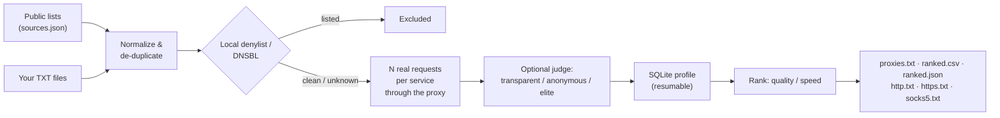

<div align="center">


# Proxy Workbench

**Collect free public proxies from 55 open lists and web pages, test every one against _your_ services, and keep only the fast, stable, clean and anonymous ones.**

Local browser GUI (English / Russian) + CLI · HTTP / HTTPS (CONNECT) / SOCKS5 · anonymity levels · resumable · no accounts, no telemetry


-42bbaa)


**English** · [Русский](README.ru.md)

[Quick start](#-quick-start) · [Features](#-features) · [How it works](#-how-it-works) · [CLI](#-command-line) · [FAQ](#-faq) · [Roadmap](#-roadmap) · [Contributing](CONTRIBUTING.md)

<br>


<sub>15-second tour: start a scan → ranking → “Elite only” filter → per-attempt details → EN/RU switch (synthetic data).</sub>

</div>

---

## Why

Free proxy lists are everywhere, but most of what they contain is dead, slow, or blocked by the site you actually care about. A proxy that answers `example.com` may still fail your API, return a captcha page with status `200`, or sit on a spam blacklist.

**Proxy Workbench answers one practical question: _which of these proxies really work for my service, right now, and how well?_**

- It gathers candidates from dozens of public lists (or your own files) and de-duplicates them.
- It sends **real HTTP(S) requests through each proxy** to every service you specify — several times — and checks status codes, body text, or even a SHA-256 of the response.
- It ranks survivors by **median latency, jitter and success rate**, flags **blacklisted IPs** (local denylist + optional DNSBL), rates **anonymity** (transparent / anonymous / elite) and exports TXT / CSV / JSON plus ready-to-use `host:port` lists per protocol.

Everything runs on your machine. The GUI binds to `127.0.0.1` only.

## 📸 Screenshots

<table>
<tr>
<td width="50%"><br><sub><b>Scan</b> — pick services, success rules and watch live progress</sub></td>
<td width="50%"><br><sub><b>Results</b> — ranked by quality or speed, with cleanliness verdicts</sub></td>
</tr>
<tr>
<td width="50%"><br><sub><b>Details</b> — every attempt for every service</sub></td>
<td width="50%"><br><sub><b>Light theme</b> — one click in the header</sub></td>
</tr>
</table>

<sub>Screenshots use synthetic data from documentation IP ranges (RFC 5737). The interface is available in English and Russian (EN/RU toggle in the header).</sub>

## ✨ Features

| | |
| --- | --- |
| **55 built-in sources** | Popular GitHub-hosted lists, ProxyScrape, paginated Geonode API and free-proxy web pages. Any web page, CSV or HTML table works as a source: every `ip:port` is pulled out of it. **Remove dead sources** and **Get new sources** keep the list healthy in one click. |
| **Unknown protocol? No problem** | Addresses without a protocol can be tried as HTTP, SOCKS4 and SOCKS5 at once; the checks keep whichever works. |
| **Protocols** | HTTP, HTTPS/CONNECT, explicit `https://` proxies, SOCKS4, SOCKS5 / SOCKS5h, IPv4 and IPv6. |
| **Test against your services** | Several targets per profile (up to 20 in the GUI). A proxy passes only if it works for **all** of them. |
| **Strict success rules** | Allowed status codes, required body substring, expected SHA-256, `GET`/`HEAD`, safe custom headers. Catches captcha and stub pages that still return `200`. |
| **Repeated measurements** | N attempts per target (default 3), a per-target success threshold (e.g. 2 of 3), median latency and jitter. |
| **Just a few proxies? Specific country?** | `--want 20` stops as soon as 20 proxies match; previously working addresses are tried first. `--country DE,NL` skips every other country *before* checking, so a country-specific search takes minutes, not hours. |
| **Always fresh** | **Re-check only matching proxies** refreshes the current list in minutes; **Keep fresh** in the GUI (or `--watch 30`) does it automatically every 30 minutes, and the API and rotating proxy pick up each new list. Every proxy keeps an uptime history, so you can sort by the ones that survive re-checks. |
| **Source ratings** | The Sources tab shows how many working proxies each public list produced, so you can drop dead lists and scan faster. |
| **Presets** | Quick, Balanced and Thorough set attempts, timeouts and workers in one click. |
| **Anonymity levels** | Point it at any echo “judge” page and every working proxy is rated **transparent** (leaks your IP), **anonymous** (reveals itself with `Via` / `X-Forwarded-For`) or **elite**. Filter with one click or `--min-anonymity elite`. |
| **Cleanliness checks** | Local IP / CIDR / exact-proxy denylist plus optional DNSBL zones. Verdicts: `clean`, `listed`, `local_denied`, `unknown`, with an optional strict mode. |
| **Built for big lists** | Bounded worker queue, rate limiter, automatic file-descriptor fitting. A **quick pre-check** drops addresses that do not even accept a TCP connection before the full check, **fail-fast** skips the remaining attempts once a proxy can no longer pass, and a short **connect timeout** drops dead hosts early. Tested with 190,000 simulated candidates. |
| **Stop & resume** | Progress is stored in SQLite. `Ctrl+C` or **Stop** keeps finished work; the same command continues where it left off. |
| **Ranking & export** | Sort by `quality`, `speed`, `stability` or `uptime`; filter by protocol, country, maximum latency, anonymity and success rate; search by address or port and copy a page with one click. Export top N (or all) to `proxies.txt`, `ranked.csv`, `ranked.json`, plus `http.txt` / `https.txt` / `socks4.txt` / `socks5.txt` / `hostport.txt` in plain `host:port` format, a ready `proxychains.txt`, a browser `proxy.pac` and a Clash / Mihomo `clash.yaml` with automatic fastest-proxy selection. A protocol and country summary sits above the files. Crash-safe export generations. |
| **Rotating proxy gateway** | Set `127.0.0.1:8899` as the HTTP or SOCKS5 proxy in a browser, Telegram, a scraper or any app. Every new connection goes out through the next working proxy; failing ones are skipped and rested automatically. |
| **Recommended first** | The default order puts first the proxies that are fast, survive re-checks, come from lists with a good record and are offered by few lists (less crowded, so they live longer). |
| **Scripts and more clients** | `proxy-workbench get --country DE --top 5` prints working proxies, `proxy-workbench test socks5://…` checks your own; sing-box config and a **Use in Telegram** button for the rotating proxy. |
| **For scrapers** | Gateway user names choose per client: `country-de`, `protocol-socks5`, `latency-800`, `session-abc` (one IP per session). A per-proxy connection cap and `/status` stats. |
| **Real speed and provider** | Optional speed test in Mbit/s with a bandwidth sort; every proxy shows its provider (AS number) and hosting / data-centre ranges can be skipped. |
| **Ready-made checks** | One click adds a check for Google, YouTube, Telegram, Discord, Instagram, the OpenAI API, GitHub, Wikipedia or Cloudflare. |
| **Exit country** | The anonymity judge also reports the address the traffic really leaves from; the table shows `DE → NL` when it differs from the proxy's own country. |
| **Local API for your code** | The GUI (or `serve` on a server) answers `GET /random?protocol=socks5&country=DE` or `/proxies?max_latency=800&format=txt` with the freshest working proxies, so scripts, scrapers and bots can pick a proxy with one HTTP request. |
| **Safe by default** | Loopback-only GUI with a per-session token, CSRF/Host checks, SSRF-hardened source fetching (no private/metadata IPs, validated redirects, size limits), credential-like headers rejected. |
| **English & Russian UI** | Switch with the EN/RU button; defaults to your browser language. Dark and light themes. |
| **Zero setup** | A Windows `.exe` that needs nothing else, `pipx install`, Docker Compose, or a double-click launcher that creates its own virtual environment. |

## 🚀 Quick start

Pick one way to install:

| Way | How | Needs |
| --- | --- | --- |
| **Windows app** | Download `proxy-workbench-…-windows-x64.exe` from the [latest release](https://github.com/DavidVoitenko/proxy-workbench/releases/latest) and double-click it | nothing else |
| **pipx** (Windows, macOS, Linux) | `pipx install git+https://github.com/DavidVoitenko/proxy-workbench` then `proxy-workbench` | Python 3.11+ and [pipx](https://pipx.pypa.io/) |
| **Source folder** | Download the code (**Code → Download ZIP** or `git clone`), then double-click `Start.bat` (Windows) / `Start.command` (macOS) or run `./run.sh` (Linux) | Python 3.11+ |
| **Docker** | `docker compose up -d` with the bundled [`compose.yml`](compose.yml) (checker + API + rotating proxy) | Docker |

`proxy-workbench` without arguments opens the GUI in your browser; `proxy-workbench run …` and the other commands below work the same way as `./run.sh …`. The `.exe` keeps its data in a `data` folder next to itself; pipx installs keep it in your user profile (`%LOCALAPPDATA%\proxy-workbench`, `~/Library/Application Support/proxy-workbench` or `~/.local/share/proxy-workbench`); `PROXY_WORKBENCH_DATA` overrides both. The Windows executable is not code-signed yet, so SmartScreen may ask you to confirm the first start (**More info → Run anyway**); every release lists its SHA-256 checksum.

1. **Scan** tab: add one or more service URLs, allowed status codes and (recommended) a text that must appear in the response.
2. Press **Find and check** (“Найти и проверить”). Watch progress, speed, ETA and the number of matching proxies.
3. **Results** tab: choose order, success threshold and how many to keep, press **Build export**, then download TXT / CSV / JSON.

Close the app with `Ctrl+C` in its terminal window — progress is saved.

## 🧭 How it works



**Scoring.** `speed` sorts by median time of a full successful request (connect + TLS + response), `stability` by the lowest jitter. `quality` uses

```text
score = 100 × (lowest success rate among targets) / (1 + (median_ms + stdev_ms) / 1000)
```

so a proxy has to be both reliable _for every service_ and fast to rank high.

**Profiles.** Target URLs, checks, headers, request profile, cleanliness policy, attempts, timeout and response-size limit together form a _profile_. Re-running the same profile resumes it; changing any of them starts a separate result set, so old and new measurements never mix.

## 💻 Command line

`proxy-workbench <command>` (pipx or the `.exe`), `./run.sh <command>` in a source folder on macOS/Linux, or `.venv\Scripts\python proxytool.py <command>` in a source folder on Windows. Messages follow your system language (English or Russian); set `PROXY_WORKBENCH_LANG=en` or `ru` to choose. `--help` lists every option with examples.

```sh
# Collect from all sources and check every candidate against example.com
./run.sh run

# Check against your own endpoint
./run.sh run --url https://example.org/health

# Several services, status/body/hash checks: copy the example config first
cp service.example.json data/service.json
./run.sh run --config data/service.json

# Only your own list, no public sources, separate data folder
./run.sh run --no-sources --input data/my-proxies.txt --data data/my-run

# Resume after Ctrl+C / re-check everything from scratch
./run.sh scan --config data/service.json
./run.sh scan --config data/service.json --recheck

# Export without new requests
./run.sh export --top 500 --sort quality
./run.sh export --top 0 --sort speed --min-success 1
./run.sh export --protocol socks5 --max-latency 800 --sort stability

# Need just 20 working German or Dutch SOCKS5 proxies, fast
./run.sh update-geoip          # once: offline country database (DB-IP Lite, ~7 MB)
./run.sh run --country DE,NL --protocol socks5 --want 20 --attempts 1

# Refresh only the proxies that currently pass (minutes, not hours)
./run.sh scan --recheck-passing
# ...or keep the list fresh automatically every 30 minutes (Ctrl+C to stop)
./run.sh run --want 50 --watch 30

# Rate anonymity with an echo judge and keep only elite proxies
./run.sh run --judge-url http://judge.example/azenv.php --min-anonymity elite

# Tune performance and cleanliness
./run.sh run --workers 256 --rate 100 --timeout 8 --connect-timeout 3 --attempts 3
./run.sh run --no-fail-fast   # always run every attempt, e.g. for research
./run.sh run --dnsbl --dnsbl-zone bl.example.org --strict-clean

# Delete local databases and exports (keeps settings and denylist)
./run.sh clear-data --yes
```

<details>
<summary><b>Service config format</b> (<code>data/service.json</code>)</summary>

```json
{
  "request_profile": "workbench",
  "reputation": { "local_enabled": true, "dnsbl_enabled": false, "dnsbl_zones": [], "timeout": 2.5, "strict": false },
  "anonymity": { "judge_url": "http://judge.example/azenv.php" },
  "targets": [
    {
      "url": "https://example.com/",
      "method": "GET",
      "statuses": [200],
      "contains": "Example Domain",
      "headers": {}
    }
  ]
}
```

| Field | Meaning |
| --- | --- |
| `url` | Required HTTP/HTTPS URL. Redirects are not followed — use the final URL or allow the redirect status. |
| `method` | `GET` (default) or `HEAD`. |
| `statuses` | Accepted status codes, default 200–299. |
| `contains` | UTF-8 text that must be present in the body. |
| `sha256` | Expected SHA-256 of the full body. |
| `headers` | Safe headers only: `Accept*`, `Cache-Control`, `Pragma`, `User-Agent`, `X-Request-ID`, `X-Client-Version`. |
| `request_profile` | `workbench`, `standard` or `minimal` — neutral User-Agent/Accept presets. |
| `reputation` | Local denylist and DNSBL policy. |
| `anonymity.judge_url` | Optional echo endpoint for anonymity levels (see [FAQ](#-faq)). |

</details>

<details>
<summary><b>Source list format</b> (<code>proxy_workbench/sources.json</code>)</summary>

A JSON array of strings, one per source:

- `https://…/list.txt` — plain HTTP/CONNECT list (`IP:port` or `scheme://IP:port`);
- `socks4 https://…/list.txt` / `socks5 https://…/list.txt` — SOCKS lists without a scheme;
- `auto https://…/list.txt` — protocol unknown: every address is tried as HTTP, SOCKS4 and SOCKS5;
- `text https://…` — any web page, CSV or HTML table: every `ip:port` in it is collected;
- `http-fields https://…` — `IP:port:country` lines;
- `geonode https://proxylist.geonode.com/api/proxy-list?...` — paginated Geonode JSON API.

Remote lists are streamed with limits (8 MiB, 64 KiB per line, 100,000 candidates, 5 redirects by default; see `--source-max-*`). Per-source results are written to `data/sources-report.json`. Authenticated proxies, hostnames and non-public IPs are rejected. `--detect-protocols` tries addresses without a protocol from your own `--input` files as HTTP, SOCKS4 and SOCKS5.

</details>

<details>
<summary><b>All CLI options</b></summary>

Run `./run.sh --help` for the complete list: `--input`, `--sources`, `--no-sources`, `--source-timeout`, `--url`, `--config`, `--request-profile`, `--attempts`, `--timeout`, `--workers`, `--rate`, `--max-bytes`, `--denylist-file`, `--local-denylist/--no-local-denylist`, `--dnsbl`, `--dnsbl-zone`, `--reputation-timeout`, `--strict-clean`, `--judge-url`, `--min-anonymity`, `--connect-timeout`, `--fail-fast/--no-fail-fast`, `--protocol`, `--max-latency`, `--country`, `--want`, `--geoip-db`, `--recheck`, `--recheck-passing`, `--watch`, the `update-geoip` and `serve` commands with `--host`, `--port`, `--api-token`, `--top`, `--sort`, `--min-success`, `--data`.

</details>

## 🔁 Rotating proxy gateway

While the GUI is open, `127.0.0.1:8899` works as one proxy that rotates through all working proxies of the latest export. Use it as an **HTTP** or **SOCKS5** proxy anywhere:

```sh
curl -x http://127.0.0.1:8899 https://example.org/
curl -x socks5h://127.0.0.1:8899 https://example.org/
```

- Every new connection takes the next proxy (`--rotate random` picks at random).
- If a proxy fails, the same connection is retried through another one (up to 3). A proxy that fails twice rests for 5 minutes.
- Plain `http://` requests reach HTTP proxies directly, because many of them allow CONNECT only to port 443.

On a server, start it with `./run.sh gateway` and narrow the pool with the usual filters, for example `gateway --protocol socks5 --country DE --max-latency 1500`. Binding to a network address (`--host 0.0.0.0`) requires a password: `--api-token <secret>`. Clients then log in with any user name and that password, over HTTP Basic or SOCKS5 user/password.

Browser without extensions: use `http://127.0.0.1:8765/pac` as the automatic proxy configuration URL. It serves the 10 best matching proxies and accepts the same filters as the API, for example `/pac?country=DE`. `/clash` returns a complete Clash / Mihomo config.

## 🔌 Local API: use the proxies from your own code

While the GUI is open, a read-only API runs on `http://127.0.0.1:8765` (this computer only). On a server, start it with `./run.sh serve` (Windows: `.venv\Scripts\python proxytool.py serve`). It serves the latest export and picks up every new one automatically, so it can run next to `run --watch`.

| Request | Returns |
| --- | --- |
| `GET /random` | one random working proxy; `limit=5` for several |
| `GET /proxies` | all working proxies, best first (the export order) |
| `GET /pac` | proxy auto-config for browsers with the 10 best matching proxies |
| `GET /clash` | Clash / Mihomo config with an automatic fastest-proxy group |
| `GET /status` | how many are available, when the export was built, which services were checked |

Filters for `/random` and `/proxies`: `protocol=http\|https\|socks5`, `country=DE,NL`, `max_latency=800` (ms), `anonymity=anonymous\|elite`, `limit=N`, `format=json\|txt\|hostport`.

```sh
curl "http://127.0.0.1:8765/random?protocol=socks5&country=DE&format=txt"
# socks5://203.0.113.7:1080
```

```python
import httpx

proxy = httpx.get("http://127.0.0.1:8765/random?protocol=http&max_latency=1500&format=txt").text.strip()
print(httpx.get("https://example.org/", proxy=proxy, timeout=15).status_code)
```

JSON rows contain `proxy`, `protocol`, `host`, `port`, `country`, `exit_ip`, `exit_country`, `anonymity`, `latency_ms`, `jitter_ms`, `reliability`, `uptime`, `checks`, `score`, `checked_at`. The GUI shows the address with a **Copy** button under the download buttons; change the port with `gui.py --api-port 9000` or turn it off with `--no-api`.

To reach the API from other machines (for example from Docker), bind it to a network address and set a token: `serve --host 0.0.0.0 --api-token <secret>` or the `PROXY_WORKBENCH_API_TOKEN` variable. Clients then send `Authorization: Bearer <secret>`.

## 🐳 Docker (headless CLI)

Run scans on a server or NAS without installing Python. The image contains the CLI only; the browser GUI stays on your own machine.

```sh
docker build -t proxy-workbench .
mkdir -p data
docker run --rm --user "$(id -u):$(id -g)" -v "$PWD/data:/app/data" \
  proxy-workbench run --url https://example.org/health --judge-url http://judge.example/azenv.php
```

Serve fresh proxies to other containers: one container re-checks, the other answers API requests from the same data folder.

```sh
docker run -d --name pw-check -v "$PWD/data:/app/data" proxy-workbench run --want 50 --watch 30
docker run -d --name pw-api -p 127.0.0.1:8765:8765 -e PROXY_WORKBENCH_API_TOKEN=change-me \
  -v "$PWD/data:/app/data" proxy-workbench serve --host 0.0.0.0
docker run -d --name pw-gateway -p 127.0.0.1:8899:8899 -e PROXY_WORKBENCH_API_TOKEN=change-me \
  -v "$PWD/data:/app/data" proxy-workbench gateway --host 0.0.0.0
```

Every release also publishes a ready image to the GitHub Container Registry. It appears under **Packages** in the repository sidebar as `ghcr.io/<owner>/proxy-workbench:<version>` and `:latest`. Results land in the mounted `data/` folder exactly as with a local install.

## 📁 Where your data lives

Everything is written to the data folder: `data/` in a source checkout (git-ignored) or next to the `.exe`, your user profile for pipx installs, or `PROXY_WORKBENCH_DATA`:

| Path | Content |
| --- | --- |
| `data/proxies.sqlite3` | candidates, profiles and every measurement |
| `data/exports/` | `proxies.txt`, `ranked.csv`, `ranked.json`, `http.txt`, `https.txt`, `socks4.txt`, `socks5.txt`, `hostport.txt`, `proxychains.txt`, `proxy.pac`, `clash.yaml`, `status.json` |
| `data/sources-report.json` | per-source rows, rejects and errors |
| `data/geoip/dbip-country-lite.csv.gz` | optional offline country database |
| `data/denylist.txt` | your IP / CIDR / proxy rules (`#` comments allowed) |
| `data/gui-settings.json` | GUI settings |

Delete it any time with `./run.sh clear-data --yes` or the button on the **How it works** tab.

## 🛠 Troubleshooting

- **macOS blocks `Start.command`:** right-click → Open once, or run `./run.sh` from Terminal.
- **Windows says Python is missing:** install Python 3.11+ from python.org with the *py launcher* option enabled.
- **Wrong Python / broken environment:** delete only the `.venv/` folder and start the launcher again.
- **“Data folder is busy”:** another GUI or CLI process uses the same `data/` folder — stop it first.
- **No results:** check the **Sources** report, your denylist, DNSBL zones and whether the target URL itself is reachable.

## ❓ FAQ

**Does this make me anonymous?**
No. Proxy Workbench measures _reachability and latency_. A public proxy sees your IP, your destination and — for plain HTTP — your traffic. Never send passwords, cookies or tokens through untrusted public proxies. See [PRIVACY.md](PRIVACY.md).

**How long does a full scan take?**
It depends on how many candidates respond. With the defaults (3 attempts, 8 s request timeout, 4 s connect timeout, fail-fast, 128 workers) even ~190,000 completely dead addresses take about 3.5 hours, because each dead proxy is dropped after two short connect failures; in practice most fail much faster. Raise `--workers`, lower `--connect-timeout`, or use fewer sources for quicker runs. You can stop and resume at any time.

**Why did a proxy that works in my browser fail here?**
Redirects are not followed, TLS certificates are verified, and each target must pass on its own threshold. Check **Details** for the exact error of every attempt.

**What do transparent / anonymous / elite mean, and which judge should I use?**
A *judge* is any page that echoes back the IP and headers it received — for example an `httpbin`-style `/get` endpoint or an `azenv.php` script (ideally one you host yourself). Proxy Workbench asks it once directly to learn your public IP (kept in memory only, never saved), then once through every working proxy:

| Level | Meaning |
| --- | --- |
| `transparent` | your real IP is visible to the site |
| `anonymous` | your IP is hidden, but the proxy announces itself (`Via`, `X-Forwarded-For`, …) |
| `elite` | neither your IP nor proxy headers are visible |
| `unknown` | the judge request through the proxy failed |

Use an **`http://`** judge: through an HTTPS tunnel a proxy cannot add headers, so every proxy would look elite.

**I only need a few proxies. Do I have to wait for the whole list?**
No. Set **Stop after finding** in the GUI or `--want 20` in the CLI. Addresses that worked in earlier scans are tried first, the rest in random order, and the scan stops as soon as 20 match. Run it again later to continue where it stopped. The **Quick** preset (1 attempt, short timeouts) makes it even faster.

**Free proxies die quickly. How do I keep my list working?**
Press **Re-check only matching proxies** (or `./run.sh scan --recheck-passing`): only the proxies that currently pass are measured again, which takes minutes. `--watch 30` repeats this every 30 minutes and rewrites the export files each time. Sort by **uptime** to put the proxies that survived the most re-checks first.

**How do I get proxies from a specific country?**
Download the country database once (**Sources → Country database**, or `./run.sh update-geoip`), then enter the countries (`DE, NL`) in the GUI or pass `--country DE,NL`. Addresses from other countries are skipped before any request is sent. Results from a country-limited run are kept, so a later run for all countries does not check them again. Country data: [DB-IP](https://db-ip.com) (CC BY 4.0) plus the country field of Geonode sources.

**What does “clean” mean?**
The IP is not in your local denylist and (if enabled) not listed by the DNSBL zones you chose. It is a reputation signal, not a guarantee of safety.

**Can I use my own proxy list only?**
Yes: `--no-sources --input my.txt`, or paste/upload a TXT on the **Sources** tab.

**Is running it legal?**
Checking public lists is generally fine, but you are responsible for respecting the terms of the services you test and the laws where you live. Only test endpoints you are allowed to test.

## 🗺 Roadmap

- [x] English interface with an EN/RU switch
- [ ] `pipx install` / PyPI package and a single `proxy-workbench` command
- [x] Anonymity level detection (transparent / anonymous / elite)
- [x] Per-protocol `host:port` exports
- [x] Country column and filters from a local GeoIP database
- [x] “Find N and stop” mode and presets
- [x] Re-check only matching proxies, `--watch` auto-refresh and uptime history
- [x] Source ratings and proxychains export
- [x] Docker image for headless servers

Have an idea? Open a [feature request](../../issues/new/choose) or start a [discussion](../../discussions).

## 🤝 Contributing

Contributions of every size are welcome — bug reports, new sources, docs, translations and code. Read [CONTRIBUTING.md](CONTRIBUTING.md) to get started. Tests run entirely on local mocks:

```sh
python -m unittest discover -s tests -v
```

Please also read the [Code of Conduct](CODE_OF_CONDUCT.md). Found a vulnerability? Follow [SECURITY.md](SECURITY.md) and report it privately.

If Proxy Workbench saved you time, **a ⭐ on GitHub helps other people find it.**

## ⚖️ Responsible use

Proxy Workbench is intended for engineering experiments, availability benchmarking and defensive quality checks — not for bypassing access controls, abusing services or hiding identity for unlawful purposes. Use only sources and endpoints you are allowed to test and respect provider terms and applicable law.

## 📜 License

[MIT](LICENSE). Built-in source lists belong to their respective maintainers; their content, availability and licensing may change at any time.
