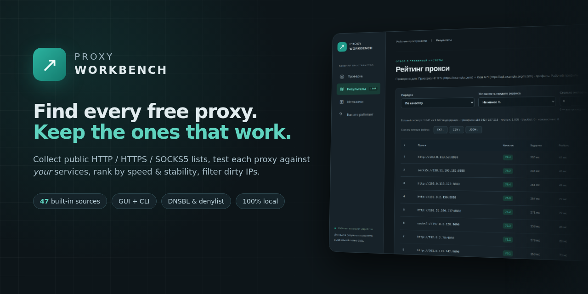
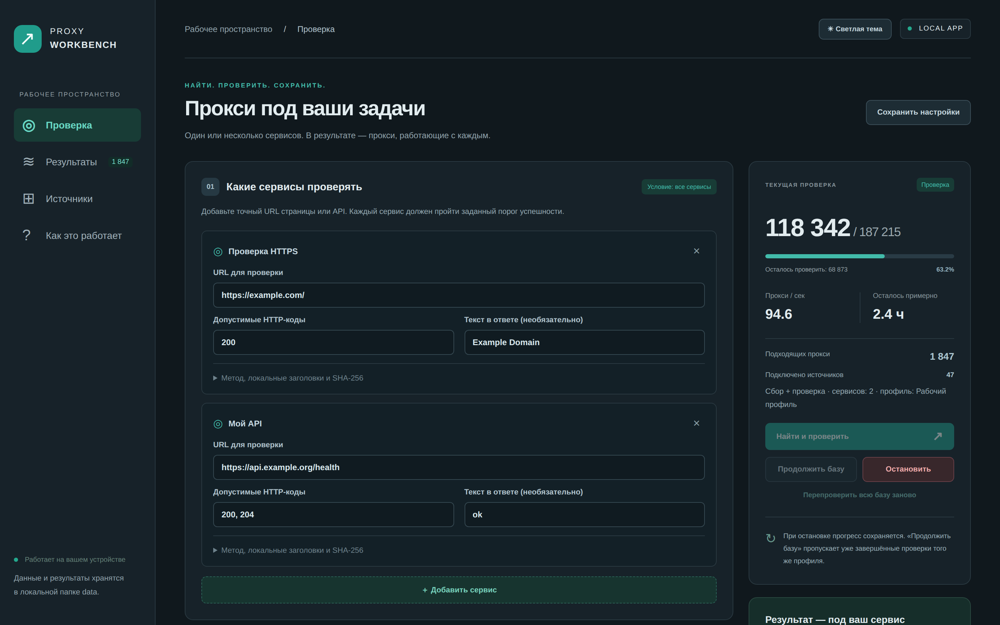
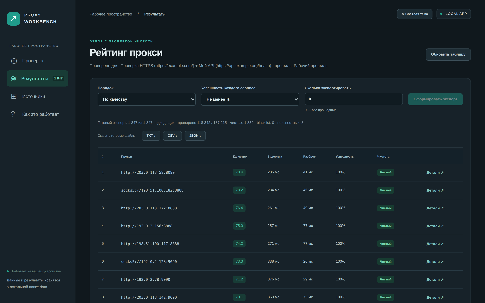
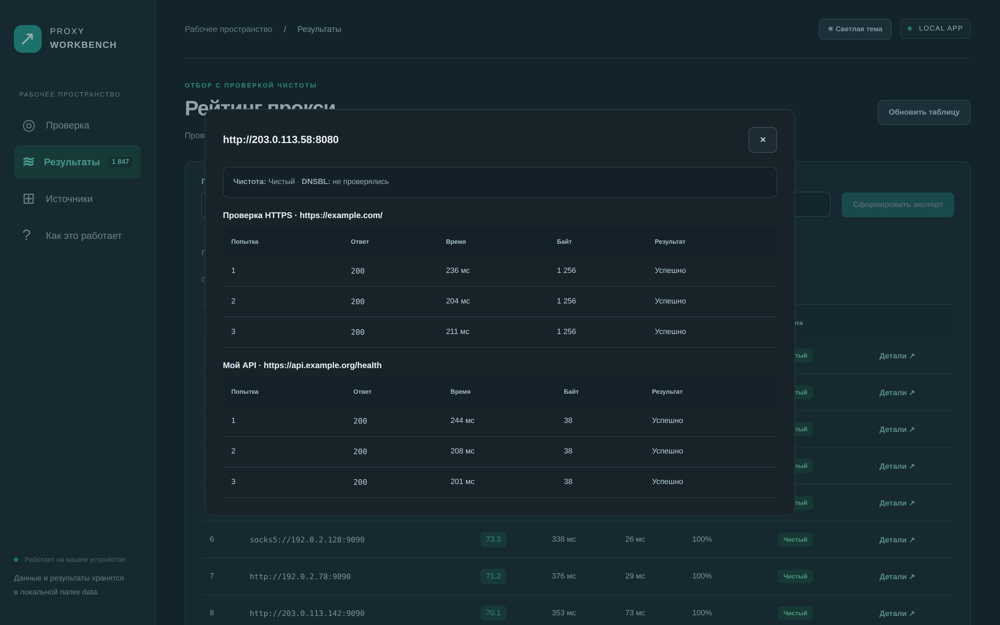
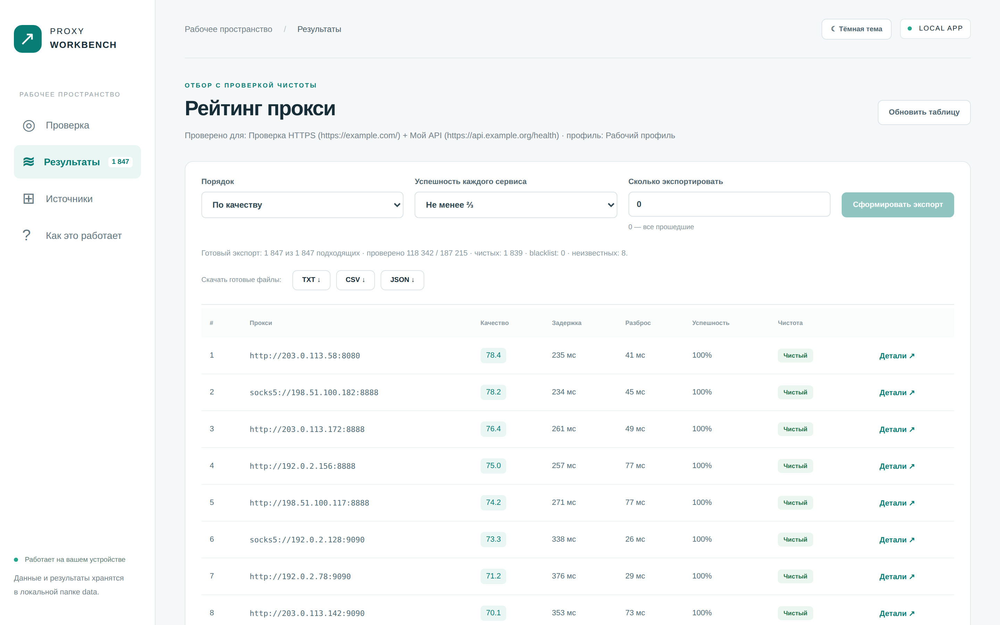
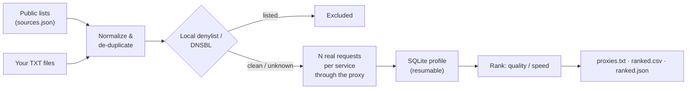

<div align="center">



# Proxy Workbench

**Collect free public proxies from 47 open lists, test every one against _your_ services, and keep only the fast, stable and clean ones.**

Local browser GUI + CLI · HTTP / HTTPS (CONNECT) / SOCKS5 · resumable · no accounts, no telemetry


-42bbaa)


**English** · [Русский](README.ru.md)

[Quick start](#-quick-start) · [Features](#-features) · [How it works](#-how-it-works) · [CLI](#-command-line) · [FAQ](#-faq) · [Roadmap](#-roadmap) · [Contributing](CONTRIBUTING.md)

</div>

---

## Why

Free proxy lists are everywhere, but most of what they contain is dead, slow, or blocked by the site you actually care about. A proxy that answers `example.com` may still fail your API, return a captcha page with status `200`, or sit on a spam blacklist.

**Proxy Workbench answers one practical question: _which of these proxies really work for my service, right now, and how well?_**

- It gathers candidates from dozens of public lists (or your own files) and de-duplicates them.
- It sends **real HTTP(S) requests through each proxy** to every service you specify — several times — and checks status codes, body text, or even a SHA-256 of the response.
- It ranks survivors by **median latency, jitter and success rate**, flags **blacklisted IPs** (local denylist + optional DNSBL), and exports TXT / CSV / JSON.

Everything runs on your machine. The GUI binds to `127.0.0.1` only.

## 📸 Screenshots

<table>
<tr>
<td width="50%"><br><sub><b>Scan</b> — pick services, success rules and watch live progress</sub></td>
<td width="50%"><br><sub><b>Results</b> — ranked by quality or speed, with cleanliness verdicts</sub></td>
</tr>
<tr>
<td width="50%"><br><sub><b>Details</b> — every attempt for every service</sub></td>
<td width="50%"><br><sub><b>Light theme</b> — one click in the header</sub></td>
</tr>
</table>

<sub>Screenshots use synthetic data from documentation IP ranges (RFC 5737). The interface is currently in Russian; an English UI is on the <a href="#-roadmap">roadmap</a>.</sub>

## ✨ Features

| | |
| --- | --- |
| **47 built-in sources** | Popular GitHub-hosted lists, ProxyScrape, paginated Geonode API. Fully editable in `sources.json` or the GUI; add your own URLs or TXT files. |
| **Protocols** | HTTP, HTTPS/CONNECT, explicit `https://` proxies, SOCKS5 / SOCKS5h, IPv4 and IPv6. |
| **Test against your services** | Several targets per profile (up to 20 in the GUI). A proxy passes only if it works for **all** of them. |
| **Strict success rules** | Allowed status codes, required body substring, expected SHA-256, `GET`/`HEAD`, safe custom headers. Catches captcha and stub pages that still return `200`. |
| **Repeated measurements** | N attempts per target (default 3), a per-target success threshold (e.g. 2 of 3), median latency and jitter. |
| **Cleanliness checks** | Local IP / CIDR / exact-proxy denylist plus optional DNSBL zones. Verdicts: `clean`, `listed`, `local_denied`, `unknown`, with an optional strict mode. |
| **Built for big lists** | Bounded worker queue, rate limiter, automatic file-descriptor fitting. Tested with 190,000 simulated candidates. |
| **Stop & resume** | Progress is stored in SQLite. `Ctrl+C` or **Stop** keeps finished work; the same command continues where it left off. |
| **Ranking & export** | Sort by `quality` or `speed`, export top N (or all) to `proxies.txt`, `ranked.csv`, `ranked.json`. Crash-safe export generations. |
| **Safe by default** | Loopback-only GUI with a per-session token, CSRF/Host checks, SSRF-hardened source fetching (no private/metadata IPs, validated redirects, size limits), credential-like headers rejected. |
| **Zero setup** | Double-click launcher creates a virtual environment and installs the single dependency (`httpx[socks]`). |

## 🚀 Quick start

You need **Python 3.11+**. Download the code (**Code → Download ZIP**, or `git clone`), then:

| OS | Start the GUI |
| --- | --- |
| **Windows** | double-click `Start.bat` |
| **macOS** | double-click `Start.command` |
| **Linux** | `./run.sh` |

The first launch creates `.venv/` and installs dependencies; your browser then opens the local interface.

1. **Scan** tab: add one or more service URLs, allowed status codes and (recommended) a text that must appear in the response.
2. Press **Find and check** (“Найти и проверить”). Watch progress, speed, ETA and the number of matching proxies.
3. **Results** tab: choose order, success threshold and how many to keep, press **Build export**, then download TXT / CSV / JSON.

Close the app with `Ctrl+C` in its terminal window — progress is saved.

## 🧭 How it works



**Scoring.** `speed` sorts by median time of a full successful request (connect + TLS + response). `quality` uses

```text
score = 100 × (lowest success rate among targets) / (1 + (median_ms + stdev_ms) / 1000)
```

so a proxy has to be both reliable _for every service_ and fast to rank high.

**Profiles.** Target URLs, checks, headers, request profile, cleanliness policy, attempts, timeout and response-size limit together form a _profile_. Re-running the same profile resumes it; changing any of them starts a separate result set, so old and new measurements never mix.

## 💻 Command line

`./run.sh <command>` on macOS/Linux, or `.venv\Scripts\python proxytool.py <command>` on Windows.

```sh
# Collect from all sources and check every candidate against example.com
./run.sh run

# Check against your own endpoint
./run.sh run --url https://example.org/health

# Several services, status/body/hash checks: copy the example config first
cp service.example.json data/service.json
./run.sh run --config data/service.json

# Only your own list, no public sources, separate data folder
./run.sh run --no-sources --input data/my-proxies.txt --data data/my-run

# Resume after Ctrl+C / re-check everything from scratch
./run.sh scan --config data/service.json
./run.sh scan --config data/service.json --recheck

# Export without new requests
./run.sh export --top 500 --sort quality
./run.sh export --top 0 --sort speed --min-success 1

# Tune performance and cleanliness
./run.sh run --workers 256 --rate 100 --timeout 8 --attempts 3
./run.sh run --dnsbl --dnsbl-zone bl.example.org --strict-clean

# Delete local databases and exports (keeps settings and denylist)
./run.sh clear-data --yes
```

<details>
<summary><b>Service config format</b> (<code>data/service.json</code>)</summary>

```json
{
  "request_profile": "workbench",
  "reputation": { "local_enabled": true, "dnsbl_enabled": false, "dnsbl_zones": [], "timeout": 2.5, "strict": false },
  "targets": [
    {
      "url": "https://example.com/",
      "method": "GET",
      "statuses": [200],
      "contains": "Example Domain",
      "headers": {}
    }
  ]
}
```

| Field | Meaning |
| --- | --- |
| `url` | Required HTTP/HTTPS URL. Redirects are not followed — use the final URL or allow the redirect status. |
| `method` | `GET` (default) or `HEAD`. |
| `statuses` | Accepted status codes, default 200–299. |
| `contains` | UTF-8 text that must be present in the body. |
| `sha256` | Expected SHA-256 of the full body. |
| `headers` | Safe headers only: `Accept*`, `Cache-Control`, `Pragma`, `User-Agent`, `X-Request-ID`, `X-Client-Version`. |
| `request_profile` | `workbench`, `standard` or `minimal` — neutral User-Agent/Accept presets. |
| `reputation` | Local denylist and DNSBL policy. |

</details>

<details>
<summary><b>Source list format</b> (<code>sources.json</code>)</summary>

A JSON array of strings, one per source:

- `https://…/list.txt` — plain HTTP/CONNECT list (`IP:port` or `scheme://IP:port`);
- `socks5 https://…/list.txt` — list of SOCKS5 proxies without a scheme;
- `http-fields https://…` — `IP:port:country` lines;
- `geonode https://proxylist.geonode.com/api/proxy-list?...` — paginated Geonode JSON API.

Remote lists are streamed with limits (8 MiB, 64 KiB per line, 100,000 candidates, 5 redirects by default; see `--source-max-*`). Per-source results are written to `data/sources-report.json`. SOCKS4, authenticated proxies, hostnames and non-public IPs are rejected.

</details>

<details>
<summary><b>All CLI options</b></summary>

Run `./run.sh --help` for the complete list: `--input`, `--sources`, `--no-sources`, `--source-timeout`, `--url`, `--config`, `--request-profile`, `--attempts`, `--timeout`, `--workers`, `--rate`, `--max-bytes`, `--denylist-file`, `--local-denylist/--no-local-denylist`, `--dnsbl`, `--dnsbl-zone`, `--reputation-timeout`, `--strict-clean`, `--recheck`, `--top`, `--sort`, `--min-success`, `--data`.

</details>

## 📁 Where your data lives

Everything is written to the git-ignored `data/` folder:

| Path | Content |
| --- | --- |
| `data/proxies.sqlite3` | candidates, profiles and every measurement |
| `data/exports/` | `proxies.txt`, `ranked.csv`, `ranked.json`, `status.json` |
| `data/sources-report.json` | per-source rows, rejects and errors |
| `data/denylist.txt` | your IP / CIDR / proxy rules (`#` comments allowed) |
| `data/gui-settings.json` | GUI settings |

Delete it any time with `./run.sh clear-data --yes` or the button on the **How it works** tab.

## 🛠 Troubleshooting

- **macOS blocks `Start.command`:** right-click → Open once, or run `./run.sh` from Terminal.
- **Windows says Python is missing:** install Python 3.11+ from python.org with the *py launcher* option enabled.
- **Wrong Python / broken environment:** delete only the `.venv/` folder and start the launcher again.
- **“Data folder is busy”:** another GUI or CLI process uses the same `data/` folder — stop it first.
- **No results:** check the **Sources** report, your denylist, DNSBL zones and whether the target URL itself is reachable.

## ❓ FAQ

**Does this make me anonymous?**
No. Proxy Workbench measures _reachability and latency_. A public proxy sees your IP, your destination and — for plain HTTP — your traffic. Never send passwords, cookies or tokens through untrusted public proxies. See [PRIVACY.md](PRIVACY.md).

**How long does a full scan take?**
It depends on how many candidates respond. The worst case — ~190,000 dead addresses, 3 attempts, 8 s timeout, 128 workers — is roughly 10 hours; in practice most dead proxies fail fast. Raise `--workers`, lower `--timeout`/`--attempts`, or use fewer sources for quicker runs. You can stop and resume at any time.

**Why did a proxy that works in my browser fail here?**
Redirects are not followed, TLS certificates are verified, and each target must pass on its own threshold. Check **Details** for the exact error of every attempt.

**What does “clean” mean?**
The IP is not in your local denylist and (if enabled) not listed by the DNSBL zones you chose. It is a reputation signal, not a guarantee of safety.

**Can I use my own proxy list only?**
Yes: `--no-sources --input my.txt`, or paste/upload a TXT on the **Sources** tab.

**Is running it legal?**
Checking public lists is generally fine, but you are responsible for respecting the terms of the services you test and the laws where you live. Only test endpoints you are allowed to test.

## 🗺 Roadmap

- [ ] English interface and language switch (GUI is Russian today)
- [ ] `pipx install` / PyPI package and a single `proxy-workbench` command
- [ ] Anonymity level detection (transparent / anonymous / elite) via a user-hosted echo endpoint
- [ ] Optional GeoIP country column and country filters from a local database
- [ ] Scheduled re-checks of the best proxies
- [ ] Docker image for headless servers

Have an idea? Open a [feature request](../../issues/new/choose) or start a [discussion](../../discussions).

## 🤝 Contributing

Contributions of every size are welcome — bug reports, new sources, docs, translations and code. Read [CONTRIBUTING.md](CONTRIBUTING.md) to get started. Tests run entirely on local mocks:

```sh
python -m unittest discover -s tests -v
```

Please also read the [Code of Conduct](CODE_OF_CONDUCT.md). Found a vulnerability? Follow [SECURITY.md](SECURITY.md) and report it privately.

If Proxy Workbench saved you time, **a ⭐ on GitHub helps other people find it.**

## ⚖️ Responsible use

Proxy Workbench is intended for engineering experiments, availability benchmarking and defensive quality checks — not for bypassing access controls, abusing services or hiding identity for unlawful purposes. Use only sources and endpoints you are allowed to test and respect provider terms and applicable law.

## 📜 License

[MIT](LICENSE). Built-in source lists belong to their respective maintainers; their content, availability and licensing may change at any time.
