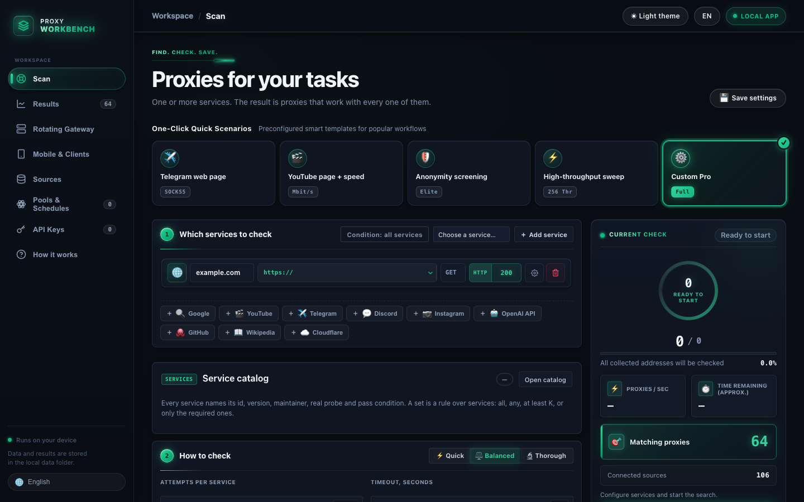
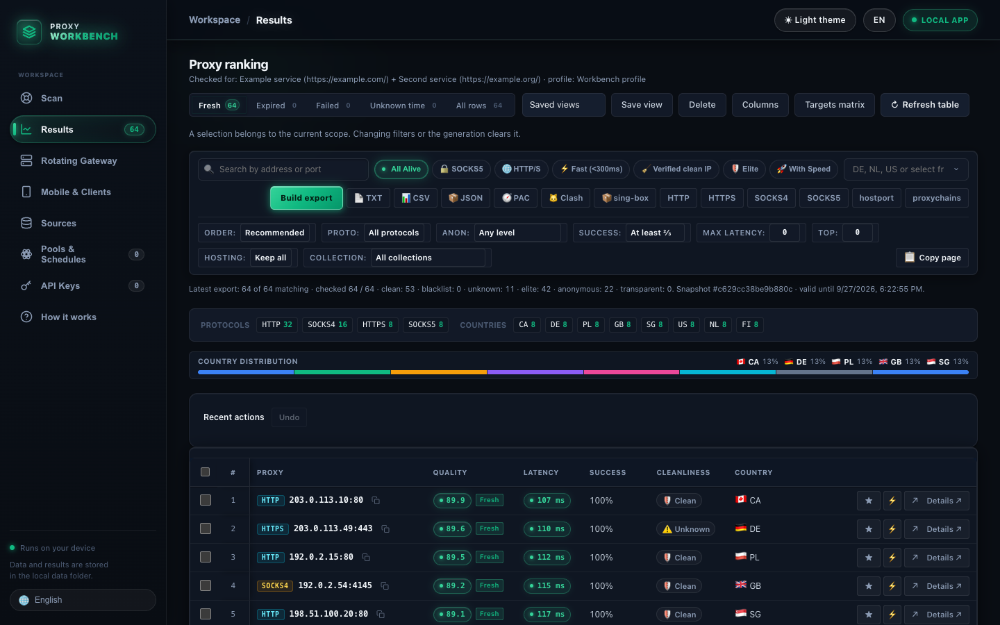
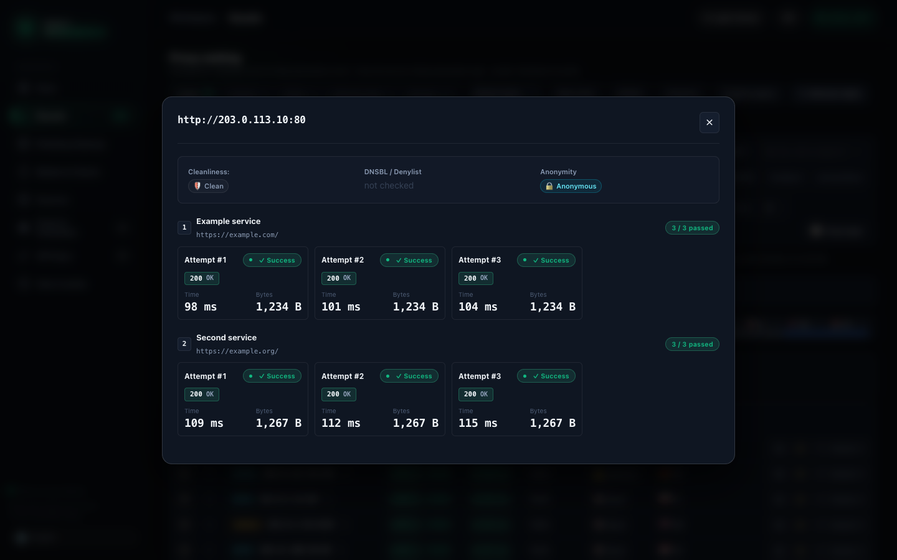
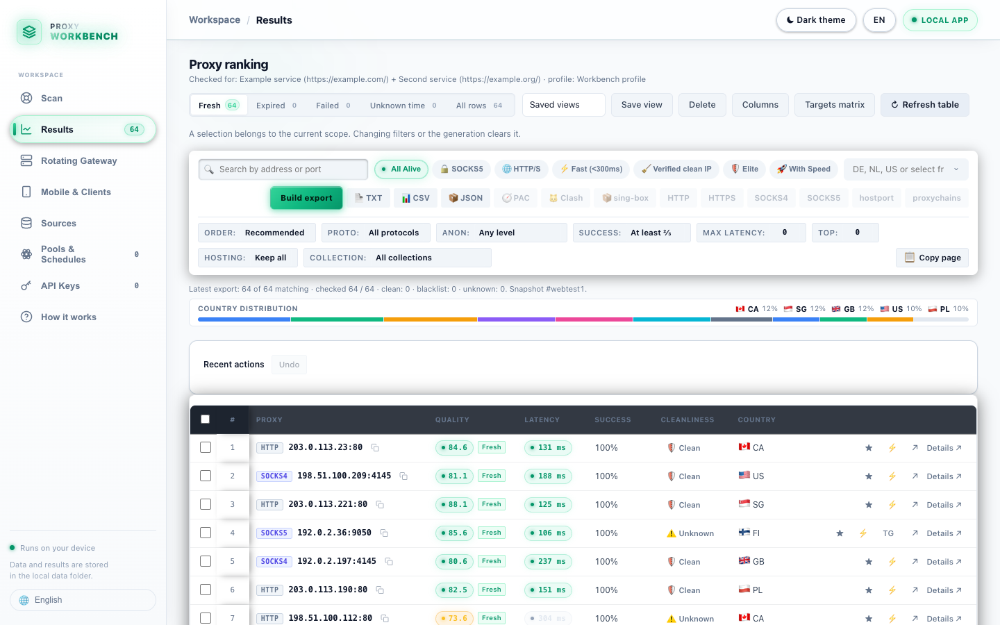
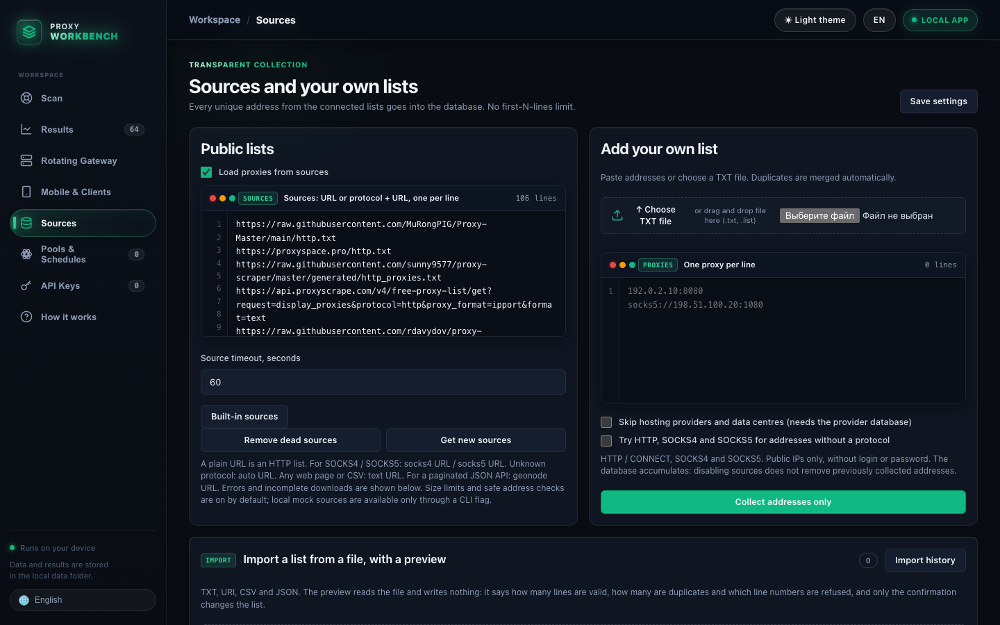
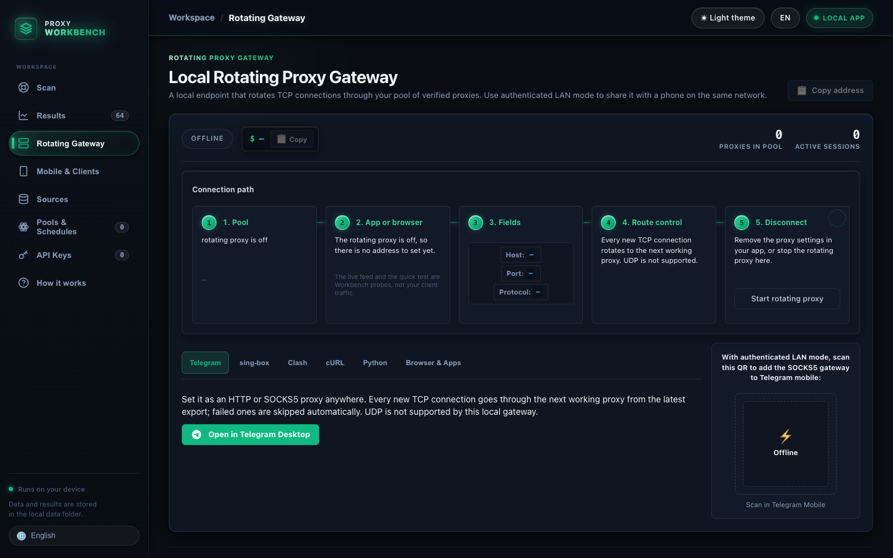
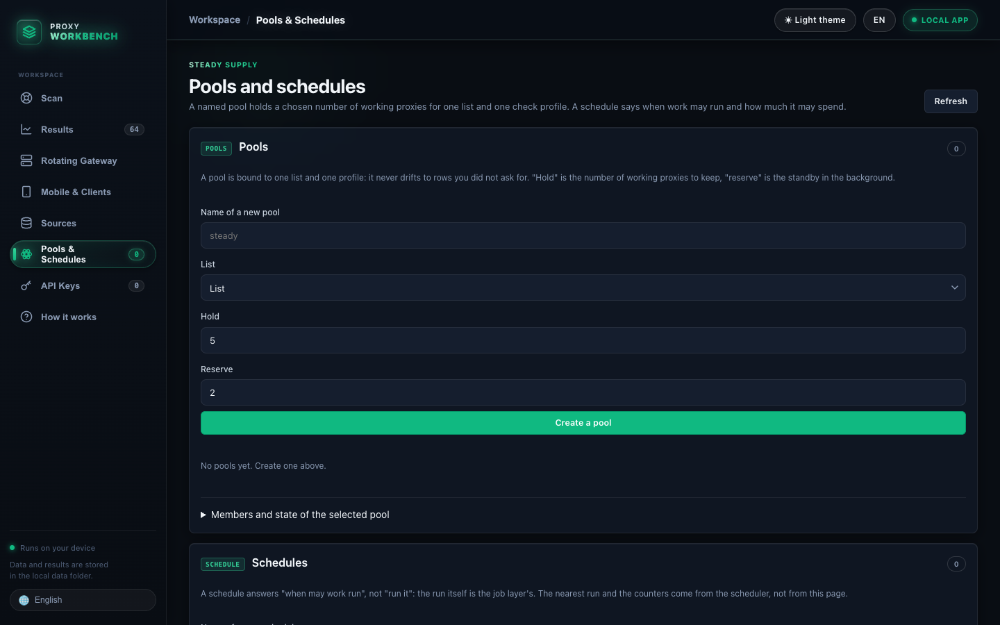
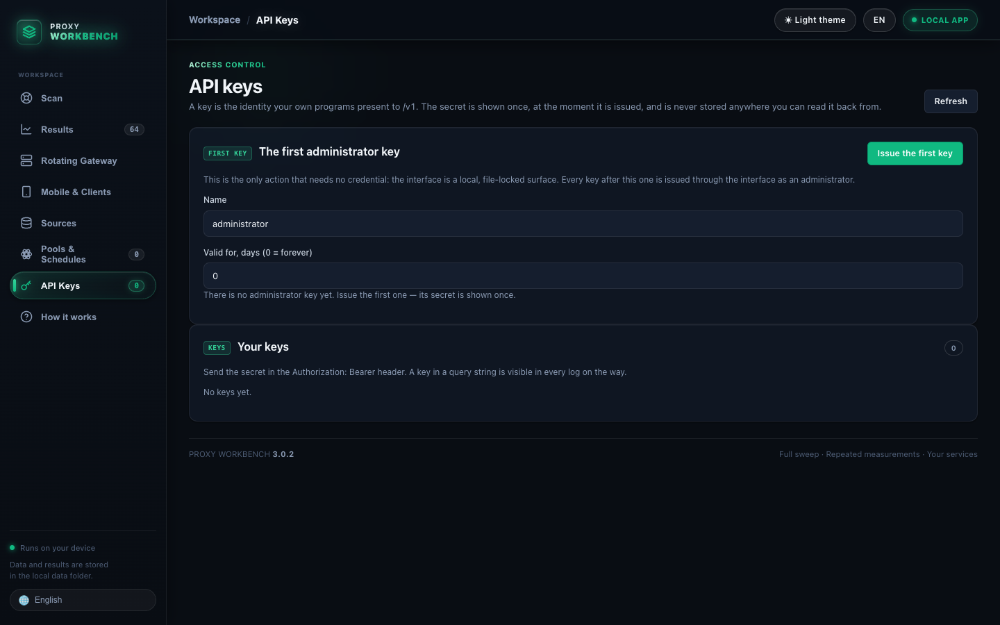
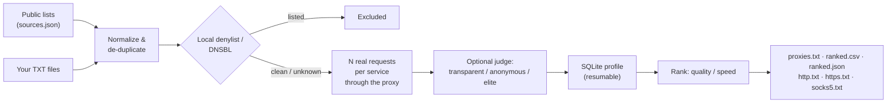

<div align="center">


# Proxy Workbench

### Find proxies that work for the sites you use

Collect addresses from public lists or your own files, check them against your services, and use the results in apps, exports, or scripts. Proxy Workbench runs locally with a browser interface, CLI, rotating proxy gateway, and API.

**Windows · macOS · Linux** &nbsp;|&nbsp; **HTTP(S) · SOCKS4 · SOCKS5** &nbsp;|&nbsp; **12 interface languages**

[](https://github.com/DavidVoitenko/proxy-workbench/actions/workflows/ci.yml)
[](https://github.com/DavidVoitenko/proxy-workbench/releases/latest)


**English** · [Русский](README.ru.md)

[Download](https://github.com/DavidVoitenko/proxy-workbench/releases/latest) · [Website](https://davidvoitenko.github.io/proxy-workbench/) · [Quick start](#-quick-start) · [Interface](#-the-eight-tabs) · [CLI](#-command-line) · [API](#-local-api-use-the-proxies-from-your-own-code)

<br>


<sub>Interface tour with synthetic example data. Actual proxy availability depends on the sources and your checks.</sub>

</div>

---

## What it does

Free proxy lists go stale quickly. Proxy Workbench turns candidates into a list measured against your own success criteria:

1. **Collect:** choose from a catalog of **150 entries**; **106 supported feeds** are enabled by default for new installations. You can also import your own list. Addresses are normalized and deduplicated.
2. **Check:** make real requests through each candidate to one or more target URLs. Set accepted HTTP status codes, body text or hash, retry threshold, timeouts, and optional reputation or anonymity checks.
3. **Use:** filter and export the results, connect to the local rotating gateway at `127.0.0.1:8899`, or read the latest published list from the API. Pools and schedules can refresh it.

The interface and its local API bind to loopback by default. The headless service can be exposed deliberately with a separate API token.

## 📸 Screenshots

<table>
<tr>
<td width="50%"><br><sub><b>Scan</b> — configure targets and follow progress</sub></td>
<td width="50%"><br><sub><b>Results</b> — review, filter, rank, and export</sub></td>
</tr>
<tr>
<td width="50%"><br><sub><b>Details</b> — inspect individual attempts and errors</sub></td>
<td width="50%"><br><sub><b>Light theme</b> — switch from the header</sub></td>
</tr>
<tr>
<td width="50%"><br><sub><b>Sources</b> — bundled catalog and your own lists</sub></td>
<td width="50%"><br><sub><b>Rotating Gateway</b> — connection setup and route controls; offline until started</sub></td>
</tr>
<tr>
<td width="50%"><br><sub><b>Pools &amp; Schedules</b> — desired size, reserve, and refresh rules</sub></td>
<td width="50%"><br><sub><b>API Keys</b> — permissions and limits; no secrets shown</sub></td>
</tr>
</table>

<sub>Proxy results, metrics, and locations shown here are synthetic; IPs use RFC 5737 documentation ranges. The Sources catalog is the bundled catalog. No working public proxy is implied.</sub>

## 🧭 The eight tabs

| Tab | What you do there |
| --- | --- |
| **Scan** | Choose target sites and success rules, use a preset or tune the check, start and resume a scan, and follow live progress. |
| **Results** | Inspect fresh, expired, failed, and unknown results; filter and sort proxies; review individual attempts; build TXT, CSV, JSON, PAC, Clash, and sing-box exports. |
| **Rotating Gateway** | See gateway health and pool size, copy its local HTTP/SOCKS5 endpoint, and get client setup examples. |
| **Mobile & Clients** | Copy or download sing-box and Clash/Mihomo configs. Set up Telegram through a link, or a QR code after enabling authenticated LAN mode. |
| **Sources** | Select supported public feeds, import your own lists, inspect source yield and errors, and manage the optional country database. |
| **Pools & Schedules** | Keep a target number of passing proxies for a list and profile; set refresh intervals, quiet hours, and budgets. |
| **API Keys** | Issue and manage scoped keys for the authenticated `/v1` control API. Secrets are shown once. |
| **How it works** | Follow the workflow, read setup guidance, investigate empty results, and access diagnostics and maintenance tools. |

The interface has dark and light themes and 12 languages. HTTP(S), SOCKS4, SOCKS5 and IPv6 are supported. Checks can use several target URLs, repeated attempts, status/body/hash conditions, a local denylist, optional DNSBL zones, and an optional anonymity judge. The full options are documented in the [CLI](#-command-line), [gateway](#-rotating-proxy-gateway), and [API](#-local-api-use-the-proxies-from-your-own-code) sections below.

## 🚀 Quick start

Choose the build for your system. The [latest release](https://github.com/DavidVoitenko/proxy-workbench/releases/latest) has installers, portable archives, checksums, and a Python wheel.

| System | Install or run | Requirements |
| --- | --- | --- |
| **macOS, Apple Silicon** | Download `proxy-workbench-3.0.4-macos-arm64.dmg`; drag the app into Applications. | No Python needed |
| **macOS, Intel** | Download `proxy-workbench-3.0.4-macos-x86_64.dmg`; drag the app into Applications. | No Python needed |
| **Windows x64** | Run `proxy-workbench-3.0.4-windows-x64-setup.exe`; a portable ZIP and separate CLI `.exe` are also available. | No Python needed |
| **Linux, or any OS with Python** | `pipx install git+https://github.com/DavidVoitenko/proxy-workbench` then `proxy-workbench` | Python 3.11+ and [pipx](https://pypa.io/pipx/) |
| **Source checkout** | `Start.bat` on Windows, `Start.command` on macOS, or `./run.sh` on Linux. | Python 3.11+ |
| **Docker server/NAS** | Set `PROXY_WORKBENCH_API_TOKEN` and run `docker compose up -d` with [`compose.yml`](compose.yml). | Docker; headless CLI/API/gateway, no GUI |

`proxy-workbench` without arguments starts the application: the interface opens in your browser, and on macOS a menu bar item shows what is happening and offers pause, start, “start at login” and quit. Starting it a second time reaches the one that is already running instead of opening a rival. `proxy-workbench run …` and the other commands below work the same way as `./run.sh …`.

```sh
proxy-workbench                  # the application: interface + menu bar + one instance
proxy-workbench gui              # the interface alone, no menu bar
proxy-workbench --no-desktop     # the same, spelled the other way
proxy-workbench --print-paths    # which data/cache/log folders this launch would use
```

Installed builds keep their data in your own per-user folders (`%LOCALAPPDATA%\proxy-workbench`, `~/Library/Application Support/proxy-workbench` or `~/.local/share/proxy-workbench`) and never write into their own program folder; a source checkout keeps `data/` next to the project; `PROXY_WORKBENCH_DATA` overrides all of it. Portable mode is opt-in: put an empty `proxy-workbench-portable.json` next to the program and it keeps its data beside itself.

Release installers are **not code-signed**. macOS Gatekeeper or Windows SmartScreen may ask you to confirm the first run. Compare the published SHA-256 checksum if you want to verify the downloaded file; a checksum does not establish the publisher's identity.

1. In **Scan**, add your target URL and success rules (status code and, when useful, expected text). A proxy must pass each selected target.
2. Press **Find and check**. You can stop and later resume from saved progress.
3. In **Results**, review attempts, select filters and sort order, press **Build export**, and download the format you need.

Closing the browser tab does not stop the check. Quitting from the menu bar (or `Ctrl+C` in a terminal launch) stops it.

**Scope and limits:** free proxy addresses can disappear or change without notice; a passing check applies to the targets and time measured, not every site or future connection. Country lookup needs the optional offline database, and anonymity classification needs a judge endpoint. The local gateway handles TCP through HTTP or SOCKS5; it does not support SOCKS5 UDP ASSOCIATE. Docker runs without the browser GUI.

## 🧭 How it works


```mermaid
flowchart LR
    A["Public lists<br/>(sources.json)"] --> C["Normalize &<br/>de-duplicate"]
    B["Your TXT files"] --> C
    C --> D{"Local denylist /<br/>DNSBL"}
    D -- listed --> X["Excluded"]
    D -- "clean / unknown" --> E["N real requests<br/>per service<br/>through the proxy"]
    E --> J["Optional judge:<br/>transparent / anonymous / elite"]
    J --> F["SQLite profile<br/>(resumable)"]
    F --> G["Rank: quality / speed"]
    G --> H["proxies.txt · ranked.csv · ranked.json<br/>http.txt · https.txt · socks5.txt"]
```

**Scoring.** `speed` sorts by median time of a full successful request (connect + TLS + response), `stability` by the lowest jitter. `quality` uses

```text
score = 100 × (lowest success rate among targets) / (1 + (median_ms + stdev_ms) / 1000)
```

so a proxy has to be both reliable _for every service_ and fast to rank high.

**Profiles.** Target URLs, checks, headers, request profile, cleanliness policy, attempts, timeout and response-size limit together form a _profile_. Re-running the same profile resumes it; changing any of them starts a separate result set, so old and new measurements never mix.

## 💻 Command line

`proxy-workbench <command>` (pipx or the `.exe`), `./run.sh <command>` in a source folder on macOS/Linux, or `.venv\Scripts\python proxytool.py <command>` in a source folder on Windows. Messages follow your system language (English or Russian); set `PROXY_WORKBENCH_LANG=en` or `ru` to choose. `--help` lists every option with examples.

```sh
# Collect from all sources and check every candidate against example.com
./run.sh run

# Check against your own endpoint
./run.sh run --url https://example.org/health

# Several services, status/body/hash checks: copy the example config first
cp service.example.json data/service.json
./run.sh run --config data/service.json

# Only your own list, no public sources, separate data folder
./run.sh run --no-sources --input data/my-proxies.txt --data data/my-run

# Resume after Ctrl+C / re-check everything from scratch
./run.sh scan --config data/service.json
./run.sh scan --config data/service.json --recheck

# Export without new requests
./run.sh export --top 500 --sort quality
./run.sh export --top 0 --sort speed --min-success 1
./run.sh export --protocol socks5 --max-latency 800 --sort stability

# Need just 20 working German or Dutch SOCKS5 proxies, fast
./run.sh update-geoip          # once: offline country database (DB-IP Lite, ~7 MB)
./run.sh run --country DE,NL --protocol socks5 --want 20 --attempts 1

# Refresh only the proxies that currently pass
./run.sh scan --recheck-passing
# ...or keep the list fresh automatically every 30 minutes (Ctrl+C to stop)
./run.sh run --want 50 --watch 30

# Rate anonymity with an echo judge and keep only elite proxies
./run.sh run --judge-url http://judge.example/azenv.php --min-anonymity elite

# Tune performance and cleanliness
./run.sh run --workers 256 --rate 100 --timeout 8 --connect-timeout 3 --attempts 3
./run.sh run --no-fail-fast   # always run every attempt, e.g. for research
./run.sh run --dnsbl --dnsbl-zone bl.example.org --strict-clean

# Bound what one run may spend, and say what --want is counting
./run.sh run --max-requests 500000 --run-max-bytes 2147483648
./run.sh run --want 20 --count-what exit

# Measure the pipeline on a local fixture: no network, no public proxies
./run.sh bench --bench-items 2000 --bench-n 20

# Delete local databases and exports (keeps settings and denylist)
./run.sh clear-data --yes
```

<details>
<summary><b>Service config format</b> (<code>data/service.json</code>)</summary>

```json
{
  "request_profile": "workbench",
  "reputation": { "local_enabled": true, "dnsbl_enabled": false, "dnsbl_zones": [], "timeout": 2.5, "strict": false },
  "anonymity": { "judge_url": "http://judge.example/azenv.php" },
  "targets": [
    {
      "url": "https://example.com/",
      "method": "GET",
      "statuses": [200],
      "contains": "Example Domain",
      "headers": {}
    }
  ]
}
```

| Field | Meaning |
| --- | --- |
| `url` | Required HTTP/HTTPS URL. Redirects are not followed — use the final URL or allow the redirect status. |
| `method` | `GET` (default) or `HEAD`. |
| `statuses` | Accepted status codes, default 200–299. |
| `contains` | UTF-8 text that must be present in the body. |
| `sha256` | Expected SHA-256 of the full body. |
| `headers` | Safe headers only: `Accept*`, `Cache-Control`, `Pragma`, `User-Agent`, `X-Request-ID`, `X-Client-Version`. |
| `request_profile` | `workbench`, `standard` or `minimal` — neutral User-Agent/Accept presets. |
| `reputation` | Local denylist and DNSBL policy. |
| `anonymity.judge_url` | Optional echo endpoint for anonymity levels (see [FAQ](#-faq)). |

</details>

<details>
<summary><b>Source list format</b> (<code>proxy_workbench/sources.json</code>)</summary>

A JSON array of strings, one per source:

Fresh installations select the **all-supported** set (106 feeds), including the new catalog sources. The unchanged old 55-source default is upgraded while preserving pauses. Custom selections stay unchanged. In the Sources catalog choose **all-supported**, or run `./run.sh source set all-supported`; **quick** selects 8 feeds for a shorter collection. Catalog visibility (117 public-free entries) is separate from readable HTTP/SOCKS feeds: documentation, Tor/MTProto data and unsupported or restricted formats are not downloaded as proxy lists.

- `https://…/list.txt` — plain HTTP/CONNECT list (`IP:port` or `scheme://IP:port`);
- `socks4 https://…/list.txt` / `socks5 https://…/list.txt` — SOCKS lists without a scheme;
- `auto https://…/list.txt` — protocol unknown: every address is tried as HTTP, SOCKS4 and SOCKS5;
- `text https://…` — any web page, CSV or HTML table: every `ip:port` in it is collected;
- `http-fields https://…` — `IP:port:country` lines;
- `geonode https://proxylist.geonode.com/api/proxy-list?...` — paginated Geonode JSON API.

Remote lists are streamed with limits (32 MiB, 64 KiB per line, 500,000 candidates, 5 redirects by default; see `--source-max-*`). Per-source results are written to `data/sources-report.json`. Authenticated proxies, hostnames and non-public IPs are rejected. `--detect-protocols` tries addresses without a protocol from your own `--input` files as HTTP, SOCKS4 and SOCKS5.

</details>

<details>
<summary><b>All CLI options</b></summary>

Run `./run.sh --help` for the complete list: `--input`, `--sources`, `--no-sources`, `--source-timeout`, `--url`, `--config`, `--request-profile`, `--attempts`, `--timeout`, `--workers`, `--rate`, `--max-bytes`, `--denylist-file`, `--local-denylist/--no-local-denylist`, `--dnsbl`, `--dnsbl-zone`, `--reputation-timeout`, `--strict-clean`, `--judge-url`, `--min-anonymity`, `--connect-timeout`, `--fail-fast/--no-fail-fast`, `--protocol`, `--max-latency`, `--country`, `--want`, `--count-what`, `--max-requests`, `--run-max-bytes`, `--geoip-db`, `--recheck`, `--recheck-passing`, `--watch`, the `bench`, `update-geoip` and `serve` commands with `--bench-items`, `--bench-n`, `--host`, `--port`, `--api-token`, `--top`, `--sort`, `--min-success`, `--data`.

| Flag | What it actually is |
| --- | --- |
| `--workers N` | **A ceiling, not a number of simultaneous checks.** The pipeline starts fewer threads when there is less work, when the source list is small, or when the rate limit says so; `N` is the most that may ever run at once. Raising it above the default (128) can only help a run that is genuinely concurrency-bound. |
| `--rate N` | Requests per second across the whole run. With a rate set, concurrency is reduced to whatever the rate allows, so `--workers` stops being the binding constraint. |
| `--max-requests N` | Request budget for one run. `0` means no ceiling. When the budget is spent the run **stops**; it does not go on recording the addresses it never got to as failed. |
| `--run-max-bytes N` | Byte budget for one run, counted over what the run actually transferred. `0` means no ceiling. Same rule as above. |
| `--want N` | Stop once N usable proxies are found; `0` (default) checks everything. |
| `--count-what endpoint\|ip\|exit` | What `--want` counts: candidate endpoints, unique IPs behind them, or IPs a check confirmed as the exit address. These are three different numbers, and the default (`endpoint`) is the one that is easiest to reach. |
| `bench` | Runs the pipeline against a **local synthetic fixture** and prints throughput, time to first result and time to N. No sockets, no DNS, no public proxies — a number from `bench` is a measurement of the pipeline, not of the internet. |

</details>

## 🔁 Rotating proxy gateway

While the GUI is open, `127.0.0.1:8899` works as one local proxy that rotates TCP connections through all working proxies of the latest export. The GUI also binds an authenticated LAN listener by default so a phone on the same Wi-Fi can use the Telegram QR; the QR contains the computer's LAN address and a per-session password. Allow the port in the local firewall. Use `--gateway-host 127.0.0.1` with `gui` if you want to disable LAN sharing.

The local endpoint is **HTTP/SOCKS5 TCP only**. SOCKS5 UDP ASSOCIATE, Telegram calls and games that require UDP are not implemented by this local gateway; use a dedicated VPN/tunnel for those workloads.

```sh
curl -x http://127.0.0.1:8899 https://example.org/
curl -x socks5h://127.0.0.1:8899 https://example.org/
```

- Every new TCP connection takes the next proxy (`--rotate random` picks at random).
- If a proxy fails, the same connection is retried through another one (up to 3). A proxy that fails twice rests for 5 minutes.
- Plain `http://` requests reach HTTP proxies directly, because many of them allow CONNECT only to port 443.

On a server, start it with `./run.sh gateway` and narrow the pool with the usual filters, for example `gateway --protocol socks5 --country DE --max-latency 1500`. Binding to a network address requires `--host 0.0.0.0 --lan` and a password: `--gateway-token <secret>`, or the `PROXY_WORKBENCH_GATEWAY_TOKEN` variable; when it is not given the gateway makes one and prints it. Clients then log in with any user name and that password, over HTTP Basic or SOCKS5 user/password.

**The gateway password is not the API token.** They are separate identities on purpose: whoever knows the password you handed to a phone must not be able to read the published snapshot, and a leaked API token must not be a working proxy. Pass `--api-token` to `serve` and `--gateway-token` to `gateway`; `compose.yml` shows both variables.

Browser without extensions: use `http://127.0.0.1:8765/pac` as the automatic proxy configuration URL. It serves the 10 best matching proxies and accepts the same filters as the API, for example `/pac?country=DE`. `/clash` returns a complete Clash / Mihomo config.

## 🔑 API and keys: `/v1`

The read-only endpoints below need no key because they only answer on loopback. Everything under `/v1` is the control API, and it needs one.

**Get the first key from the machine itself.** The bootstrap is a local-only operation: the GUI's Help panel and the CLI on this computer. The secret is shown once.

```sh
./run.sh api-key bootstrap                       # print the first administrator secret
./run.sh api-key list
./run.sh api-key add reader --permission read.results
./run.sh api-key rotate <key-id>
./run.sh api-key revoke <key-id>
```

**Send it as a bearer token.** The machine-readable description of every operation is `proxy_workbench/openapi.json`; the running service also serves it at `GET /v1`.

```sh
curl -H "Authorization: Bearer $PROXY_WORKBENCH_KEY" http://127.0.0.1:8766/v1/status
curl -H "Authorization: Bearer $PROXY_WORKBENCH_KEY" http://127.0.0.1:8766/v1/results
```

```python
import httpx

key = open("/path/to/key").read().strip()
r = httpx.get("http://127.0.0.1:8766/v1/results",
              headers={"Authorization": f"Bearer {key}"}, timeout=10)
print(r.json()["items"][0]["proxy"])
```

```js
const key = process.env.PROXY_WORKBENCH_KEY;
const r = await fetch("http://127.0.0.1:8766/v1/results", {
  headers: { Authorization: `Bearer ${key}` },
});
console.log((await r.json()).items[0].proxy);
```

**What a key may do.** Permissions (`read.results`, `jobs.submit`, `export.create`, `admin.keys`, …) say *which* operations are allowed; the resource scope says *over what*: a key scoped to a collection does not see another collection's results, jobs, export artifacts or pool, and an object outside the scope answers exactly as a missing one does. A proxy's credentials never leave the vault — a secret-bearing export writes a reference to the vault entry, and asking for it is a separate permission (`export.secret`).

`./run.sh diagnose zero` (and `GET /v1/diagnostics/zero`) answers "why did I get zero proxies" with a code, a stage, the counters and the action to take, instead of a traceback.

## 🔌 Local API: use the proxies from your own code

While the GUI is open, a read-only API runs on `http://127.0.0.1:8765` (this computer only). On a server, start it with `./run.sh serve` (Windows: `.venv\Scripts\python proxytool.py serve`). It serves the latest export and picks up every new one automatically, so it can run next to `run --watch`.

| Request | Returns |
| --- | --- |
| `GET /random` | one random working proxy; `limit=5` for several |
| `GET /proxies` | all working proxies, best first (the export order) |
| `GET /pac` | proxy auto-config for browsers with the 10 best matching proxies |
| `GET /clash` | Clash / Mihomo config with an automatic fastest-proxy group |
| `GET /status` | how many are available, when the export was built, which services were checked |

Filters for `/random` and `/proxies`: `protocol=http\|https\|socks5`, `country=DE,NL`, `max_latency=800` (ms), `anonymity=anonymous\|elite`, `limit=N`, `format=json\|txt\|hostport`.

```sh
curl "http://127.0.0.1:8765/random?protocol=socks5&country=DE&format=txt"
# socks5://203.0.113.7:1080
```

```python
import httpx

proxy = httpx.get("http://127.0.0.1:8765/random?protocol=http&max_latency=1500&format=txt").text.strip()
print(httpx.get("https://example.org/", proxy=proxy, timeout=15).status_code)
```

JSON rows contain `proxy`, `protocol`, `host`, `port`, `country`, `exit_ip`, `exit_country`, `anonymity`, `latency_ms`, `jitter_ms`, `reliability`, `uptime`, `checks`, `score`, `checked_at`. The GUI shows the address with a **Copy** button under the download buttons; change the port with `gui.py --api-port 9000` or turn it off with `--no-api`.

To reach the API from other machines (for example from Docker), bind it to a network address and set a token: `serve --host 0.0.0.0 --api-token <secret>` or the `PROXY_WORKBENCH_API_TOKEN` variable. Clients then send `Authorization: Bearer <secret>`.

## 🐳 Docker (headless CLI)

Run scans on a server or NAS without installing Python. The image contains the CLI only; the browser GUI stays on your own machine.

```sh
docker build -t proxy-workbench .
mkdir -p data
docker run --rm --user "$(id -u):$(id -g)" -v "$PWD/data:/app/data" \
  proxy-workbench run --url https://example.org/health --judge-url http://judge.example/azenv.php
```

Serve fresh proxies to other containers: one container re-checks, the other answers API requests from the same data folder.

```sh
docker run -d --name pw-check --user "$(id -u):$(id -g)" -v "$PWD/data:/app/data" proxy-workbench run --want 50 --watch 30
docker run -d --name pw-api --user "$(id -u):$(id -g)" -p 127.0.0.1:8765:8765 -e PROXY_WORKBENCH_API_TOKEN=change-me \
  -v "$PWD/data:/app/data" proxy-workbench serve --host 0.0.0.0
docker run -d --name pw-gateway --user "$(id -u):$(id -g)" -p 127.0.0.1:8899:8899 -e PROXY_WORKBENCH_GATEWAY_TOKEN=another-secret \
  -v "$PWD/data:/app/data" proxy-workbench gateway --host 0.0.0.0 --lan
```

Every release also publishes a ready image to the GitHub Container Registry. It appears under **Packages** in the repository sidebar as `ghcr.io/<owner>/proxy-workbench:<version>` and `:latest`. Results land in the mounted `data/` folder exactly as with a local install.

## 📁 Where your data lives

Everything is written to one data folder. Which folder that is depends on how you run the product, and the answer is printed by `./run.sh --print-paths`:

| How you run it | Data folder |
| --- | --- |
| Source checkout (`./run.sh`, `Start.bat`, `Start.command`) | `data/` next to the project (git-ignored) |
| pipx / `pip install` | the same `data/`-style folder next to the installed command, or your user profile |
| Installed build (`.app`, `.exe`) | your own per-user folders: `~/Library/Application Support/proxy-workbench` on macOS, `%LOCALAPPDATA%\proxy-workbench` on Windows, `$XDG_DATA_HOME/proxy-workbench` on Linux |
| Portable build (only if you ask for it) | next to the program, inside the `.app` or beside the `.exe` |

An installed program **never** writes into its own folder: `.app` bundles and `Program Files` are read-only, and a build that tried would not start. Portable mode is opt-in (a `proxy-workbench-portable.json` file next to the program) and never happens just because a folder happens to be writable.

| Path | Content |
| --- | --- |
| `data/proxies.sqlite3` | candidates, profiles and every measurement |
| `data/exports/` | `proxies.txt`, `ranked.csv`, `ranked.json`, `http.txt`, `https.txt`, `socks4.txt`, `socks5.txt`, `hostport.txt`, `proxychains.txt`, `proxy.pac`, `clash.yaml`, `status.json` |
| `data/sources-report.json` | per-source rows, rejects and errors |
| `data/geoip/dbip-country-lite.csv.gz` | optional offline country database |
| `data/denylist.txt` | your IP / CIDR / proxy rules (`#` comments allowed) |
| `data/gui-settings.json` | GUI settings |

Delete it any time with `./run.sh clear-data --yes` or the button on the **How it works** tab.

## 🛠 Troubleshooting

- **macOS blocks `Start.command`:** right-click → Open once, or run `./run.sh` from Terminal.
- **Windows says Python is missing:** install Python 3.11+ from python.org with the *py launcher* option enabled.
- **Wrong Python / broken environment:** delete only the `.venv/` folder and start the launcher again.
- **“Data folder is busy”:** another GUI or CLI process uses the same `data/` folder — stop it first.
- **No results:** check the **Sources** report, your denylist, DNSBL zones and whether the target URL itself is reachable.

## ❓ FAQ

**Does this make me anonymous?**
No. Proxy Workbench measures _reachability and latency_. A public proxy sees your IP, your destination and — for plain HTTP — your traffic. Never send passwords, cookies or tokens through untrusted public proxies. Proxy Workbench itself sends no telemetry and has no accounts.

**How long does a full scan take?**
There is no fixed duration: it depends on the number of candidates, their timeouts, the target services, and your connection. Use fewer sources or the **Quick** preset for a shorter run. Progress is saved so you can stop and resume later.

**Why did a proxy that works in my browser fail here?**
Redirects are not followed, TLS certificates are verified, and each target must pass on its own threshold. Check **Details** for the exact error of every attempt.

**What do transparent / anonymous / elite mean, and which judge should I use?**
A *judge* is any page that echoes back the IP and headers it received — for example an `httpbin`-style `/get` endpoint or an `azenv.php` script (ideally one you host yourself). Proxy Workbench asks it once directly to learn your public IP (kept in memory only, never saved), then once through every working proxy:

| Level | Meaning |
| --- | --- |
| `transparent` | your real IP is visible to the site |
| `anonymous` | your IP is hidden, but the proxy announces itself (`Via`, `X-Forwarded-For`, …) |
| `elite` | neither your IP nor proxy headers are visible |
| `unknown` | the judge request through the proxy failed |

Use an **`http://`** judge: through an HTTPS tunnel a proxy cannot add headers, so every proxy would look elite.

**I only need a few proxies. Do I have to wait for the whole list?**
No. Set **Stop after finding** in the GUI or `--want 20` in the CLI. Addresses that worked in earlier scans are tried first, the rest in random order, and the scan stops as soon as 20 match. Run it again later to continue where it stopped. The **Quick** preset (1 attempt, short timeouts) makes it even faster.

**Free proxies die quickly. How do I keep my list working?**
Press **Re-check only matching proxies** (or `./run.sh scan --recheck-passing`): only the proxies that currently pass are measured again. `--watch 30` repeats this every 30 minutes and rewrites the export files each time. Sort by **uptime** to put the proxies that survived the most re-checks first.

**How do I get proxies from a specific country?**
Download the country database once (**Sources → Country database**, or `./run.sh update-geoip`), then enter the countries (`DE, NL`) in the GUI or pass `--country DE,NL`. Addresses from other countries are skipped before any request is sent. Results from a country-limited run are kept, so a later run for all countries does not check them again. Country data: [DB-IP](https://db-ip.com) (CC BY 4.0) plus the country field of Geonode sources.

**What does “clean” mean?**
The IP is not in your local denylist and (if enabled) not listed by the DNSBL zones you chose. It is a reputation signal, not a guarantee of safety.

**Can I use my own proxy list only?**
Yes: `--no-sources --input my.txt`, or paste/upload a TXT on the **Sources** tab.

**What may I check?**
Check only endpoints and sources you are allowed to use, and follow the applicable service terms and laws.

## 🗺 Roadmap

- [x] Interface in 12 languages
- [x] `pipx install` and a single `proxy-workbench` command
- [x] Desktop app: macOS menu bar, Windows installer, per-user data folders
- [x] Persistent pools, schedules, profiles with revisions and list import
- [x] API keys with permissions, scope, rotation and audit
- [x] Diagnostics funnel, backups and restore with preview
- [ ] Checking proxies that need a login
- [ ] Signed and notarized builds, automatic updates
- [ ] PyPI package
- [x] Anonymity level detection (transparent / anonymous / elite)
- [x] Per-protocol `host:port` exports
- [x] Country column and filters from a local GeoIP database
- [x] “Find N and stop” mode and presets
- [x] Re-check only matching proxies, `--watch` auto-refresh and uptime history
- [x] Source ratings and proxychains export
- [x] Docker image for headless servers

Have an idea? Open a [feature request](https://github.com/DavidVoitenko/proxy-workbench/issues/new/choose) or start a [discussion](https://github.com/DavidVoitenko/proxy-workbench/discussions).

## 🤝 Contributing

Bug reports, new sources, translations and code are welcome — open an [issue](https://github.com/DavidVoitenko/proxy-workbench/issues) or a pull request. Tests run entirely on local mocks:

```sh
python -m unittest discover -s tests -v
```

Found a vulnerability? Please report it privately through [GitHub security advisories](https://github.com/DavidVoitenko/proxy-workbench/security/advisories/new) rather than a public issue.

If Proxy Workbench saved you time, **a ⭐ on GitHub helps other people find it.**

## ⚖️ Responsible use

Proxy Workbench is intended for engineering experiments, availability benchmarking and defensive quality checks — not for bypassing access controls, abusing services or hiding identity for unlawful purposes. Use only sources and endpoints you are allowed to test and respect provider terms and applicable law.

## 📜 License

[MIT](LICENSE). Built-in source lists belong to their respective maintainers; their content, availability and licensing may change at any time.
