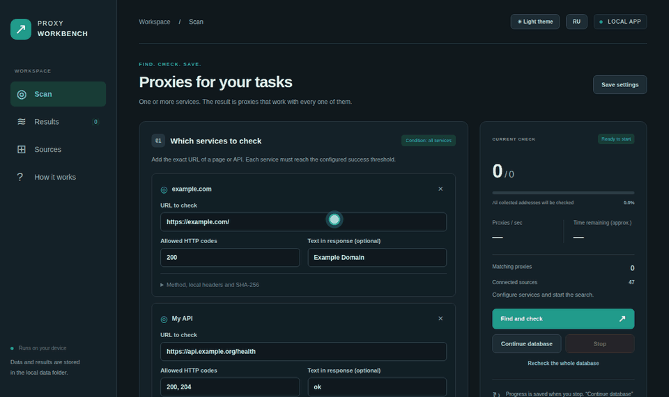
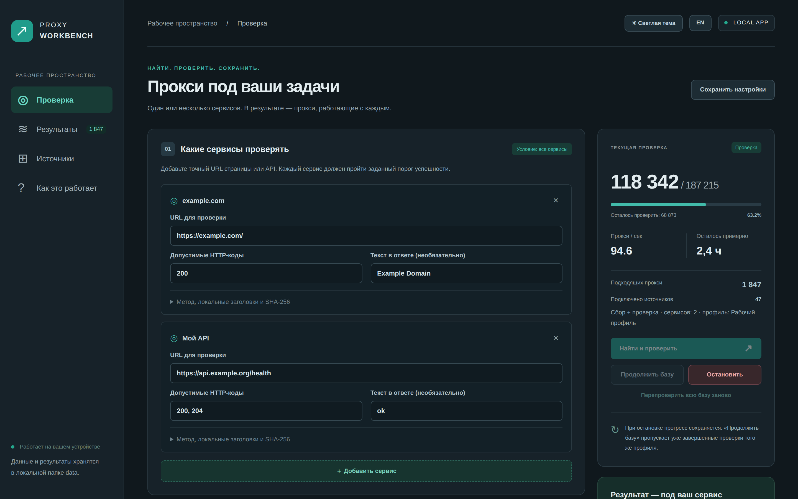
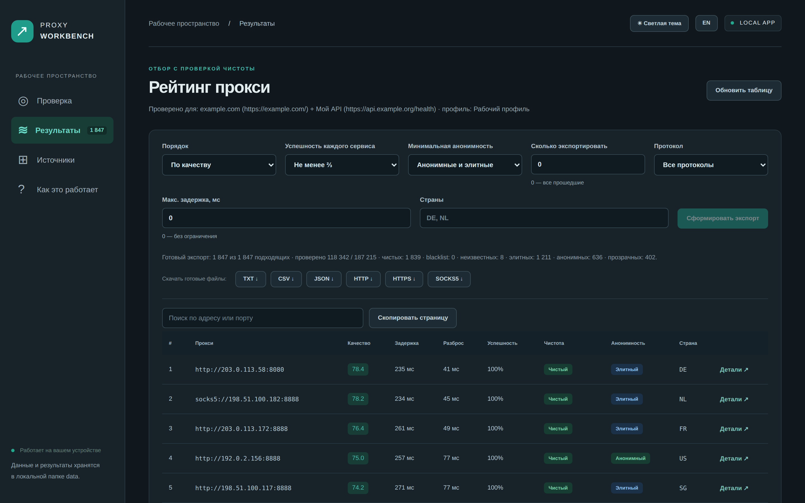
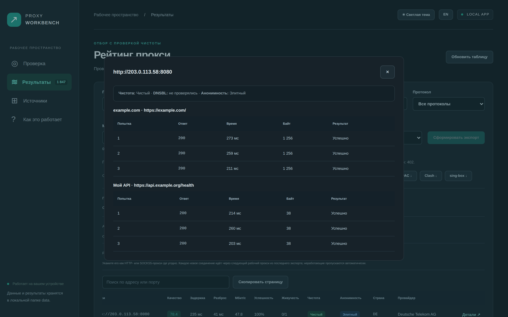
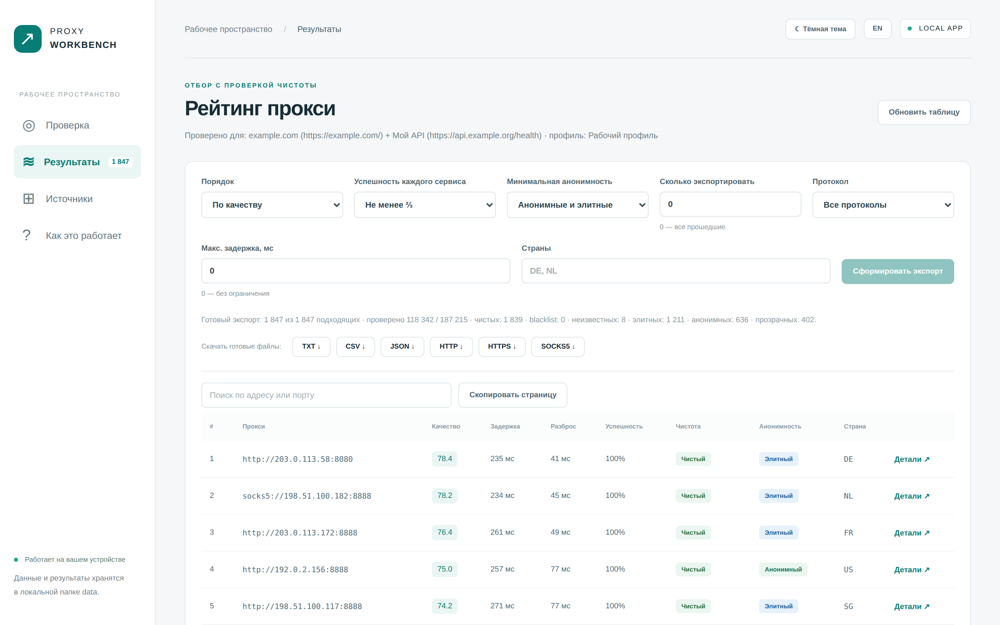

<div align="center">


# Proxy Workbench

**Собирает бесплатные публичные прокси из 55 открытых списков и веб-страниц, проверяет каждый на _ваших_ сервисах и оставляет только быстрые, стабильные, чистые и анонимные.**

Локальный GUI в браузере (русский / английский) + CLI · HTTP / HTTPS (CONNECT) / SOCKS5 · уровни анонимности · продолжение после остановки · без аккаунтов и телеметрии


-42bbaa)


[English](README.md) · **Русский**

[Быстрый старт](#-быстрый-старт) · [Возможности](#-возможности) · [Командная строка](#запуск-через-командную-строку) · [Чистота](#проверка-чистоты-и-локальный-denylist) · [Анонимность](#проверка-анонимности) · [FAQ](#-частые-вопросы) · [Планы](#-планы)

<br>



<sub>15 секунд: запуск проверки → рейтинг → фильтр «только элитные» → детали попыток → переключение EN/RU (синтетические данные).</sub>

</div>

---

> **Статус:** публичная beta. Проект измеряет доступность и задержку; он не обещает анонимность, безопасность или стабильную работу сторонних прокси.

## Зачем это нужно

Списков бесплатных прокси много, но большая часть адресов в них мёртвые, медленные или заблокированы именно на том сайте, который вам нужен. Прокси, который открывает `example.com`, может не работать с вашим API, отдавать капчу с кодом `200` или находиться в спам-блеклисте.

**Proxy Workbench отвечает на практический вопрос: _какие из этих прокси действительно работают с моим сервисом прямо сейчас и насколько хорошо?_**

- Собирает кандидатов из десятков публичных списков (или ваших файлов) и убирает дубликаты.
- Делает **настоящие HTTP(S)-запросы через каждый прокси** ко всем указанным сервисам — несколько раз — и проверяет HTTP-код, текст ответа или SHA-256.
- Ранжирует прошедшие по **медианной задержке, разбросу и доле успехов**, отмечает **адреса из блеклистов** (локальный denylist + опциональные DNSBL), определяет **уровень анонимности** (прозрачный / анонимный / элитный) и экспортирует TXT / CSV / JSON и готовые списки `host:port` по протоколам.

Всё работает на вашем компьютере. Интерфейс слушает только `127.0.0.1`.

## 📸 Скриншоты

<table>
<tr>
<td width="50%"><br><sub><b>Проверка</b> — сервисы, правила успеха и живой прогресс</sub></td>
<td width="50%"><br><sub><b>Результаты</b> — рейтинг по качеству или скорости с оценкой чистоты</sub></td>
</tr>
<tr>
<td width="50%"><br><sub><b>Детали</b> — каждая попытка по каждому сервису</sub></td>
<td width="50%"><br><sub><b>Светлая тема</b> — переключается одной кнопкой</sub></td>
</tr>
</table>

<sub>На скриншотах синтетические данные из документационных диапазонов IP (RFC 5737).</sub>

## ✨ Возможности

| | |
| --- | --- |
| **55 встроенных источников** | Популярные списки на GitHub, ProxyScrape, постраничный API Geonode и веб-страницы с бесплатными прокси. Источником может быть любая страница, CSV или HTML-таблица: из неё вытаскивается каждый `ip:port`. Кнопки **Убрать мёртвые источники** и **Новые источники** поддерживают список в порядке в один клик. |
| **Протокол неизвестен? Не проблема** | Адреса без протокола можно проверить сразу как HTTP, SOCKS4 и SOCKS5: останется тот вариант, который работает. |
| **Протоколы** | HTTP, HTTPS/CONNECT, явные `https://`-прокси, SOCKS4, SOCKS5 / SOCKS5h, IPv4 и IPv6. |
| **Проверка на ваших сервисах** | Несколько targets в одном профиле (до 20 в GUI). Прокси проходит, только если работает со **всеми**. |
| **Строгие условия успеха** | Допустимые HTTP-коды, обязательный текст в ответе, ожидаемый SHA-256, `GET`/`HEAD`, безопасные заголовки. Отсекает капчи и заглушки с кодом `200`. |
| **Повторные замеры** | N попыток на сервис (по умолчанию 3), порог успешности для каждого сервиса, медиана задержки и разброс. |
| **Нужно всего несколько прокси или конкретная страна?** | `--want 20` останавливает проверку, как только найдено 20 подходящих; сначала проверяются адреса, которые уже работали. `--country DE,NL` пропускает все остальные страны *до* проверки, поэтому поиск по стране занимает минуты, а не часы. |
| **Всегда свежий список** | «Перепроверить только подходящие» обновляет текущий список за минуты; `--watch 30` делает это автоматически каждые 30 минут. У каждого прокси есть история живучести, по ней можно сортировать. |
| **Рейтинг источников** | На вкладке «Источники» видно, сколько рабочих прокси дал каждый список: мёртвые списки легко отключить и ускорить сбор. |
| **Пресеты** | «Быстро», «Баланс» и «Тщательно» настраивают попытки, таймауты и воркеры одной кнопкой. |
| **Уровни анонимности** | Укажите любую echo-страницу (judge), и каждый рабочий прокси получит уровень **transparent** (выдаёт ваш IP), **anonymous** (выдаёт себя заголовками `Via` / `X-Forwarded-For`) или **elite**. Фильтр в один клик или `--min-anonymity elite`. |
| **Проверка чистоты** | Локальный denylist (IP / CIDR / точный адрес) и опциональные DNSBL-зоны. Вердикты `clean`, `listed`, `local_denied`, `unknown`, строгий режим. |
| **Большие списки** | Ограниченная очередь, лимит частоты запросов, автоподбор числа воркеров. **Досрочная отбраковка** пропускает оставшиеся попытки, когда прокси уже не пройдёт порог, а короткий **таймаут подключения** быстро отсеивает мёртвые адреса: полный проход в худшем случае примерно в 3 раза быстрее. Проверено на 190 000 синтетических кандидатов. |
| **Остановка и продолжение** | Прогресс хранится в SQLite. `Ctrl+C` или **Остановить** сохраняет готовое; повторный запуск продолжает. |
| **Рейтинг и экспорт** | Сортировка `quality`, `speed`, `stability` или `uptime`; фильтры по протоколу, стране, максимальной задержке, анонимности и успешности; поиск по адресу или порту и копирование страницы в один клик. Экспорт топ-N или всех в `proxies.txt`, `ranked.csv`, `ranked.json`, а также `http.txt` / `https.txt` / `socks5.txt` / `hostport.txt` в формате `host:port` и готовый `proxychains.txt`. Crash-safe поколения экспорта. |
| **Локальное API для своих программ** | GUI (или команда `serve` на сервере) отвечает на `GET /random?protocol=socks5&country=DE` или `/proxies?max_latency=800&format=txt` самыми свежими рабочими прокси: скрипт, парсер или бот берёт прокси одним HTTP-запросом. |
| **Безопасность по умолчанию** | GUI только на loopback с токеном сессии и проверкой Host/Origin, защищённая загрузка источников (без private/metadata IP, проверка redirects, лимиты размера), credential-like заголовки отклоняются. |
| **Русский и английский интерфейс** | Кнопка EN/RU; по умолчанию язык браузера. Тёмная и светлая темы. |
| **Без настройки** | Запуск двойным кликом создаёт виртуальное окружение и ставит единственную зависимость `httpx[socks]`. |

## 🚀 Быстрый старт

Нужен **Python 3.11+**. Скачайте код (**Code → Download ZIP** или `git clone`) и запустите:

| ОС | Запуск интерфейса |
| --- | --- |
| **Windows** | двойной клик по `Start.bat` |
| **macOS** | двойной клик по `Start.command` |
| **Linux** | `./run.sh` (или `./run.sh gui`) |

На Windows нужен Python 3.11+ с Python Launcher (`py`). Первый запуск создаст `.venv/` и установит зависимость, затем откроется локальная страница в вашем браузере. По умолчанию включена тёмная тема; кнопка вверху переключает на светлую. Рядом кнопка EN/RU переключает язык интерфейса: по умолчанию используется язык браузера (русский для `ru`, иначе английский). Оба выбора сохраняются в браузере. Сервер доступен только на этом устройстве. Повторный запуск открывает уже работающий интерфейс.

1. В разделе **Проверка** добавьте один или несколько сервисов, HTTP-коды и при необходимости текст ответа. Условие **«все сервисы»** действует всегда.
2. При необходимости откройте **Источники**: редактируйте URL, добавьте свои списки вставкой или TXT-файлом. SOCKS-списки указываются как `socks4 URL` / `socks5 URL`, список с неизвестным протоколом — как `auto URL`, любая веб-страница или CSV — как `text URL`, Geonode JSON API — как `geonode URL`.
3. Нажмите **Найти и проверить**. Справа: прогресс, скорость обхода, оставшееся время и число подходящих прокси. **Остановить** сохраняет завершённые результаты; **Продолжить базу** продолжает текущий профиль без повторной загрузки источников.
4. В **Результатах** выберите порядок, порог успешности и количество, нажмите **Сформировать экспорт**, затем TXT / CSV / JSON. Кнопка **Детали** показывает каждую попытку по каждому сервису. Таблица обновляется при открытии, завершении проверки или кнопкой **Обновить таблицу**.

Кнопка **Перепроверить всю базу заново** заменяет результаты текущего профиля новыми. Изменение URL или параметров замера создаёт другой профиль. Настройки сохраняются по кнопке и при запуске. Завершённый экспорт остаётся доступным при следующем открытии.

Не закрывайте окно терминала, пока пользуетесь интерфейсом. Закрытие вкладки браузера не останавливает работу. Для выхода нажмите Ctrl+C в окне приложения: проверка остановится с сохранением прогресса.

Если переносите папку на другое устройство, не переносите `.venv`: на новом устройстве запускающий файл создаст окружение заново. ZIP содержит только исходники и инструкции, без баз, настроек и секретов.

## Запуск через командную строку

Сообщения выводятся на языке системы (русский или английский); выбрать явно можно переменной `PROXY_WORKBENCH_LANG=ru` или `en`. `--help` показывает все параметры с примерами.

В терминале, находясь в этой папке:

```sh
./run.sh run
```

Первый запуск создаст `.venv` и установит зависимость. Launcher сохраняет SHA-256 `requirements.txt` и повторно обновляет окружение при изменении зависимостей. Затем загрузит публичные списки из `sources.json`, удалит дубликаты и проверит **все** адреса. Число кандидатов зависит от источников: 190 тысяч не гарантированы. Нет ограничения на количество проверяемых адресов, общего таймера прохода или остановки при заполнении пула. Фильтры по стране, ChatGPT и инвойсам не выполняются; отдельно доступны локальный denylist и опциональные DNSBL-сигналы.

По умолчанию: HTTPS-запрос к `https://example.com/`, 3 независимых замера на адрес, таймаут 8 секунд на запрос, 128 параллельных проверок, до 100 стартов запросов/секунду. Нужны успешные ответы в двух из трёх попыток. При ограничении файловых дескрипторов число воркеров автоматически снижается.

На Windows или при ручной установке:

```sh
python -m venv .venv
# Windows:
.venv\Scripts\python -m pip install -r requirements.txt
.venv\Scripts\python proxytool.py run
# macOS/Linux:
.venv/bin/python -m pip install -r requirements.txt
.venv/bin/python proxytool.py run
```

## Проверять свой сервис

```sh
./run.sh run --url https://example.org/health
```

Для проверки определённого HTTP-кода, содержимого или нескольких адресов скопируйте `service.example.json` в `data/service.json`, укажите свои URL и запустите:

```sh
./run.sh run --config data/service.json
```

`targets` — список проверяемых адресов. Для каждого доступны:

- `url`: обязательный HTTP/HTTPS URL;
- `method`: `GET` или `HEAD`, по умолчанию `GET`;
- `statuses`: допустимые коды, по умолчанию 200–299;
- `contains`: строка, которая должна присутствовать в теле ответа в UTF-8;
- `sha256`: ожидаемый SHA-256 полного тела ответа, необязательно;
- `headers`: необязательные безопасные HTTP-заголовки (`Accept*`, `Cache-Control`, `Pragma`, `User-Agent`, `X-Request-ID`, `X-Client-Version`); произвольные credential-like заголовки отклоняются;
- `request_profile`: необязательный нейтральный пресет `workbench`, `standard` или `minimal`;
- `reputation`: необязательные параметры локального denylist и DNSBL (`local_enabled`, `dnsbl_enabled`, `dnsbl_zones`, `timeout`, `strict`).

Каждый адрес проверяется во всех попытках. Порог успешности применяется **к каждому** адресу сервиса, а не только к средней доле ответов. Редиректы не выполняются автоматически: задавайте конечный URL либо явно разрешите код редиректа. TLS-сертификаты проверяются. Секретные заголовки и конфиги храните только в `data/`; конфигурация проверки также сохраняется в локальной базе. Для HEAD не задавайте проверку тела.

Для замеров выбирайте небольшой стабильный endpoint. При большой странице увеличьте `--max-bytes`: превышение лимита считается ошибкой, а не успешным частичным ответом. Без `contains`/`sha256` проверяется только HTTP-код, поэтому страница заглушки с кодом 200 может пройти.

## Проверка чистоты и локальный denylist

В `data/denylist.txt` можно записать IP, IPv4/IPv6 CIDR, точный адрес прокси и комментарии с `#`. Список применяется при сборе, перед проверкой и повторно перед экспортом; совпадения считаются отдельно от невалидных строк. Файл находится в игнорируемой локальной папке и не содержит аккаунтов или секретов. Политику можно принудительно переключить флагами `--local-denylist` и `--no-local-denylist`.

Публичные DNSBL-проверки выключены по умолчанию. Включить их можно в GUI или CLI:

```sh
./run.sh run --dnsbl --dnsbl-zone bl.example.org --reputation-timeout 2.5
./run.sh run --dnsbl --dnsbl-zone bl.example.org --strict-clean
```

Каждая зона проверяется DNS-запросом без API-ключей; если список зон пуст, DNSBL фактически выключается. В результате отображаются `clean`, `listed`, `unknown` и `local_denied`; `listed` и `local_denied` не попадают в экспорт, а `unknown` исключается только в строгом режиме. Ошибка чтения denylist показывается как `unknown` и блокирует экспорт до исправления файла. Для новой политики или после её изменения используйте «Перепроверить»; это также обновляет профиль результатов. DNSBL — только сигнал репутации, а не доказательство анонимности или безопасности.

## Быстрый поиск: N прокси и нужные страны

Когда нужно всего несколько рабочих прокси, не обязательно ждать полный проход:

```sh
./run.sh update-geoip                      # один раз: офлайн-база стран DB-IP Lite (~7 МБ)
./run.sh run --country DE,NL --protocol socks5 --want 20 --attempts 1
```

- `--want N` (в GUI — «Остановиться после») завершает проверку, как только найдено N подходящих прокси. Непроверенные адреса остаются в очереди: следующий запуск того же профиля продолжит с них.
- Порядок проверки: сначала адреса, которые уже проходили в других профилях. В режиме `--want` остальные идут в случайном порядке, чтобы первые находки не были из одной подсети или одного источника; полный проход идёт по порядку, так быстрее пишется база.
- `--country DE,NL` (в GUI — «Страны») пропускает адреса других стран **до** отправки запросов. Страна берётся из данных Geonode и из офлайн-базы [DB-IP](https://db-ip.com) Country Lite (CC BY 4.0), которая скачивается командой `update-geoip` или кнопкой «Скачать / обновить» на вкладке «Источники».
- Фильтры страны и протокола не входят в профиль: результаты, полученные для DE, будут переиспользованы при проверке всех стран.
- Пресет «Быстро» ставит 1 попытку, короткие таймауты и 256 воркеров; «Тщательно» — 5 попыток и терпеливые таймауты.

## Свежесть списка: перепроверка и живучесть

Бесплатные прокси быстро умирают. Чтобы не проверять всю базу заново:

```sh
./run.sh scan --recheck-passing      # перепроверить только подходящие (минуты)
./run.sh run --want 50 --watch 30    # найти 50 и перепроверять их каждые 30 минут (Ctrl+C — стоп)
```

- «Перепроверить только подходящие» (в GUI — кнопка под «Найти и проверить») измеряет заново только прокси, которые сейчас проходят отбор; остальная база профиля не трогается.
- `--watch N` после проверки сохраняет экспорт, ждёт N минут и перепроверяет подходящие, пока его не остановят.
- У каждого прокси хранится история: сколько раз проверялся, сколько раз прошёл, когда был успешен последний раз. Сортировка `uptime` («По живучести») ставит первыми тех, кто чаще переживал перепроверки; в CSV/JSON есть поля `checks` и `passes`.
- В колонке «Рабочих» на вкладке «Источники» видно, сколько подходящих прокси дал каждый список в последнем экспорте. В `status.json` это поле `source_quality` (источники обозначены хешем, без URL).

## Проверка анонимности

Укажите judge-URL — страницу, которая возвращает IP и заголовки полученного запроса (например, `httpbin`-подобный `/get` или скрипт `azenv.php`, лучше на своём сервере). В GUI это поле в карточке «Отпечаток и чистота», в CLI — флаг `--judge-url`, в `service.json` — ключ `"anonymity": {"judge_url": "..."}`.

```sh
./run.sh run --judge-url http://judge.example/azenv.php --min-anonymity elite
```

Перед проверкой программа один раз напрямую запрашивает judge и запоминает ваш внешний IP только в памяти: он не пишется в базу, экспорт или журнал. Затем через каждый прокси, прошедший хотя бы одну попытку на ваших сервисах, выполняется ещё один запрос к judge:

| Уровень | Значение |
| --- | --- |
| `transparent` | сайт видит ваш реальный IP |
| `anonymous` | IP скрыт, но прокси выдаёт себя заголовками (`Via`, `X-Forwarded-For` и др.) |
| `elite` | не видно ни IP, ни прокси-заголовков |
| `unknown` | запрос к judge через прокси не удался |

`--min-anonymity any|anonymous|elite` (и выпадающий список в GUI) оставляет только прокси нужного уровня; без judge-URL фильтр не действует. Используйте **`http://`** judge: внутри HTTPS-туннеля прокси не может добавить заголовки, и все прокси будут выглядеть элитными. Judge-URL входит в профиль проверки, поэтому его изменение создаёт отдельные результаты.

## Сохранить сколько нужно и выбрать рейтинг

Все проверки сохраняются в `data/proxies.sqlite3`. Экспорт находится в `data/exports/`:

- `proxies.txt`: отсортированные рабочие адреса;
- `ranked.csv`: рейтинг, задержка, разброс и доля успешных запросов;
- `ranked.json`: то же с деталями каждой попытки;
- `http.txt`, `https.txt`, `socks5.txt`: адреса по протоколам в формате `host:port` для других программ;
- `hostport.txt`: все адреса в формате `host:port`; `proxychains.txt`: строки для раздела `[ProxyList]` в proxychains.conf;
- `status.json`: сколько кандидатов, проверено, осталось и сохранено.

```sh
# Сохранить все подходящие, самые быстрые первыми:
./run.sh export --top 0 --sort speed
# Только SOCKS5 быстрее 800 мс, самые стабильные первыми:
./run.sh export --protocol socks5 --max-latency 800 --sort stability
# Сохранить 500 лучших по качеству:
./run.sh export --top 500 --sort quality
# Только адреса, прошедшие каждую попытку:
./run.sh export --top 0 --min-success 1
# Адреса с хотя бы одним успехом на КАЖДОМ сервисе:
./run.sh export --top 0 --min-success 0
```

Экспорт использует последний запущенный профиль и не повторяет запросы. `--top` ограничивает только экспорт, **никогда не обход**. Если подходящих меньше, сохраняется доступное количество. Те же параметры можно передать команде `run` или `scan`.

`speed` сортирует по медиане времени успешного полного запроса, включая соединение и TLS. `quality` сортирует по формуле `100 × минимальная успешность среди targets / (1 + (медиана + стандартное отклонение) / 1000)`. Время указано в миллисекундах. Это текущая оценка доступности и задержки, не измерение пропускной способности в Мбит/с и не гарантия анонимности. Для осмысленного сравнения используйте одинаковый профиль.

## Полный проход и продолжение

```sh
# Только сбор:
./run.sh collect
# Проверка уже собранной базы:
./run.sh scan --config data/service.json
# Ctrl+C: сохранить завершённое и остановиться.
# Та же команда продолжит незавершённые адреса.
./run.sh scan --config data/service.json
# Свежая проверка всех адресов того же профиля:
./run.sh scan --config data/service.json --recheck
```

URL, содержимое, заголовки, request-профиль, политика denylist/DNSBL, число попыток, таймаут и размер ответа определяют профиль. В профиль также входит digest фактического набора заголовков пресета, поэтому изменение версии продукта не смешивает старые и новые результаты. Повторный запуск того же профиля продолжает проход; для обновления старых оценок нужен `--recheck`. Профили версии 1 после обновления получают новый профиль версии 2, поэтому первый запуск может начать новый проход. Прерванный посреди попыток адрес проверяется заново. Завершённые результаты пишутся в SQLite пакетами; Ctrl+C сохраняет текущий пакет, аварийное завершение может потребовать повторить последний пакет.

Прогресс и оценка оставшегося времени обновляются каждые 2 секунды. По умолчанию включены досрочная отбраковка (`--fail-fast`) и таймаут подключения 4 секунды (`--connect-timeout`): мёртвый адрес отбрасывается после двух коротких неудачных подключений вместо трёх полных таймаутов. Поэтому даже 190 тысяч полностью неотвечающих адресов на 128 воркерах проверяются примерно за 3,5 часа вместо 10; на практике быстрее. `--no-fail-fast` возвращает прежний режим, когда выполняются все попытки. Несколько targets увеличивают число запросов. Ограничение скорости и параллельности настраиваются:

```sh
./run.sh run --workers 256 --rate 100 --timeout 8 --connect-timeout 3 --attempts 3
```

Не создаётся задача на каждый из 190 тысяч адресов: очередь ограничена удвоенным числом воркеров. Нет предварительного TCP-фильтра, который мог бы отсеять адрес до проверки сервиса. Попытки прекращаются досрочно, только если порог успешности уже недостижим (отключается `--no-fail-fast`). Одновременно разрешён один процесс на одну папку `data`.

## Свои списки и независимые наборы

```sh
./run.sh run --no-sources --input data/my-proxies.txt --url https://example.org/health
./run.sh collect --sources data/my-sources.json --input data/extra.txt
./run.sh run --data data/another-service --url https://example.net/status
```

`sources.json` — редактируемый JSON-массив источников. Обычный URL означает HTTP-список. Формат `IP:порт:страна` поддерживается через префикс `http-fields URL` (используется встроенными списками HideIP). Для SOCKS4/SOCKS5 без схемы у адресов используйте строку `socks4 https://example.org/list.txt` или `socks5 https://example.org/list.txt`. Если протокол неизвестен, `auto https://…` проверит каждый адрес как HTTP, SOCKS4 и SOCKS5. `text https://…` принимает любую веб-страницу, CSV или HTML-таблицу и забирает из неё все `ip:port`. Для постраничного JSON API Geonode используйте строку `geonode https://proxylist.geonode.com/api/proxy-list?limit=500&protocols=http%2Csocks5`. Сборщик обходит все страницы до заявленного API количества, отмечает повторённые/недостающие страницы и повторяет неудачную загрузку один раз. Каждая строка списка: `IP:port`, `http://IP:port`, `socks4://IP:port` или `socks5://IP:port` / `socks5h://IP:port`. Поддерживается IPv6 в квадратных скобках. Явный `https://` сохраняется как TLS-соединение к самому прокси. Обычные списки HTTPS/CONNECT с адресами без схемы читаются как `http://`. Метаданные HTTPS в Geonode означают CONNECT и преобразуются в HTTP. Авторизованные прокси, доменные имена вместо IP и непубличные IP отклоняются. Встроены HTTP/CONNECT, HTTPS, SOCKS4 и SOCKS5-источники, а также веб-страницы. Флаг `--detect-protocols` проверяет адреса без протокола из ваших файлов `--input` как HTTP, SOCKS4 и SOCKS5. Все источники остаются редактируемыми.

База накапливает уникальные адреса. `--no-sources` отключает загрузку, но не удаляет ранее собранные адреса: для полностью отдельного списка используйте новую `--data`.

Списки читаются потоково с безопасными пределами по умолчанию: до 8 MiB на один удалённый источник, 64 KiB на строку, 100 000 кандидатов на источник и 5 redirect hops. Параметры меняются через `--source-max-bytes`, `--source-max-line-bytes`, `--source-max-candidates` и `--source-max-redirects`. На загрузку текстового источника или одной страницы API отведено 60 секунд (`--source-timeout`), с одним повтором при ошибке. Ошибки, незавершённые загрузки, исходные и отклонённые строки отражаются в `data/sources-report.json`; уже прочитанные валидные адреса остаются в базе. Полный обход означает проверку всех собранных кандидатов, а не гарантию доступности всех внешних источников.

По умолчанию источники не должны указывать на loopback, private/link-local/reserved/metadata адреса. Для локальных mock-сервисов есть явный `--allow-private-sources`; этот флаг небезопасен для обычного запуска. Автоматические redirects отключены, каждый hop проверяется, а выбранный DNS address закрепляется в transport на время запроса.

## Встроенные источники

Добавлены SOCKS5-ленты [hookzof](https://github.com/hookzof/socks5_list), [TheSpeedX](https://github.com/TheSpeedX/PROXY-List), [Proxifly](https://github.com/proxifly/free-proxy-list), [monosans](https://github.com/monosans/proxy-list), [IPLocate](https://github.com/iplocate/free-proxy-list), открытый ProxyScrape v4 и постраничный [Geonode](https://geonode.com/free-proxy-list). Доступность источников проверялась 20.09.2026; их объём и актуальность меняются. Число адресов из нескольких списков нельзя складывать без удаления дублей.

Триалы коммерческих провайдеров требуют отдельной регистрации и не являются публичными списками. Регистрация, платёжные действия и активация промокодов не автоматизированы; указанные в стороннем каталоге объёмы и промокод не считаются проверенными. MTProto-прокси предназначены для другого протокола и не включены в HTTP/SOCKS-проверку. Авторизованные провайдерские прокси пока не поддерживаются.

## Request-профиль (отпечаток приложения)

В настройках выбирается нейтральный request-профиль: `workbench` (по умолчанию), `standard` или `minimal`. Пресет задаёт только User-Agent, Accept и Accept-Encoding; он добавляется к заголовкам сервиса без личных данных и без browser impersonation. Изменение пресета создаёт отдельный профиль результатов.

Профиль не меняет TLS/JA3/JA4, HTTP-транспорт или гарантии анонимности. Пользовательские заголовки сервиса остаются локальной настройкой, не выводятся в экспорт и не включаются в код. Credential-like заголовки отклоняются. В отчётах URL показываются только без query, fragment и path, чтобы токены в ссылках не попадали в status/result metadata. Для CLI можно выбрать пресет флагом `--request-profile standard`.

## Локальное API: прокси в своих программах

Пока открыт GUI, на `http://127.0.0.1:8765` работает API только для чтения (доступно только с этого компьютера). На сервере его запускает `./run.sh serve` (Windows: `.venv\Scripts\python proxytool.py serve`). API отдаёт последний экспорт и само подхватывает каждый новый, поэтому его можно держать рядом с `run --watch`.

| Запрос | Что вернёт |
| --- | --- |
| `GET /random` | один случайный рабочий прокси; `limit=5` — несколько |
| `GET /proxies` | все рабочие прокси, лучшие первыми (порядок экспорта) |
| `GET /status` | сколько доступно, когда собран экспорт, на каких сервисах проверено |

Фильтры для `/random` и `/proxies`: `protocol=http\|https\|socks5`, `country=DE,NL`, `max_latency=800` (мс), `anonymity=anonymous\|elite`, `limit=N`, `format=json\|txt\|hostport`.

```sh
curl "http://127.0.0.1:8765/random?protocol=socks5&country=DE&format=txt"
# socks5://203.0.113.7:1080
```

```python
import httpx

proxy = httpx.get("http://127.0.0.1:8765/random?protocol=http&max_latency=1500&format=txt").text.strip()
print(httpx.get("https://example.org/", proxy=proxy, timeout=15).status_code)
```

В JSON у каждого прокси есть `proxy`, `protocol`, `host`, `port`, `country`, `anonymity`, `latency_ms`, `jitter_ms`, `reliability`, `uptime`, `checks`, `score`, `checked_at`. В GUI адрес API с кнопкой **Скопировать** находится под кнопками скачивания; порт меняется флагом `gui.py --api-port 9000`, выключить API можно флагом `--no-api`.

Чтобы API было доступно с других машин (например, из Docker), укажите сетевой адрес и токен: `serve --host 0.0.0.0 --api-token <секрет>` или переменная `PROXY_WORKBENCH_API_TOKEN`. Клиенты передают заголовок `Authorization: Bearer <секрет>`.

## Docker (CLI без GUI)

Проверку можно запускать на сервере или NAS без установки Python. В образе только CLI, браузерный интерфейс остаётся на вашем компьютере.

```sh
docker build -t proxy-workbench .
mkdir -p data
docker run --rm --user "$(id -u):$(id -g)" -v "$PWD/data:/app/data" \
  proxy-workbench run --url https://example.org/health --judge-url http://judge.example/azenv.php
```

Раздавать свежие прокси другим контейнерам: один контейнер перепроверяет, второй отвечает на запросы API из той же папки данных.

```sh
docker run -d --name pw-check -v "$PWD/data:/app/data" proxy-workbench run --want 50 --watch 30
docker run -d --name pw-api -p 127.0.0.1:8765:8765 -e PROXY_WORKBENCH_API_TOKEN=change-me \
  -v "$PWD/data:/app/data" proxy-workbench serve --host 0.0.0.0
```

Каждый релиз также публикует готовый образ в GitHub Container Registry. Он появляется в разделе **Packages** на странице репозитория как `ghcr.io/<owner>/proxy-workbench:<версия>` и `:latest`. Результаты сохраняются в подключённую папку `data/`, как при обычной установке.

## Очистка локальных данных

Удалить базу, профили, экспорты и runtime-отчёты можно явно:

```sh
./run.sh clear-data --yes
```

Команда не удаляет `gui-settings.json` и `denylist.txt`, если они уже настроены. Экспорт хранит crash-safe generation-каталоги и автоматически оставляет только последние три; перед удалением убедитесь, что процессы GUI и CLI остановлены. Резервные копии и browser storage приложение не очищает.

## Структура проекта

- `proxytool.py` — CLI, collector, scanner, reputation и export pipeline.
- `api.py` — локальное API только для чтения (`/random`, `/proxies`, `/status`).
- `socks4.py` — подключение через SOCKS4 (httpx умеет только HTTP и SOCKS5).
- `i18n.py` — язык сообщений в терминале.
- `gui.py` / `ui/` — loopback-only browser interface.
- `reputation.py` — denylist/DNSBL verdicts.
- `branding.py` — versioned neutral request profiles.
- `maintenance.py` — блокировка папки `data` и очистка локальных данных.
- `tests/` — isolated unit and local mock tests.
- `docs/assets/` — скриншоты и изображение для превью.
- `.github/` — CI, release workflow, шаблоны issues и pull requests.
- `data/` — ignored local settings, databases, reports and exports.

## Если что-то не запускается

- **Port/Gatekeeper:** запускайте `Start.command` или `Start.bat`; при первом старте macOS может запросить разрешение на запуск локального Python.
- **Python version:** требуется Python 3.11+; удалите только `.venv/`, затем запустите launcher снова.
- **Stale dependencies:** launcher сравнивает digest `requirements.txt` и переустанавливает их при изменении.
- **Data folder is busy:** остановите GUI и CLI-процессы перед `clear-data`; активные симлинки других проектов не трогайте.
- **No results:** проверьте source report, denylist, DNSBL-зоны и доступность выбранного service endpoint.

## Разработка и тесты

```sh
.venv/bin/python -m unittest discover -s tests -v
```

Тесты используют временные базы, имитацию 190 000 кандидатов, локальные mock-DNSBL и HTTP-прокси. Внешних сервисов и рабочих аккаунтов не касаются. Документация транспорта: [HTTPX proxy support](https://www.python-httpx.org/advanced/proxies/).

## ❓ Частые вопросы

**Это делает меня анонимным?**
Нет. Proxy Workbench измеряет _доступность и задержку_. Публичный прокси видит ваш IP, адрес назначения и — для обычного HTTP — сам трафик. Не отправляйте пароли, cookies и токены через непроверенные публичные прокси. См. [PRIVACY.md](PRIVACY.md).

**Почему прокси работает в браузере, а здесь не прошёл?**
Редиректы не выполняются, TLS-сертификаты проверяются, а каждый сервис должен пройти свой порог. Откройте **Детали** — там ошибка каждой попытки.

**Что значат transparent / anonymous / elite?**
См. раздел [Проверка анонимности](#проверка-анонимности): прозрачный прокси выдаёт ваш IP, анонимный скрывает IP, но выдаёт себя заголовками, элитный не выдаёт ни того, ни другого.

**Мне нужно всего несколько прокси — обязательно ждать весь список?**
Нет: укажите «Остановиться после» в GUI или `--want 20`. См. раздел [Быстрый поиск](#быстрый-поиск-n-прокси-и-нужные-страны).

**Как получить прокси из конкретной страны?**
Скачайте базу стран (вкладка «Источники» или `./run.sh update-geoip`) и укажите страны: `DE, NL` в GUI или `--country DE,NL`.

**Что значит «чистый»?**
IP нет в вашем локальном denylist и (если включено) в выбранных DNSBL-зонах. Это сигнал репутации, а не гарантия безопасности.

**Можно проверить только свой список?**
Да: `--no-sources --input my.txt` или вставьте/загрузите TXT на вкладке **Источники**.

## 🗺 Планы

- [x] Английский интерфейс и переключатель EN/RU
- [ ] Установка через `pipx` / PyPI и единая команда `proxy-workbench`
- [x] Определение уровня анонимности (transparent / anonymous / elite)
- [x] Экспорт `host:port` по протоколам
- [x] Колонка страны и фильтры по локальной базе GeoIP
- [x] Режим «найти N и остановиться» и пресеты
- [x] Перепроверка только подходящих, автообновление `--watch` и история живучести
- [x] Рейтинг источников и экспорт для proxychains
- [x] Docker-образ для серверов без GUI

Есть идея? Создайте [feature request](../../issues/new/choose) или откройте [обсуждение](../../discussions).

## 🤝 Участие

Рады любому вкладу: баг-репорты, новые источники, документация, переводы и код. Начните с [CONTRIBUTING.md](CONTRIBUTING.md), соблюдайте [Code of Conduct](CODE_OF_CONDUCT.md). Уязвимости сообщайте приватно по [SECURITY.md](SECURITY.md).

Если проект сэкономил вам время — **поставьте ⭐, это помогает другим его найти.**

## ⚖️ Ответственное использование

Инструмент предназначен для инженерных экспериментов, замеров доступности и защитных проверок качества — не для обхода ограничений доступа, злоупотребления сервисами или сокрытия личности в незаконных целях. Используйте только источники и endpoints, которые вам разрешено проверять, соблюдайте условия провайдеров и законы.

## 📜 Лицензия

[MIT](LICENSE). Встроенные списки источников принадлежат их авторам; содержимое, доступность и лицензии могут меняться.
