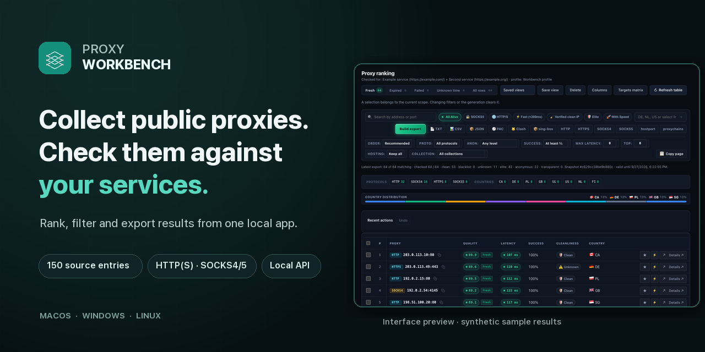
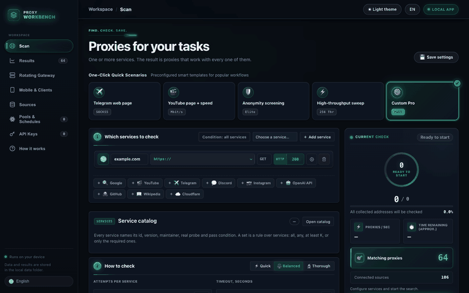
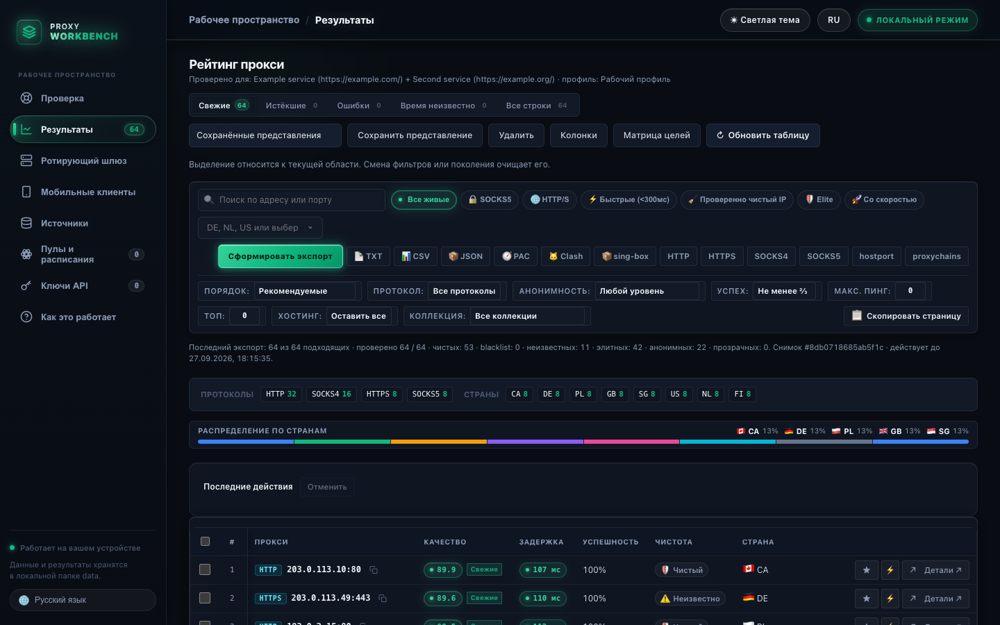
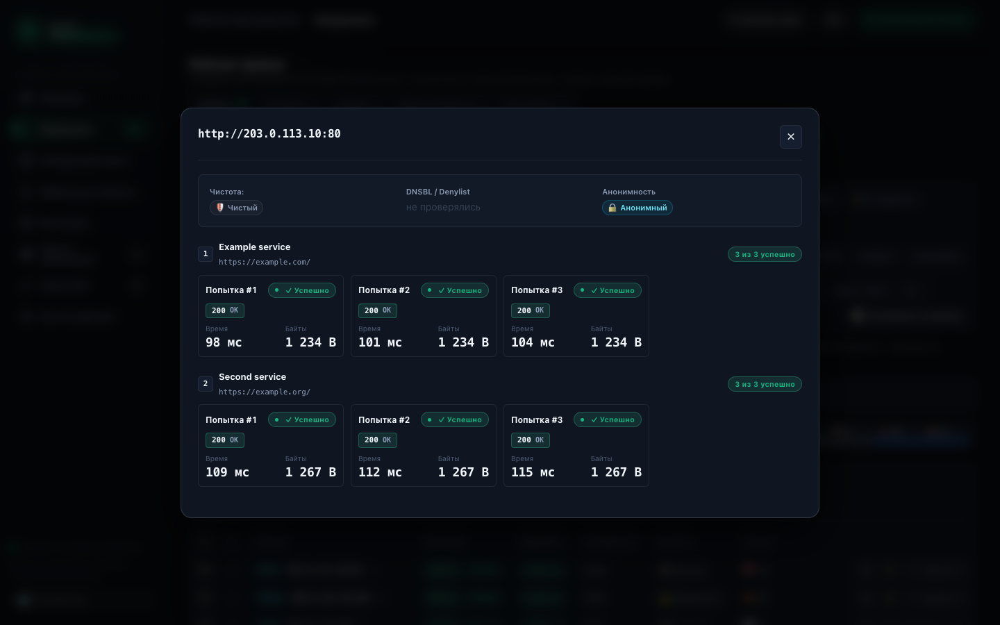
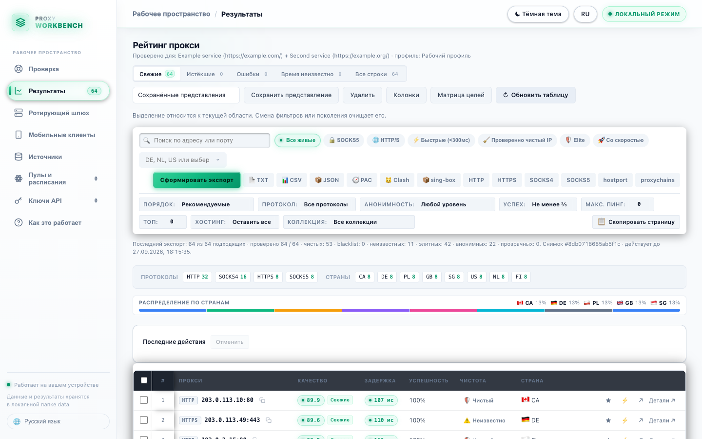
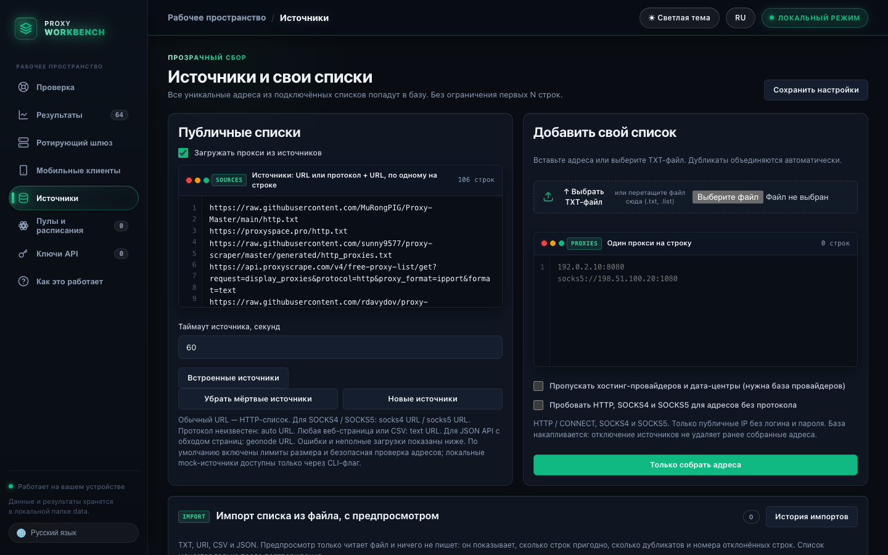
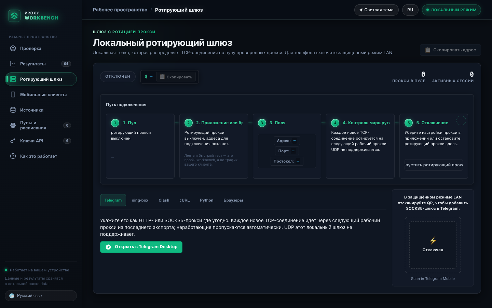
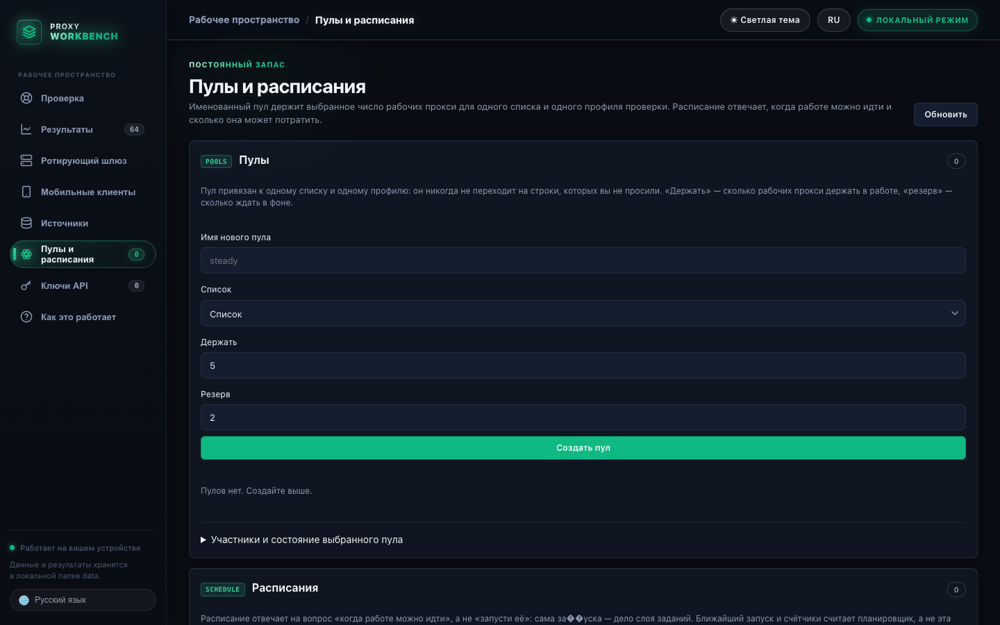
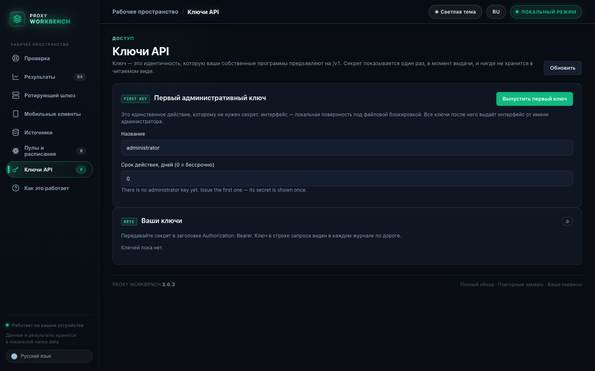

<div align="center">



# Proxy Workbench

### Найдите прокси, которые работают с нужными вам сайтами

Соберите адреса из открытых списков или своих файлов, проверьте их на выбранных сервисах и используйте результаты в приложениях, файлах экспорта или скриптах. Proxy Workbench работает локально: браузерный интерфейс, CLI, ротирующий прокси-шлюз и API.

**Windows · macOS · Linux** &nbsp;|&nbsp; **HTTP(S) · SOCKS4 · SOCKS5** &nbsp;|&nbsp; **12 языков интерфейса**

[](https://github.com/DavidVoitenko/proxy-workbench/actions/workflows/ci.yml)
[](https://github.com/DavidVoitenko/proxy-workbench/releases/latest)


[English](README.md) · **Русский**

[Скачать](https://github.com/DavidVoitenko/proxy-workbench/releases/latest) · [Сайт](https://davidvoitenko.github.io/proxy-workbench/) · [Быстрый старт](#-быстрый-старт) · [Вкладки](#-восемь-вкладок) · [CLI](#запуск-через-командную-строку) · [API](#локальное-api-прокси-в-своих-программах)

<br>



<sub>Демонстрация с синтетическими данными. Доступность реальных прокси зависит от источников и параметров проверки.</sub>

</div>

---

## Что делает программа

Открытые списки прокси быстро устаревают. Proxy Workbench превращает адреса-кандидаты в список, измеренный по вашим условиям:

1. **Сбор:** выбирает из каталога **150 записей**; **106 поддерживаемых лент** включены по умолчанию при новой установке. Можно импортировать свой список. Адреса приводятся к единому виду, дубликаты удаляются.
2. **Проверка:** отправляет реальные запросы через каждый адрес к одному или нескольким URL. Можно задать HTTP-коды, текст или хеш ответа, порог успешных попыток, таймауты и дополнительные проверки репутации или анонимности.
3. **Использование:** фильтры и экспорт, локальный ротирующий шлюз `127.0.0.1:8899` или API для последнего опубликованного списка. Пулы и расписания помогают обновлять результаты.

Интерфейс и локальное API по умолчанию доступны только на этом компьютере. Открыть серверное API для сети можно явно, с отдельным токеном.

## 📸 Скриншоты

<table>
<tr>
<td width="50%"><br><sub><b>Проверка</b> — цели и прогресс</sub></td>
<td width="50%"><br><sub><b>Результаты</b> — фильтры, сортировка и экспорт</sub></td>
</tr>
<tr>
<td width="50%"><br><sub><b>Детали</b> — отдельные попытки и ошибки</sub></td>
<td width="50%"><br><sub><b>Светлая тема</b> — переключается в шапке</sub></td>
</tr>
<tr>
<td width="50%"><br><sub><b>Источники</b> — встроенный каталог и свои списки</sub></td>
<td width="50%"><br><sub><b>Ротирующий шлюз</b> — настройка локального маршрута; на кадре выключен</sub></td>
</tr>
<tr>
<td width="50%"><br><sub><b>Пулы и расписания</b> — цель, резерв и обновление</sub></td>
<td width="50%"><br><sub><b>Ключи API</b> — права и лимиты без раскрытых секретов</sub></td>
</tr>
</table>

<sub>Результаты, метрики и география на скриншотах синтетические; IP-адреса взяты из диапазонов для документации (RFC 5737). Каталог источников настоящий, встроенный в проект. Скриншоты не подразумевают наличие рабочих публичных прокси.</sub>

## 🧭 Восемь вкладок

| Вкладка | Что в ней можно делать |
| --- | --- |
| **Проверка** | Задать сайты и условия успеха, выбрать пресет или точные параметры, запустить и продолжить проверку, следить за прогрессом. |
| **Результаты** | Смотреть свежие, просроченные, неудачные и неизвестные результаты; фильтровать и сортировать; изучать попытки; экспортировать TXT, CSV, JSON, PAC, Clash и sing-box. |
| **Ротирующий шлюз** | Проверить состояние и размер пула, скопировать локальный HTTP/SOCKS5-адрес, получить инструкции для клиентов. |
| **Мобильные клиенты** | Скопировать или скачать конфиги sing-box и Clash/Mihomo. Настроить Telegram через ссылку либо через QR-код после включения защищённого LAN-режима. |
| **Источники** | Выбрать поддерживаемые открытые ленты, импортировать свои списки, посмотреть отдачу и ошибки источников, управлять дополнительной базой стран. |
| **Пулы и расписания** | Поддерживать нужное количество подходящих прокси для списка и профиля, настроить интервалы, тихие часы и бюджеты. |
| **Ключи API** | Создать и управлять ключами с ограниченными правами для API `/v1`. Секрет показывается один раз. |
| **Как это работает** | Изучить процесс и инструкции, разобраться с пустым результатом, открыть диагностику и инструменты обслуживания. |

Интерфейс поддерживает тёмную и светлую темы и 12 языков. Доступны HTTP(S), SOCKS4, SOCKS5 и IPv6. Проверка умеет работать с несколькими URL, повторными попытками, условиями по коду/телу/хешу, локальным denylist, дополнительными DNSBL-зонами и judge-сервисом для оценки анонимности. Подробности — в разделах [CLI](#запуск-через-командную-строку), [шлюза](#ротирующий-прокси-шлюз) и [API](#локальное-api-прокси-в-своих-программах).

## 🚀 Быстрый старт

Выберите сборку для своей системы. В [последнем релизе](https://github.com/DavidVoitenko/proxy-workbench/releases/latest) есть установщики, portable-архивы, контрольные суммы и Python wheel.

| Система | Установка или запуск | Что нужно |
| --- | --- | --- |
| **macOS, Apple Silicon** | Скачайте `proxy-workbench-3.0.3-macos-arm64.dmg` и перетащите приложение в «Программы». | Python не нужен |
| **macOS, Intel** | Скачайте `proxy-workbench-3.0.3-macos-x86_64.dmg` и перетащите приложение в «Программы». | Python не нужен |
| **Windows x64** | Запустите `proxy-workbench-3.0.3-windows-x64-setup.exe`. Есть portable ZIP и отдельный CLI `.exe`. | Python не нужен |
| **Linux или любая ОС с Python** | `pipx install git+https://github.com/DavidVoitenko/proxy-workbench`, затем `proxy-workbench`. | Python 3.11+ и [pipx](https://pypa.io/pipx/) |
| **Папка с исходниками** | `Start.bat` на Windows, `Start.command` на macOS или `./run.sh` на Linux. | Python 3.11+ |
| **Сервер/NAS с Docker** | Задайте `PROXY_WORKBENCH_API_TOKEN` и выполните `docker compose up -d` с готовым [`compose.yml`](compose.yml). | Docker; CLI/API/шлюз без GUI |

Команда `proxy-workbench` без аргументов открывает интерфейс в браузере. На macOS появляется значок в строке меню для запуска, паузы и выхода. Повторный запуск обращается к уже работающему экземпляру. Команды `proxy-workbench run …` и `./run.sh run …` выполняют одну и ту же задачу.

```sh
proxy-workbench                  # приложение и локальный интерфейс
proxy-workbench gui              # только интерфейс
proxy-workbench --print-paths    # выбранные папки данных, кэша и журналов
```

Установленная сборка хранит данные в папке пользователя (`%LOCALAPPDATA%\proxy-workbench` на Windows, `~/Library/Application Support/proxy-workbench` на macOS, `~/.local/share/proxy-workbench` на Linux); исходники используют `data/` рядом с проектом. `PROXY_WORKBENCH_DATA` задаёт папку явно. Для portable-режима положите пустой `proxy-workbench-portable.json` рядом с программой.

Установщики релиза **не подписаны сертификатом**. macOS Gatekeeper или Windows SmartScreen могут запросить подтверждение первого запуска. Опубликованная контрольная сумма SHA-256 помогает сверить загруженный файл, но не подтверждает личность издателя.

1. Во вкладке **Проверка** добавьте URL и условия успеха: HTTP-код и, при необходимости, ожидаемый текст. Прокси должен пройти каждый выбранный сервис.
2. Нажмите **Найти и проверить**. Работу можно остановить и затем продолжить с сохранённого прогресса.
3. Во вкладке **Результаты** изучите попытки, задайте фильтры и сортировку, нажмите **Сформировать экспорт** и скачайте нужный формат.

Закрытие вкладки браузера не останавливает проверку. Для выхода используйте меню приложения или `Ctrl+C` при запуске из терминала.

**Границы работы:** открытые прокси могут исчезнуть или измениться без предупреждения; успешная проверка относится к выбранным сервисам и моменту измерения. Для определения страны нужна дополнительная локальная база, для оценки анонимности — judge-сервис. Локальный шлюз передаёт TCP через HTTP или SOCKS5; SOCKS5 UDP ASSOCIATE не поддерживается. Docker работает без браузерного GUI.

## Запуск через командную строку

Сообщения выводятся на языке системы (русский или английский); выбрать явно можно переменной `PROXY_WORKBENCH_LANG=ru` или `en`. `--help` показывает все параметры с примерами.

В терминале, находясь в этой папке:

```sh
./run.sh run
```

Первый запуск создаст `.venv` и установит зависимости. Launcher сверяет SHA-256 `requirements.txt` и обновляет окружение при изменении файла. Затем загрузит выбранные публичные ленты, удалит дубликаты и проверит адреса. Число кандидатов зависит от источников; 190 тысяч не гарантированы. По умолчанию нет ограничения на количество результатов и общего таймера прохода; при необходимости используйте `--want`, бюджеты запросов и трафика, а также фильтр страны. Отдельно доступны локальный denylist и опциональные DNSBL-сигналы.

По умолчанию: HTTPS-запрос к `https://example.com/`, 3 независимых замера на адрес, таймаут 8 секунд на запрос, до 100 стартов запросов/секунду. Нужны успешные ответы в двух из трёх попыток. При ограничении файловых дескрипторов число воркеров автоматически снижается.

### Потолок параллелизма и бюджеты прогона

`--workers 128` — это **потолок**, а не число одновременных проверок. Конвейер сам решает, сколько проверок ему нужно: при коротком списке кандидатов, при низком лимите скорости или при нехватке файловых дескрипторов одновременных проверок будет меньше, и значение `--workers` просто не будет достигнуто. Поднимать его выше имеет смысл только тогда, когда прогон действительно упирается в параллелизм.

```sh
./run.sh run --workers 256 --rate 100          # потолок и скорость
./run.sh run --max-requests 500000             # потолок запросов на один прогон
./run.sh run --run-max-bytes 2147483648        # потолок байт на один прогон
./run.sh run --want 20 --count-what exit       # что именно считает --want
```

- `--max-requests N` — бюджет запросов на прогон, `0` — без потолка. Когда бюджет исчерпан, прогон **останавливается**; непроверенные адреса не записываются как недостижимые.
- `--run-max-bytes N` — бюджет байт на прогон, `0` — без потолка; правило остановки то же.
- `--want N` — остановиться, когда найдено N годных прокси; `0` (по умолчанию) — проверять всё.
- `--count-what endpoint|ip|exit` — что именно считает `--want`: сами адреса (`endpoint`, по умолчанию), уникальные IP за ними или IP, подтверждённые как адрес выхода. Это три разных числа, и `endpoint` достичь проще всего.

### `bench`: замер самого конвейера

```sh
./run.sh bench --bench-items 2000 --bench-n 20
```

Команда прогоняет конвейер на **локальной синтетической фикстуре**: без сокетов, без DNS и без публичных прокси. Она печатает пропускную способность, время до первого результата и время до N. Числа от `bench` — это измерение конвейера, а не измерение интернета, и заметка об этом печатается вместе с каждым числом.

На Windows или при ручной установке:

```sh
python -m venv .venv
# Windows:
.venv\Scripts\python -m pip install -r requirements.txt
.venv\Scripts\python proxytool.py run
# macOS/Linux:
.venv/bin/python -m pip install -r requirements.txt
.venv/bin/python proxytool.py run
```

## Проверять свой сервис

```sh
./run.sh run --url https://example.org/health
```

Для проверки определённого HTTP-кода, содержимого или нескольких адресов скопируйте `service.example.json` в `data/service.json`, укажите свои URL и запустите:

```sh
./run.sh run --config data/service.json
```

`targets` — список проверяемых адресов. Для каждого доступны:

- `url`: обязательный HTTP/HTTPS URL;
- `method`: `GET` или `HEAD`, по умолчанию `GET`;
- `statuses`: допустимые коды, по умолчанию 200–299;
- `contains`: строка, которая должна присутствовать в теле ответа в UTF-8;
- `sha256`: ожидаемый SHA-256 полного тела ответа, необязательно;
- `headers`: необязательные безопасные HTTP-заголовки (`Accept*`, `Cache-Control`, `Pragma`, `User-Agent`, `X-Request-ID`, `X-Client-Version`); произвольные credential-like заголовки отклоняются;
- `request_profile`: необязательный нейтральный пресет `workbench`, `standard` или `minimal`;
- `reputation`: необязательные параметры локального denylist и DNSBL (`local_enabled`, `dnsbl_enabled`, `dnsbl_zones`, `timeout`, `strict`).

Каждый адрес проверяется во всех попытках. Порог успешности применяется **к каждому** адресу сервиса, а не только к средней доле ответов. Редиректы не выполняются автоматически: задавайте конечный URL либо явно разрешите код редиректа. TLS-сертификаты проверяются. Секретные заголовки и конфиги храните только в `data/`; конфигурация проверки также сохраняется в локальной базе. Для HEAD не задавайте проверку тела.

Для замеров выбирайте небольшой стабильный endpoint. При большой странице увеличьте `--max-bytes`: превышение лимита считается ошибкой, а не успешным частичным ответом. Без `contains`/`sha256` проверяется только HTTP-код, поэтому страница заглушки с кодом 200 может пройти.

## Проверка чистоты и локальный denylist

В `data/denylist.txt` можно записать IP, IPv4/IPv6 CIDR, точный адрес прокси и комментарии с `#`. Список применяется при сборе, перед проверкой и повторно перед экспортом; совпадения считаются отдельно от невалидных строк. Файл находится в игнорируемой локальной папке и не содержит аккаунтов или секретов. Политику можно принудительно переключить флагами `--local-denylist` и `--no-local-denylist`.

Публичные DNSBL-проверки выключены по умолчанию. Включить их можно в GUI или CLI:

```sh
./run.sh run --dnsbl --dnsbl-zone bl.example.org --reputation-timeout 2.5
./run.sh run --dnsbl --dnsbl-zone bl.example.org --strict-clean
```

Каждая зона проверяется DNS-запросом без API-ключей; если список зон пуст, DNSBL фактически выключается. В результате отображаются `clean`, `listed`, `unknown` и `local_denied`; `listed` и `local_denied` не попадают в экспорт, а `unknown` исключается только в строгом режиме. Ошибка чтения denylist показывается как `unknown` и блокирует экспорт до исправления файла. Для новой политики или после её изменения используйте «Перепроверить»; это также обновляет профиль результатов. DNSBL — только сигнал репутации, а не доказательство анонимности или безопасности.

## Быстрый поиск: N прокси и нужные страны

Когда нужно всего несколько рабочих прокси, не обязательно ждать полный проход:

```sh
./run.sh update-geoip                      # один раз: офлайн-база стран DB-IP Lite (~7 МБ)
./run.sh run --country DE,NL --protocol socks5 --want 20 --attempts 1
```

- `--want N` (в GUI — «Остановиться после») завершает проверку, как только найдено N подходящих прокси. Непроверенные адреса остаются в очереди: следующий запуск того же профиля продолжит с них.
- Порядок проверки: сначала адреса, которые уже проходили в других профилях. В режиме `--want` остальные идут в случайном порядке, чтобы первые находки не были из одной подсети или одного источника; полный проход идёт по порядку, так быстрее пишется база.
- `--country DE,NL` (в GUI — «Страны») пропускает адреса других стран **до** отправки запросов. Страна берётся из данных Geonode и из офлайн-базы [DB-IP](https://db-ip.com) Country Lite (CC BY 4.0), которая скачивается командой `update-geoip` или кнопкой «Скачать / обновить» на вкладке «Источники».
- Фильтры страны и протокола не входят в профиль: результаты, полученные для DE, будут переиспользованы при проверке всех стран.
- Пресет «Быстро» ставит 1 попытку, короткие таймауты и 256 воркеров; «Тщательно» — 5 попыток и терпеливые таймауты.

## Свежесть списка: перепроверка и живучесть

Бесплатные прокси быстро умирают. Чтобы не проверять всю базу заново:

```sh
./run.sh scan --recheck-passing      # перепроверить только подходящие
./run.sh run --want 50 --watch 30    # найти 50 и перепроверять их каждые 30 минут (Ctrl+C — стоп)
```

- «Перепроверить только подходящие» (в GUI — кнопка под «Найти и проверить») измеряет заново только прокси, которые сейчас проходят отбор; остальная база профиля не трогается.
- `--watch N` после проверки сохраняет экспорт, ждёт N минут и перепроверяет подходящие, пока его не остановят.
- У каждого прокси хранится история: сколько раз проверялся, сколько раз прошёл, когда был успешен последний раз. Сортировка `uptime` («По живучести») ставит первыми тех, кто чаще переживал перепроверки; в CSV/JSON есть поля `checks` и `passes`.
- В колонке «Рабочих» на вкладке «Источники» видно, сколько подходящих прокси дал каждый список в последнем экспорте. В `status.json` это поле `source_quality` (источники обозначены хешем, без URL).

## Проверка анонимности

Укажите judge-URL — страницу, которая возвращает IP и заголовки полученного запроса (например, `httpbin`-подобный `/get` или скрипт `azenv.php`, лучше на своём сервере). В GUI это поле в карточке «Отпечаток и чистота», в CLI — флаг `--judge-url`, в `service.json` — ключ `"anonymity": {"judge_url": "..."}`.

```sh
./run.sh run --judge-url http://judge.example/azenv.php --min-anonymity elite
```

Перед проверкой программа один раз напрямую запрашивает judge и запоминает ваш внешний IP только в памяти: он не пишется в базу, экспорт или журнал. Затем через каждый прокси, прошедший хотя бы одну попытку на ваших сервисах, выполняется ещё один запрос к judge:

| Уровень | Значение |
| --- | --- |
| `transparent` | сайт видит ваш реальный IP |
| `anonymous` | IP скрыт, но прокси выдаёт себя заголовками (`Via`, `X-Forwarded-For` и др.) |
| `elite` | не видно ни IP, ни прокси-заголовков |
| `unknown` | запрос к judge через прокси не удался |

`--min-anonymity any|anonymous|elite` (и выпадающий список в GUI) оставляет только прокси нужного уровня; без judge-URL фильтр не действует. Используйте **`http://`** judge: внутри HTTPS-туннеля прокси не может добавить заголовки, и все прокси будут выглядеть элитными. Judge-URL входит в профиль проверки, поэтому его изменение создаёт отдельные результаты.

## Сохранить сколько нужно и выбрать рейтинг

Все проверки сохраняются в `data/proxies.sqlite3`. Экспорт находится в `data/exports/`:

- `proxies.txt`: отсортированные рабочие адреса;
- `ranked.csv`: рейтинг, задержка, разброс и доля успешных запросов;
- `ranked.json`: то же с деталями каждой попытки;
- `http.txt`, `https.txt`, `socks5.txt`: адреса по протоколам в формате `host:port` для других программ;
- `hostport.txt`: все адреса в формате `host:port`; `proxychains.txt`: строки для раздела `[ProxyList]` в proxychains.conf;
- `status.json`: сколько кандидатов, проверено, осталось и сохранено.

```sh
# Сохранить все подходящие, самые быстрые первыми:
./run.sh export --top 0 --sort speed
# Только SOCKS5 быстрее 800 мс, самые стабильные первыми:
./run.sh export --protocol socks5 --max-latency 800 --sort stability
# Сохранить 500 лучших по качеству:
./run.sh export --top 500 --sort quality
# Только адреса, прошедшие каждую попытку:
./run.sh export --top 0 --min-success 1
# Адреса с хотя бы одним успехом на КАЖДОМ сервисе:
./run.sh export --top 0 --min-success 0
```

Экспорт использует последний запущенный профиль и не повторяет запросы. `--top` ограничивает только экспорт, **никогда не обход**. Если подходящих меньше, сохраняется доступное количество. Те же параметры можно передать команде `run` или `scan`.

`speed` сортирует по медиане времени успешного полного запроса, включая соединение и TLS. `quality` сортирует по формуле `100 × минимальная успешность среди targets / (1 + (медиана + стандартное отклонение) / 1000)`. Время указано в миллисекундах. Это текущая оценка доступности и задержки, не измерение пропускной способности в Мбит/с и не гарантия анонимности. Для осмысленного сравнения используйте одинаковый профиль.

## Полный проход и продолжение

```sh
# Только сбор:
./run.sh collect
# Проверка уже собранной базы:
./run.sh scan --config data/service.json
# Ctrl+C: сохранить завершённое и остановиться.
# Та же команда продолжит незавершённые адреса.
./run.sh scan --config data/service.json
# Свежая проверка всех адресов того же профиля:
./run.sh scan --config data/service.json --recheck
```

URL, содержимое, заголовки, request-профиль, политика denylist/DNSBL, число попыток, таймаут и размер ответа определяют профиль. В профиль также входит digest фактического набора заголовков пресета, поэтому изменение версии продукта не смешивает старые и новые результаты. Повторный запуск того же профиля продолжает проход; для обновления старых оценок нужен `--recheck`. Профили версии 1 после обновления получают новый профиль версии 2, поэтому первый запуск может начать новый проход. Прерванный посреди попыток адрес проверяется заново. Завершённые результаты пишутся в SQLite пакетами; Ctrl+C сохраняет текущий пакет, аварийное завершение может потребовать повторить последний пакет.

Прогресс и оценка оставшегося времени обновляются каждые 2 секунды. По умолчанию включены досрочная отбраковка (`--fail-fast`) и таймаут подключения 4 секунды (`--connect-timeout`): безответный адрес можно отбросить раньше, если порог успеха уже недостижим. Длительность прохода зависит от количества адресов, таймаутов, целевых сервисов и вашей сети. `--no-fail-fast` выполняет все попытки. Несколько targets увеличивают число запросов. Ограничение скорости и параллельности настраиваются:

```sh
./run.sh run --workers 256 --rate 100 --timeout 8 --connect-timeout 3 --attempts 3
```

`--workers` здесь — потолок, а не число одновременных проверок: конвейер сам решает, сколько ему нужно, и до 256 одновременно дойдёт только тот прогон, которому это действительно требуется. Бюджеты прогона и команда `bench` описаны выше.

Не создаётся задача на каждый адрес: очередь ограничена удвоенным числом воркеров. Включённая по умолчанию быстрая TCP-предпроверка отсеивает адреса, которые не принимают соединение, до проверки сервиса; её можно отключить параметром `--prefilter 0`. Попытки прекращаются досрочно, когда порог успешности уже недостижим (отключается `--no-fail-fast`). Одновременно разрешён один процесс на одну папку `data`.

## Свои списки и независимые наборы

```sh
./run.sh run --no-sources --input data/my-proxies.txt --url https://example.org/health
./run.sh collect --sources data/my-sources.json --input data/extra.txt
./run.sh run --data data/another-service --url https://example.net/status
```

`proxy_workbench/sources.json` — редактируемый JSON-массив встроенных источников (в GUI список правится на вкладке «Источники»). Обычный URL означает HTTP-список. Формат `IP:порт:страна` поддерживается через префикс `http-fields URL` (используется встроенными списками HideIP). Для SOCKS4/SOCKS5 без схемы у адресов используйте строку `socks4 https://example.org/list.txt` или `socks5 https://example.org/list.txt`. Если протокол неизвестен, `auto https://…` проверит каждый адрес как HTTP, SOCKS4 и SOCKS5. `text https://…` принимает любую веб-страницу, CSV или HTML-таблицу и забирает из неё все `ip:port`. Для постраничного JSON API Geonode используйте строку `geonode https://proxylist.geonode.com/api/proxy-list?limit=500&protocols=http%2Csocks5`. Сборщик обходит все страницы до заявленного API количества, отмечает повторённые/недостающие страницы и повторяет неудачную загрузку один раз. Каждая строка списка: `IP:port`, `http://IP:port`, `socks4://IP:port` или `socks5://IP:port` / `socks5h://IP:port`. Поддерживается IPv6 в квадратных скобках. Явный `https://` сохраняется как TLS-соединение к самому прокси. Обычные списки HTTPS/CONNECT с адресами без схемы читаются как `http://`. Метаданные HTTPS в Geonode означают CONNECT и преобразуются в HTTP. Авторизованные прокси, доменные имена вместо IP и непубличные IP отклоняются. Встроены HTTP/CONNECT, HTTPS, SOCKS4 и SOCKS5-источники, а также веб-страницы. Флаг `--detect-protocols` проверяет адреса без протокола из ваших файлов `--input` как HTTP, SOCKS4 и SOCKS5. Все источники остаются редактируемыми.

База накапливает уникальные адреса. `--no-sources` отключает загрузку, но не удаляет ранее собранные адреса: для полностью отдельного списка используйте новую `--data`.

Списки читаются потоково с безопасными пределами по умолчанию: до 32 MiB на один удалённый источник, 64 KiB на строку, 500 000 кандидатов на источник и 5 redirect hops. Параметры меняются через `--source-max-bytes`, `--source-max-line-bytes`, `--source-max-candidates` и `--source-max-redirects`. На загрузку текстового источника или одной страницы API отведено 60 секунд (`--source-timeout`), с одним повтором при ошибке. Ошибки, незавершённые загрузки, исходные и отклонённые строки отражаются в `data/sources-report.json`; уже прочитанные валидные адреса остаются в базе. Полный обход означает проверку всех собранных кандидатов, а не гарантию доступности всех внешних источников.

По умолчанию источники не должны указывать на loopback, private/link-local/reserved/metadata адреса. Для локальных mock-сервисов есть явный `--allow-private-sources`; этот флаг небезопасен для обычного запуска. Автоматические redirects отключены, каждый hop проверяется, а выбранный DNS address закрепляется в transport на время запроса.

## Встроенные источники

Новая установка использует набор **all-supported / Все поддерживаемые**: 106 лент, включая новые источники. Неизменённый старый выбор из 55 источников обновляется с сохранением пауз; пользовательские наборы сохраняются. Набор можно выбрать в каталоге или командой `./run.sh source set all-supported`; **quick** содержит 8 лент для более короткого сбора. Число публичных бесплатных записей — 117 — включает также документацию, Tor/MTProto и форматы или источники с ограничениями, которые не являются доступными для сбора HTTP/SOCKS-списками.

Добавлены SOCKS5-ленты [hookzof](https://github.com/hookzof/socks5_list), [TheSpeedX](https://github.com/TheSpeedX/PROXY-List), [Proxifly](https://github.com/proxifly/free-proxy-list), [monosans](https://github.com/monosans/proxy-list), [IPLocate](https://github.com/iplocate/free-proxy-list), открытый ProxyScrape v4 и постраничный [Geonode](https://geonode.com/free-proxy-list). Доступность источников проверялась 20.09.2026; их объём и актуальность меняются. Число адресов из нескольких списков нельзя складывать без удаления дублей.

Триалы коммерческих провайдеров требуют отдельной регистрации и не являются публичными списками. Регистрация, платёжные действия и активация промокодов не автоматизированы; указанные в стороннем каталоге объёмы и промокод не считаются проверенными. MTProto-прокси предназначены для другого протокола и не включены в HTTP/SOCKS-проверку. Авторизованные провайдерские прокси пока не поддерживаются.

## Request-профиль (отпечаток приложения)

В настройках выбирается нейтральный request-профиль: `workbench` (по умолчанию), `standard` или `minimal`. Пресет задаёт только User-Agent, Accept и Accept-Encoding; он добавляется к заголовкам сервиса без личных данных и без browser impersonation. Изменение пресета создаёт отдельный профиль результатов.

Профиль не меняет TLS/JA3/JA4, HTTP-транспорт или гарантии анонимности. Пользовательские заголовки сервиса остаются локальной настройкой, не выводятся в экспорт и не включаются в код. Credential-like заголовки отклоняются. В отчётах URL показываются только без query, fragment и path, чтобы токены в ссылках не попадали в status/result metadata. Для CLI можно выбрать пресет флагом `--request-profile standard`.

## Ротирующий прокси-шлюз

Пока открыт GUI, адрес `127.0.0.1:8899` работает как локальный прокси, который по очереди использует все рабочие прокси из последнего экспорта. По умолчанию GUI также поднимает защищённый LAN-шлюз, чтобы телефон в той же сети мог использовать QR для Telegram: QR содержит адрес компьютера в сети и пароль текущей сессии. Разрешите порт в локальном брандмауэре. Если LAN не нужен, запустите `gui --gateway-host 127.0.0.1`.

Локальный шлюз поддерживает только **HTTP/SOCKS5 TCP**. SOCKS5 UDP ASSOCIATE, звонки Telegram и игры, которым нужен UDP, здесь не реализованы; для них нужен отдельный VPN/туннель.

```sh
curl -x http://127.0.0.1:8899 https://example.org/
curl -x socks5h://127.0.0.1:8899 https://example.org/
```

- Каждое новое TCP-соединение берёт следующий прокси (`--rotate random` выбирает случайно).
- Если прокси не ответил, то же соединение повторяется через другой (до 3 раз). Прокси, который ошибся дважды, отдыхает 5 минут.
- Обычные `http://`-запросы идут в HTTP-прокси напрямую, потому что многие из них разрешают CONNECT только на порт 443.

На сервере шлюз запускает `./run.sh gateway`; пул сужается обычными фильтрами, например `gateway --protocol socks5 --country DE --max-latency 1500`. Для сетевого адреса нужны `--host 0.0.0.0 --lan` и пароль: `--gateway-token <секрет>` или переменная `PROXY_WORKBENCH_GATEWAY_TOKEN`; если он не задан, шлюз придумывает свой и печатает его. Клиенты входят с любым именем и этим паролем через HTTP Basic или логин/пароль SOCKS5.

**Пароль шлюза — не токен API.** Это разные идентичности намеренно: тот, кому вы дали пароль для телефона в сети, не должен читать опубликованный снапшот, а утёкший токен API не должен работать как прокси. `serve` получает `--api-token`, `gateway` — `--gateway-token`; в `compose.yml` показаны обе переменные.

Браузер без расширений: укажите `http://127.0.0.1:8765/pac` как адрес автоматической настройки прокси. Он отдаёт 10 лучших подходящих прокси и принимает те же фильтры, что API, например `/pac?country=DE`. `/clash` возвращает готовый конфиг Clash / Mihomo.

## API и ключи: `/v1`

Read-only адреса ниже ключа не требуют: они отвечают только на loopback. Всё, что под `/v1`, — управляющий API, и ключ ему нужен.

**Первый ключ выдаёт сама машина.** Bootstrap — локальная операция: панель Help в GUI или CLI на этом компьютере. Секрет показывается один раз.

```sh
./run.sh api-key bootstrap                       # первый административный секрет
./run.sh api-key list
./run.sh api-key add reader --permission read.results
./run.sh api-key rotate <key-id>
./run.sh api-key revoke <key-id>
```

**Ключ передаётся как bearer-токен.** Машиночитаемое описание всех операций — `proxy_workbench/openapi.json`; работающая служба отдаёт его же на `GET /v1`.

```sh
curl -H "Authorization: Bearer $PROXY_WORKBENCH_KEY" http://127.0.0.1:8766/v1/status
curl -H "Authorization: Bearer $PROXY_WORKBENCH_KEY" http://127.0.0.1:8766/v1/results
```

```python
import httpx

key = open("/path/to/key").read().strip()
r = httpx.get("http://127.0.0.1:8766/v1/results",
              headers={"Authorization": f"Bearer {key}"}, timeout=10)
print(r.json()["items"][0]["proxy"])
```

```js
const key = process.env.PROXY_WORKBENCH_KEY;
const r = await fetch("http://127.0.0.1:8766/v1/results", {
  headers: { Authorization: `Bearer ${key}` },
});
console.log((await r.json()).items[0].proxy);
```

**Что разрешено ключу.** Права (`read.results`, `jobs.submit`, `export.create`, `admin.keys`, …) говорят, *какие* операции доступны; resource scope — *над чем*: ключ, ограниченный одной коллекцией, не видит результаты, задания, артефакты экспорта и пулы другой коллекции, а объект вне scope отвечает ровно так же, как отсутствующий. Учётные данные прокси не покидают хранилище: чувствительный экспорт пишет ссылку на запись хранилища, а сам запрос — отдельное право (`export.secret`).

`./run.sh diagnose zero` (и `GET /v1/diagnostics/zero`) отвечает на вопрос «почему 0 результатов» кодом, стадией, счётчиками и действием — без чтения traceback.

## Локальное API: прокси в своих программах

Пока открыт GUI, на `http://127.0.0.1:8765` работает API только для чтения (доступно только с этого компьютера). На сервере его запускает `./run.sh serve` (Windows: `.venv\Scripts\python proxytool.py serve`). API отдаёт последний экспорт и само подхватывает каждый новый, поэтому его можно держать рядом с `run --watch`.

| Запрос | Что вернёт |
| --- | --- |
| `GET /random` | один случайный рабочий прокси; `limit=5` — несколько |
| `GET /proxies` | все рабочие прокси, лучшие первыми (порядок экспорта) |
| `GET /pac` | автонастройка прокси для браузера с 10 лучшими подходящими прокси |
| `GET /clash` | конфиг Clash / Mihomo с группой автоматического выбора |
| `GET /status` | сколько доступно, когда собран экспорт, на каких сервисах проверено |

Фильтры для `/random` и `/proxies`: `protocol=http\|https\|socks5`, `country=DE,NL`, `max_latency=800` (мс), `anonymity=anonymous\|elite`, `limit=N`, `format=json\|txt\|hostport`.

```sh
curl "http://127.0.0.1:8765/random?protocol=socks5&country=DE&format=txt"
# socks5://203.0.113.7:1080
```

```python
import httpx

proxy = httpx.get("http://127.0.0.1:8765/random?protocol=http&max_latency=1500&format=txt").text.strip()
print(httpx.get("https://example.org/", proxy=proxy, timeout=15).status_code)
```

В JSON у каждого прокси есть `proxy`, `protocol`, `host`, `port`, `country`, `exit_ip`, `exit_country`, `anonymity`, `latency_ms`, `jitter_ms`, `reliability`, `uptime`, `checks`, `score`, `checked_at`. В GUI адрес API с кнопкой **Скопировать** находится под кнопками скачивания; порт меняется флагом `gui.py --api-port 9000`, выключить API можно флагом `--no-api`.

Чтобы API было доступно с других машин (например, из Docker), укажите сетевой адрес и токен: `serve --host 0.0.0.0 --api-token <секрет>` или переменная `PROXY_WORKBENCH_API_TOKEN`. Клиенты передают заголовок `Authorization: Bearer <секрет>`.

## Docker (CLI без GUI)

Проверку можно запускать на сервере или NAS без установки Python. В образе только CLI, браузерный интерфейс остаётся на вашем компьютере.

```sh
docker build -t proxy-workbench .
mkdir -p data
docker run --rm --user "$(id -u):$(id -g)" -v "$PWD/data:/app/data" \
  proxy-workbench run --url https://example.org/health --judge-url http://judge.example/azenv.php
```

Раздавать свежие прокси другим контейнерам: один контейнер перепроверяет, второй отвечает на запросы API из той же папки данных.

```sh
docker run -d --name pw-check --user "$(id -u):$(id -g)" -v "$PWD/data:/app/data" proxy-workbench run --want 50 --watch 30
docker run -d --name pw-api --user "$(id -u):$(id -g)" -p 127.0.0.1:8765:8765 -e PROXY_WORKBENCH_API_TOKEN=change-me \
  -v "$PWD/data:/app/data" proxy-workbench serve --host 0.0.0.0
docker run -d --name pw-gateway --user "$(id -u):$(id -g)" -p 127.0.0.1:8899:8899 -e PROXY_WORKBENCH_GATEWAY_TOKEN=another-secret \
  -v "$PWD/data:/app/data" proxy-workbench gateway --host 0.0.0.0 --lan
```

Каждый релиз также публикует готовый образ в GitHub Container Registry. Он появляется в разделе **Packages** на странице репозитория как `ghcr.io/<owner>/proxy-workbench:<версия>` и `:latest`. Результаты сохраняются в подключённую папку `data/`, как при обычной установке.

## Очистка локальных данных

Удалить базу, профили, экспорты и runtime-отчёты можно явно:

```sh
./run.sh clear-data --yes
```

Команда не удаляет `gui-settings.json` и `denylist.txt`, если они уже настроены. Экспорт хранит crash-safe generation-каталоги и автоматически оставляет только последние три; перед удалением убедитесь, что процессы GUI и CLI остановлены. Резервные копии и browser storage приложение не очищает.

## Структура проекта

- `proxy_workbench/` — сам пакет:
  - `proxytool.py` — CLI, collector, scanner, reputation и export pipeline;
  - `api.py` — локальное API только для чтения (`/random`, `/proxies`, `/pac`, `/clash`, `/status`);
  - `gateway.py` — ротирующий прокси-шлюз (HTTP, CONNECT, SOCKS5);
  - `formats.py` — `proxy.pac` и `clash.yaml`;
  - `socks4.py` — подключение через SOCKS4 (httpx умеет только HTTP и SOCKS5);
  - `i18n.py` — язык сообщений в терминале; `paths.py` — папка данных и запуск фоновой проверки;
  - `desktop.py` — фоновый слой поставки (F22): per-user `data`/`cache`/`logs`, portable mode, перенос старой папки, один экземпляр, меню-бар на macOS, запуск при входе, сон/пробуждение;
  - `gui.py` / `ui/` — loopback-only browser interface;
  - `reputation.py` — denylist/DNSBL verdicts; `branding.py` — версия и request-профили;
  - `maintenance.py` — блокировка папки `data` и очистка локальных данных;
  - `sources.json` — встроенные источники.
- `proxytool.py`, `gui.py` — запуск из папки с кодом (их вызывают `Start.bat`, `Start.command`, `run.sh`).
- `packaging/` — сборка `.app`/`.dmg` для macOS и GUI/CLI `.exe` + per-user installer для Windows (PyInstaller), сборка helper меню-бара, манифест артефактов и сквозные проверки собранного пакета.
- `compose.yml` — проверка, API и ротирующий прокси в Docker.
- `tests/` — isolated unit and local mock tests.
- `docs/assets/` — скриншоты и изображение для превью.
- `.github/` — CI, release workflow, шаблоны issues и pull requests.
- `data/` — ignored local settings, databases, reports and exports.

## Если что-то не запускается

- **Port/Gatekeeper:** запускайте `Start.command` или `Start.bat`; при первом старте macOS может запросить разрешение на запуск локального Python.
- **Python version:** требуется Python 3.11+; удалите только `.venv/`, затем запустите launcher снова.
- **Stale dependencies:** launcher сравнивает digest `requirements.txt` и переустанавливает их при изменении.
- **Data folder is busy:** остановите GUI и CLI-процессы перед `clear-data`; активные симлинки других проектов не трогайте.
- **No results:** проверьте source report, denylist, DNSBL-зоны и доступность выбранного service endpoint.

## Разработка и тесты

```sh
.venv/bin/python -m unittest discover -s tests -v
```

Тесты используют временные базы, имитацию 190 000 кандидатов, локальные mock-DNSBL и HTTP-прокси. Внешних сервисов и рабочих аккаунтов не касаются. Документация транспорта: [HTTPX proxy support](https://www.python-httpx.org/advanced/proxies/).

## ❓ Частые вопросы

**Это делает меня анонимным?**
Нет. Proxy Workbench измеряет _доступность и задержку_. Публичный прокси видит ваш IP, адрес назначения и — для обычного HTTP — сам трафик. Не отправляйте пароли, cookies и токены через непроверенные публичные прокси. Сам Proxy Workbench не отправляет телеметрию и не требует аккаунтов.

**Почему прокси работает в браузере, а здесь не прошёл?**
Редиректы не выполняются, TLS-сертификаты проверяются, а каждый сервис должен пройти свой порог. Откройте **Детали** — там ошибка каждой попытки.

**Что значат transparent / anonymous / elite?**
См. раздел [Проверка анонимности](#проверка-анонимности): прозрачный прокси выдаёт ваш IP, анонимный скрывает IP, но выдаёт себя заголовками, элитный не выдаёт ни того, ни другого.

**Мне нужно всего несколько прокси — обязательно ждать весь список?**
Нет: укажите «Остановиться после» в GUI или `--want 20`. См. раздел [Быстрый поиск](#быстрый-поиск-n-прокси-и-нужные-страны).

**Как получить прокси из конкретной страны?**
Скачайте базу стран (вкладка «Источники» или `./run.sh update-geoip`) и укажите страны: `DE, NL` в GUI или `--country DE,NL`.

**Что значит «чистый»?**
IP нет в вашем локальном denylist и (если включено) в выбранных DNSBL-зонах. Это сигнал репутации, а не гарантия безопасности.

**Можно проверить только свой список?**
Да: `--no-sources --input my.txt` или вставьте/загрузите TXT на вкладке **Источники**.

## 🗺 Планы

- [x] Интерфейс на 12 языках
- [x] Установка через `pipx` и единая команда `proxy-workbench`
- [x] Приложение: меню-бар macOS, установщик Windows, персональные папки данных
- [x] Постоянные пулы, расписания, профили с ревизиями и импорт списков
- [x] API-ключи с правами, областью действия, ротацией и аудитом
- [x] Воронка диагностики, резервные копии и восстановление с предпросмотром
- [ ] Проверка прокси с логином и паролем
- [ ] Подписанные сборки и автообновление
- [ ] Пакет на PyPI
- [x] Определение уровня анонимности (transparent / anonymous / elite)
- [x] Экспорт `host:port` по протоколам
- [x] Колонка страны и фильтры по локальной базе GeoIP
- [x] Режим «найти N и остановиться» и пресеты
- [x] Перепроверка только подходящих, автообновление `--watch` и история живучести
- [x] Рейтинг источников и экспорт для proxychains
- [x] Docker-образ для серверов без GUI

Есть идея? Создайте [запрос функции](https://github.com/DavidVoitenko/proxy-workbench/issues/new/choose) или откройте [обсуждение](https://github.com/DavidVoitenko/proxy-workbench/discussions).

## 🤝 Участие

Рады сообщениям об ошибках, новым источникам, переводам и коду — откройте [issue](https://github.com/DavidVoitenko/proxy-workbench/issues) или pull request. Об уязвимостях сообщайте приватно через [GitHub security advisories](https://github.com/DavidVoitenko/proxy-workbench/security/advisories/new), а не в публичном issue.

Если проект сэкономил вам время — **поставьте ⭐, это помогает другим его найти.**

## ⚖️ Ответственное использование

Инструмент предназначен для инженерных экспериментов, замеров доступности и защитных проверок качества — не для обхода ограничений доступа, злоупотребления сервисами или сокрытия личности в незаконных целях. Используйте только источники и endpoints, которые вам разрешено проверять, соблюдайте условия провайдеров и законы.

## 📜 Лицензия

[MIT](LICENSE). Встроенные списки источников принадлежат их авторам; содержимое, доступность и лицензии могут меняться.
