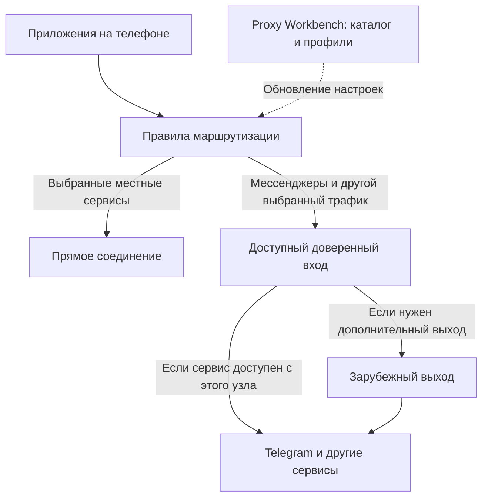

# Мобильное подключение как дополнение к Proxy Workbench

Проект решения, 25 сентября 2026 года. Цель: обычные Telegram и другие мессенджеры, включая звонки, работают после первоначальной настройки телефона. Операторы, модели телефонов и доступность серверов из нужных сетей пока неизвестны. Ниже предложена архитектура; работа в конкретной сети ещё не проверена.

## Решение

Имеет смысл делать сначала дополнение для подготовки мобильных профилей и короткий пилот на готовых клиентах. После подтверждения связи — собственное приложение с одной кнопкой. Сетевой движок берём готовый; поиск прокси, проверки, историю и управление развиваем в Proxy Workbench.

Критерий успеха — родственник принимает звонок при заблокированном экране и пользуется местными сервисами без ручного переключения настроек. Красивый интерфейс и успешное открытие тестового сайта этого не доказывают.

## 1. Как проходит трафик

Доступный вход может находиться внутри РФ или за её пределами. Зарубежный сервер не обязателен, если первый узел сам устойчиво достигает нужного сервиса. Два перехода нужны только там, где это улучшает доступность или обеспечивает выбранную границу доверия.

Для схемы с двумя узлами предпочтительно сохранять шифрованный внутренний туннель от телефона до конечного выхода: вход пересылает его. Не следует считать два обычных последовательно завершаемых туннеля эквивалентом такой защиты. Содержимое общения дополнительно защищается средствами самого мессенджера.

## 2. Что возможно при разных ограничениях

| Условие в сети телефона | Возможность решения |
| --- | --- |
| Заблокированы отдельные сервисы, доступ к нашему узлу есть | Туннель может обеспечить связь; проверяем сообщения и звонки отдельно. |
| Распознаётся и блокируется конкретный VPN-протокол | Пробуем поддерживаемые маскируемые транспорты; результат зависит от сети. |
| Доступ разрешён только к отдельным адресам/сервисам | Требуется вход, который действительно пропускается во время ограничения и может передавать трафик дальше. |
| Вход доступен, но у него нет пути к Telegram или следующему узлу | Этот маршрут не работает; нужна другая доступная инфраструктура. |
| Нет передачи данных и ни одного доступного пути | VPN-приложение связь не создаст. |

Российский IP, публичный IP и IP из белого списка — разные свойства. Совпадение хостера с разрешённым сайтом тоже не гарантирует доступ: фильтрация может учитывать адрес, имя, порт и поведение соединения. Один только подставленный SNI не создаёт путь к заблокированному серверу.

Практическое подтверждение зависимости от сети: Amnezia указывает, что для Self-hosted нет готового поддерживаемого обхода белых списков, а результат зависит от провайдера и региона; у Premium отдельно заявлена подходящая для этого локация. Это заявление разработчика, а не подтверждение для нашей сети. [Amnezia FAQ](https://docs.amnezia.org/ru/faq/).

## 3. Маршрутизация и автоматическая смена адреса

Предлагаем выбирать маршрут для сервиса и новых соединений. Установленное соединение закрепляется за рабочим выходом. Смена IP сама по себе не переносит активный звонок на другой сервер: возможны пауза и переподключение.

| Трафик | Предлагаемое правило |
| --- | --- |
| Явно выбранные местные сайты и приложения | Прямо через провайдера. |
| Telegram, другие выбранные мессенджеры | Через подходящую группу доверенных узлов. |
| Известные заблокированные назначения | Через туннель. |
| Неопознанный трафик на iPhone в основном семейном профиле | Через туннель, чтобы не пропустить динамические адреса звонков. Это увеличивает объём трафика через сервер. |
| Недоступен туннель для защищаемого назначения | Повторная попытка через резерв; без скрытого перехода напрямую. Местные исключения продолжают работать. |

Нельзя надёжно разделить всё на «Россия/заграница» только по GeoIP: сервисы используют общие облака и CDN. Основной набор правил — явные сервисы, домены и проверенные диапазоны; страна IP лишь вспомогательный признак.

Android позволяет выбирать приложения через системный VPN API. На обычном личном iPhone нельзя рассчитывать на такой же произвольный выбор приложений: системный per-app VPN относится к управляемым приложениям. Поэтому общий вариант для iPhone — правила назначения внутри туннеля. [Android VPN](https://developer.android.com/develop/connectivity/vpn), [Apple: управляемые приложения](https://support.apple.com/en-nz/guide/deployment/dep575bfed86/web), [правила sing-box](https://sing-box.sagernet.org/configuration/route/rule/).

DNS следует той же политике: выбранные местные назначения разрешаются доступным прямым способом, туннелируемые — через защищаемый путь. Начальное обнаружение самого входа не должно зависеть от ещё не поднятого туннеля; для этого нужны заранее сохранённые параметры подключения. IPv4 и IPv6 должны получать согласованные правила.

Алгоритм выбора:

1. При запуске берём последнюю рабочую конфигурацию и несколько сохранённых кандидатов.
2. На телефоне проверяем небольшой набор путей в текущей сети. Оценки с компьютера помогают отбирать кандидатов, но не доказывают доступность с телефона.
3. Учитываем успешность соединений и пригодность для нужного сервиса. Для голоса нужны также потери и задержки доставки пакетов.
4. При небольшом улучшении задержки сохраняем текущий маршрут. При повторных ошибках используем резерв и временно исключаем неработающий путь.
5. Повторяем выбор при смене Wi-Fi/мобильной сети. Успешные соединения не обрываем ради фонового рейтинга.

В sing-box уже есть URLTest и управление разрывом существующих соединений при смене выхода. Однако HTTP-проверка URLTest не подтверждает работу звонков. Политику закрепления потоков и поведение при смене сети нужно проверить на выбранной версии клиента. [URLTest](https://sing-box.sagernet.org/configuration/outbound/urltest/).

## 4. Что требуется для звонков

Нужен системный туннель с переносом TCP и UDP. Документация Telegram описывает передачу голосовых пакетов по UDP напрямую собеседнику либо через ретрансляторы Telegram. Поэтому проверка telegram.org и даже доставка сообщения не равны проверке звонка. [Telegram: голосовые вызовы](https://core.telegram.org/api/end-to-end/voice-calls).

UDP внутри туннеля и UDP между телефоном и сервером — разные вещи. При блокировке внешнего UDP можно испытать транспорт, который переносит датаграммы поверх разрешённого соединения; дополнительные задержки могут ухудшить разговор. Поддержку проверяем на обоих концах.

В пилоте отдельно проверяем входящие и исходящие голосовые/видеозвонки, доставку уведомлений, заблокированный экран, IPv6, DNS, переключение сети и восстановление после отказа узла. P2P-звонки могут использовать адреса собеседников вне известных диапазонов Telegram; при узких правилах испытываем режим через ретрансляторы, где он доступен в мессенджере.

Туннель не читает содержимое разговоров и не меняет настройки качества зашифрованного звонка. Экономию трафика и отключение автозагрузки медиа настраиваем в самом мессенджере.

## 5. Нужен ли собственный сервер

| Вариант | Что потребуется | Оценка |
| --- | --- | --- |
| Телефон и сторонние прокси/VPN | Чужие серверы; своих арендованных узлов может не быть | Подходит для пилота, но доступность и обслуживание зависят от поставщика. |
| Один наш доступный узел | Постоянно работающий сервер с выходом к сервисам | Минимальная собственная схема; единственная точка отказа. |
| Вход внутри РФ и отдельный выход | Доступность обоих участков, совместимые транспорты | Полезно при некоторых ограничениях; не универсальный обход. |
| Основной и резервный путь у разных поставщиков | Несколько доступных узлов и обслуживание | Целевая семейная схема после проверки. |
| Только разрешённый статический сайт или файл | Можно хранить конфигурацию | Сам по себе не передаёт звонки. |

Обязателен доступный путь к внешнему сервису, но сервер не обязательно должен принадлежать нам. Постоянно включённый собственный компьютер тоже может выполнять роль сервера; тогда на нас остаются доступность, питание и сетевое подключение.

Каталог конфигураций и пересылка трафика — разные функции. Каталог можно разместить как небольшой HTTPS-файл; сервер передачи данных должен поддерживать нужные соединения и исходящий доступ. Даже вычислительная платформа внутри разрешённой сети подходит только после проверки её протоколов, ограничений и доступности.

## 6. Установка и повседневное использование

Первый пилот: официальный готовый клиент → импорт персонального профиля ссылкой или QR → системное разрешение VPN → подключение. Hiddify — один из кандидатов: проект заявляет Android/iOS, TUN, удалённые профили и их обновление. Доступность конкретной версии в регионе Apple Account и обработку нашего профиля ещё нужно проверить. [Hiddify](https://github.com/hiddify/hiddify-app).

| Платформа | Готовый клиент | Собственное приложение |
| --- | --- | --- |
| Android | Установка из официального источника и импорт профиля | Подписанный APK, стабильный ключ подписи для обновлений, VpnService и уведомление о работе; проверка фоновой работы на реальном телефоне. |
| iPhone | Клиент, доступный в его App Store, и импорт профиля | NetworkExtension; тестирование через TestFlight; устойчивое распространение через App Store после проверки Apple. |

Android-подпись требуется сохранить для последующих обновлений. Также учитываем изменяющиеся требования регистрации разработчиков: официальная страница сейчас описывает региональный этап с 30 сентября 2026 года и дальнейшее расширение. [Подпись APK](https://developer.android.com/studio/publish/app-signing), [верификация разработчиков](https://developer.android.com/developer-verification).

У TestFlight сборка действует до 90 дней; это требует регулярных обновлений. Для VPN-приложений в App Store правило 5.4 требует регистрации разработчика как организации. Apple Developer Program стоит 99 USD в год либо местный эквивалент. Ad Hoc с регистрацией устройств и обновлением подписей оставляем вариантом разработки, а не основным способом семейной установки. [TestFlight](https://developer.apple.com/help/app-store-connect/test-a-beta-version/testflight-overview/), [правило 5.4](https://developer.apple.com/app-store/review/guidelines/#vpn-apps), [Apple Developer Program](https://developer.apple.com/programs/enroll/).

Важная текущая деталь: официальный sing-box для Apple сообщает о проблемах с обновлением через App Store и ограниченном доступе к TestFlight. Поэтому выбор движка sing-box не означает, что официальный клиент SFI можно без затруднений поставить каждому родственнику. [sing-box для Apple](https://sing-box.sagernet.org/clients/apple/).

Для автоматического восстановления на Android проверяем системный always-on, на iPhone — VPN On Demand. Последний умеет запускать соединение по правилам, но его нельзя приравнивать к организационному Always On VPN. Поведение после перезагрузки, остановки расширения и потери сети проверяется отдельно; правило «не переходить напрямую» внутри работающего движка само по себе не защищает период, когда системный VPN выключен. [Apple: режимы VPN](https://support.apple.com/en-am/guide/deployment/depae3d361d0/web).

При двух переходах цепочка реализуется внутри одного VPN-подключения и серверной схемы. Установка двух одновременно работающих VPN-приложений не должна быть частью пользовательской инструкции.

Собственный интерфейс: «Подключить», состояние связи и «Восстановить подключение». Первичная настройка выполняется один раз. Для повседневного использования не нужны списки IP, ручной выбор протоколов или переустановка при смене сервера. PWA или перенос браузерного Python-интерфейса сами по себе системный мобильный VPN не создают.

## 7. Обновления без постоянной ручной настройки

- Заранее сохраняем основной и резервные узлы на телефоне. Первый запуск не должен зависеть от единственного заблокированного сайта.
- Предусматриваем несколько адресов получения конфигурации и обновление через уже работающий туннель. Копии на одном заблокированном хостинге не дают независимого резерва.
- Сохраняем последнюю рабочую конфигурацию при недоступности каталога; её допустимый срок использования и отзыв ключей задаём явно.
- В своём клиенте проверяем подпись и версию конфигурации, применяем изменения атомарно. Обновление списка серверов не требует обновления самого приложения; новый протокол может потребовать новую сборку.
- Для готовых клиентов пилота используем поддерживаемый ими HTTPS-импорт. Поддержку нашей подписи профиля не предполагаем без проверки.
- Выдаём отдельный ключ устройству; удаляем потерянное устройство без перенастройки всей семьи.
- Храним минимум технических данных. Сообщения, контакты и историю посещений для выбора маршрута собирать не требуется.

## 8. Как дополнить текущий проект

Наблюдения по исходникам на дату плана:

| Уже есть | Что добавить |
| --- | --- |
| Сбор публичных прокси и история результатов | Отдельный реестр доверенных туннелей: домен/IP, транспорт, ссылка на секрет, возможности TCP/UDP. |
| HTTP(S)-проверки нескольких targets | Результат по сервису и сети проверки; отдельные транспортные проверки для звонков. |
| Рейтинг задержки и разброса HTTP-запросов | Не выдавать этот разброс за измерение джиттера голосовых пакетов. |
| HTTP/SOCKS-шлюз в gateway.py | Системный мобильный TUN на готовом ядре; текущий шлюз реализует SOCKS CONNECT, без UDP ASSOCIATE. |
| Экспорт sing-box в formats.py | Отдельный мобильный профиль с TUN, DNS, IPv6, маршрутами, резервом и контролем совместимости версии. |
| Локальное API в api.py | Персональные профили/подписки и безопасная доставка, если нужен удалённый каталог. |

Текущий sing-box-экспорт использует локальный mixed inbound, один общий URLTest и DIRECT при пустом списке. Это не готовый семейный профиль: для выбранных туннелируемых сервисов пустой пул должен давать понятную ошибку, а не незаметный прямой выход.

Публичный сборщик сейчас отклоняет адреса с учётными данными. Доверенные серверы добавляем отдельным путём; не ослабляем фильтры недоверенных источников ради импорта секретов. Закрытые настройки и ключи остаются в игнорируемой data/, на телефоне — в системном защищённом хранилище.

Предлагаем новую вкладку «Подключение»: устройства, сервисы, доверенные узлы, профиль Android/iOS, ссылка/QR и последнее подтверждённое состояние. Обычный поиск и проверка публичных прокси остаются самостоятельной функцией. Публичные прокси допустимы как явно включаемый экспериментальный пул; для семейной связи по умолчанию используются доверенные пути.

Массовый сбор и проверки выполняются на компьютере или сервере. Телефон экономно проверяет только короткий список кандидатов. Движок фиксируется на проверенном стабильном релизе; конфиги валидируются для этой версии. При включении ядра в собственное приложение отдельно выполняются условия лицензии выбранного релиза: sing-box заявляет GPLv3-or-later. [Исходный проект sing-box](https://github.com/SagerNet/sing-box).

## 9. Зарубежный трафик, оплата и штрафы

По состоянию на исследование 25 сентября 2026 года нельзя считать пересказы о будущей оплате подтверждённым тарифом конкретного оператора:

- 7 июля «Коммерсантъ» передал заявление Минцифры, что отдельная плата не рассматривается. [Публикация](https://www.kommersant.ru/doc/8798229).
- 23 сентября Meduza со ссылкой на BBC сообщила о новом обсуждении оплаты международного трафика сверх 50 ГБ в 5G; дата и размер в сообщении не определены окончательно. Это сообщение об обсуждении, не опубликованный тариф родственников. [Публикация](https://meduza.io/news/2026/09/23/bi-bi-si-v-pravitelstve-vernulis-k-idee-platy-za-mezhdunarodnyy-trafik-no-teper-v-seti-5g-v-rossii-ona-dostupna-tolko-vladeltsam-androidov).

Инженерный вывод: вход внутри РФ меняет первый адрес назначения, видимый оператору, но международный участок дальше по цепочке остаётся. Если биллинг учитывает только первый IP, результат может отличаться от прямого зарубежного VPN; если он учитывает другие признаки, такой расчёт может не сработать. Обещать отсутствие доплаты на этой основе нельзя.

В приложении полезны раздельные счётчики прямого и туннельного трафика, настраиваемое предупреждение о лимите и режим экономии мобильного трафика. Эти счётчики не являются счётом оператора и не определяют географию или стоимость каждого байта.

Штраф и оплата по тарифу — отдельные вопросы. В этот план не заложено предположение, что смена адреса отменяет юридические ограничения либо гарантированно скрывает использование туннеля. Для ответа о конкретной доплате или штрафе нужны действующие условия оператора и конкретная норма, а не общее сообщение о планах.

## 10. Пилот и решение о дальнейшей разработке

1. Собрать только необходимые вводные: оператор мобильной сети, домашний провайдер, модель/версия ОС, регион App Store, нужные мессенджеры. Без имён, адресов проживания и номеров телефонов.
2. Проверить установку готового клиента на один Android и один iPhone, если обе платформы есть в семье.
3. Испытать основной и резервный пути именно в нужных сетях, включая время действия белого списка. Узлы и транспорты выбираем по фактическому результату.
4. Проверить минимум несколько дней обычного использования: входящие звонки с выключенным экраном, голос 10–15 минут, видео, сообщения, смену сети, отключение одного узла, недоступность каталога, расход трафика и батареи.
5. Подтвердить, что выбранные местные сервисы работают напрямую, а мессенджеры не уходят напрямую при отказе туннеля.
6. При подтверждённой связи реализовать мобильные профили в Workbench. Собственный Android-клиент и затем iOS-клиент оправданы, если готовый клиент не закрывает нужную простоту, диагностику и обслуживание.

Продолжаем полноценную разработку, если есть проверенный путь для звонков, понятный способ установки и приемлемый бюджет обслуживания. Для обещания устойчивости нужен также проверенный резерв. Если доступного входа во время белых списков нет, разработка интерфейса откладывается: сначала решается вопрос сети и инфраструктуры.

Оценка масштаба: при уже доступных узлах пилот на готовых клиентах — задача на дни с последующим наблюдением; собственные качественные приложения для двух ОС и их сопровождение — недели или месяцы. Это ориентир, не обещание срока. Бюджет узлов определяют доступность у конкретных операторов и включённый трафик; покупать сервер только по стране IP до пилота нецелесообразно.

Подготовлен только этот план. Развёртывание, мобильные сборки и проверки из сетей родственников ещё не выполнялись.
