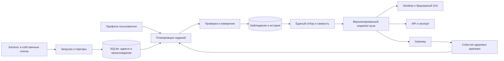

# Proxy Workbench: полный аудит и план развития

Дата: 25 сентября 2026. База: версия 2.2.1, commit `e4bf03c`, текущее рабочее дерево с локальными изменениями интерфейса.

**Рекомендация:** развивать проект как удобный локальный менеджер прокси: найти подходящие для задачи → объяснить качество → подключить приложение → поддерживать рабочий пул. Самые ценные следующие изменения — достоверные результаты, хорошие источники, самостоятельное пополнение пула и обычная установка на Windows/macOS.

Полный набор материалов:

- Этот документ: существующие возможности, конкретные проблемы, архитектура, сценарии, Windows/macOS, этапы и критерии готовности.
- [BACKLOG.ru.md](BACKLOG.ru.md): 140 задач развития по 10 направлениям, с приоритетами и критериями приёмки.
- [SOURCES.ru.md](SOURCES.ru.md): разбор всех 55 текущих ссылок, улучшение каталога и кандидаты на расширение.

## 1. Что проверено и насколько достоверны выводы

Изучены сборщик, проверки, SQLite, экспорт, GUI/backend, JS/HTML/CSS, API, шлюз, SOCKS4, GeoIP/ASN, DNSBL/анонимность, launcher-скрипты, упаковка, CI/release, тестовые сценарии, README и правила проекта. В пакете 15 Python-модулей, 4 727 строк Python; в 18 тестовых файлах найдено 121 определение теста. Это размер покрытия по исходникам, **не результат запуска тестов**.

Аудит статический. Тесты, сборки, приложение, публичные прокси и доступность 55 URL не запускались и не проверялись: `AGENTS.md` требует отдельного запроса на тесты, сканирования и сетевые проверки проекта. Поэтому ниже различаются установленная логика кода, предполагаемое проявление ошибки и новые предложения. Документация платформ и некоторых поставщиков изучена через веб; это не проверка работоспособности прокси.

Пользовательские данные и настройки из `data/` не изучались. Исходники не изменялись. Номера строк относятся к рабочему дереву на момент анализа; интерфейс уже содержал незакоммиченные правки.

## 2. Что уже хорошо сделано

| Область | Реализовано | Что сохранять при развитии |
| --- | --- | --- |
| Сбор | 55 источников, текст/HTML, Geonode, импорт TXT, дедупликация, ограниченные загрузки | Потоковое чтение, валидацию адресов, защиту загрузчика от private/metadata адресов и DNS rebinding |
| Проверка | HTTP, CONNECT, HTTPS-to-proxy, SOCKS4, SOCKS5; несколько targets; коды, contains, SHA-256 | Реальные запросы и проверку TLS; объяснимые условия прохождения |
| Скорость работы | asyncio, очереди, TCP-prefilter, fail-fast, лимиты, find-N | Ограниченный параллелизм; возможность остановки |
| Данные | SQLite WAL, профили измерений, сохранение готовых проверок, поколения экспорта | Локальное хранение и совместимость старых данных |
| Интеграции | API, HTTP/SOCKS5 gateway, sticky sessions, PAC, Clash, sing-box, proxychains, Telegram link | Единый удобный адрес подключения; готовые форматы |
| Интерфейс | EN/RU, темы, фильтры, детали, импорт/экспорт настроек | Работу без аккаунта; доступность CLI и браузерного режима |
| Распространение | Windows `.exe`, wheel, Docker; CI на трёх ОС | Проверку поставляемого артефакта на локальных mocks |
| Open source | MIT, CONTRIBUTING, SECURITY, PRIVACY, шаблоны issues, Dependabot | Прозрачность и отсутствие встроенной телеметрии |

Не нужно заново реализовывать ротацию, API, SOCKS4, поиск N прокси, GeoIP, темы или базовые экспорты: они уже есть. Нужно довести их согласованность и удобство.

## 3. Конкретные проблемы и ограничения

Приоритеты: **P0** — исправить до продвижения обновлённой версии обычным пользователям; **P1** — ближайший функциональный релиз; **P2** — следующий этап. Это продуктовый порядок работ, не рейтинг уязвимостей. Все ссылки на код ниже — относительно корня репозитория.

### Корректность результата и жизненный цикл

| ID | Приоритет | Что найдено и чем мешает | Что сделать / критерий исправления |
| --- | --- | --- | --- |
| F01 | P0 | `proxy_workbench/branding.py:18` запрашивает каталог из `/main/sources.json`, а в дереве файл находится в `proxy_workbench/sources.json`. Кнопка обновления использует этот URL (`proxy_workbench/gui.py:264`). HTTP-ответ удалённого адреса не проверялся. | Исправить путь; локальная проверка release manifest должна гарантировать, что URL соответствует публикуемому файлу. |
| F02 | P0 | `scan()` пропускает любой существующий результат того же профиля; в `api.select()` и `gateway.Pool.refresh()` нет ограничения возраста. Старый успешный адрес может считаться рабочим неограниченно долго. Новый `generated_at` при переэкспорте не означает новый замер. | Отдельные `checked_at`, `valid_until`, `exported_at`; default TTL для живого пула; просроченные адреса доступны только в истории/явном режиме stale. |
| F03 | P0 | Цикл `--watch` (`proxy_workbench/proxytool.py:2051`) выполняет только `recheck_passing=True`. Отвалившиеся адреса больше не проверяются, новые источники не собираются; пустой пул сам не восстанавливается. | Менеджер пула: перепроверка, поиск замены, периодический сбор, повторный допуск временно упавших адресов; тест восстановления пула с нуля. |
| F04 | P0 | GUI читает рейтинг под эксклюзивным `workbench.lock` (`proxy_workbench/gui.py:491`); CLI держит тот же lock во время всего задания, включая ожидание watch. JS при этом пытается обновлять таблицу во время проверки. Аналогичная блокировка есть у деталей и скачивания. | Читать согласованный snapshot/WAL без writer-lock. Во время проверки доступны последние результаты и экспорт; lock оставить для действительно конфликтующих операций. |
| F05 | P0 | Перепроверка удаляет старые `results` до получения новых (`proxy_workbench/proxytool.py:1141`), а историю хранит временно в `previous`. Остановка/сбой после удаления теряет прежние значения для ещё не проверенных адресов. | Записывать новые observations отдельно; заменять latest только после завершённого измерения. Остановка не уничтожает прежнюю историю и рабочий snapshot. |
| F06 | P1 | `country_resolver()` копирует metadata до `collect()` (`proxy_workbench/proxytool.py:1971`). Страны только что загруженного Geonode не попадут в эту копию; на первом запуске без GeoIP фильтр может пропустить все новые адреса. | Обновлять resolver после сбора или читать свежую metadata. Отдельный сценарий: пустая БД → Geonode → country-filter без GeoIP. |
| F07 | P1 | Общая таблица `candidates` накапливает всё. Отключение sources и импорт своего файла не изолируют запуск от прежних публичных адресов. Удаление источника также не удаляет принадлежавшие ему кандидаты. | Именованные списки и membership; явный scope «только этот импорт / выбранные источники / вся база». |
| F08 | P1 | Отчёт экспорта считает `pending=total-checked` по всей БД (`proxy_workbench/proxytool.py:1528`), даже если выбран один протокол/страна или достигнут `want`. Пользователь видит неоднозначное «завершено» и необработанный остаток. | Разделить `database_total`, `eligible`, `scheduled`, `checked`, `skipped`, `stop_reason`; завершённость считать относительно задания. |
| F09 | P1 | `source_quality.passed` зависит от страны, latency, анонимности и других условий экспорта (`proxy_workbench/proxytool.py:1437–1462`). `prune_sources()` удаляет источник после ≥20 checks и 0 passed (`proxy_workbench/gui.py:253`), хотя причина может быть в фильтре. | Разделить доступность источника, базовую работоспособность и соответствие конкретной задаче. Вместо удаления — обратимое временное отключение после нескольких независимых неудач. |
| F10 | P1 | Заслугу получает первый завершивший загрузку источник (`candidate_meta.source`, `proxy_workbench/proxytool.py:529`), остальные связи не участвуют полноценно в качестве. Рейтинг зависит от порядка загрузок. | Many-to-many attribution; отдельный показатель уникального вклада. Один и тот же набор лент в другом порядке даёт сопоставимую оценку. |

### Качество измерений

| ID | Приоритет | Что найдено и чем мешает | Что сделать / критерий исправления |
| --- | --- | --- | --- |
| F11 | P0 | `anonymity.classify()` (`proxy_workbench/anonymity.py:99`) возвращает `elite`, если в произвольном ответе нет своего IP и proxy headers. Успешная HTML-заглушка без echo тоже подходит под это условие. | Сначала подтвердить корректную структуру judge-ответа и наблюдаемый IP; отсутствие доказательств → `unknown`. Показывать «признаки утечки не обнаружены в этой проверке». |
| F12 | P0 | Требование `min_anonymity` тихо заменяется на `any`, если judge не задан, в scan/export/GUI. Пользователь может выбрать elite и получить непроверенные адреса. | Ошибка валидации с конкретным действием или явное снятие фильтра пользователем; никогда не ослаблять обязательное условие незаметно. |
| F13 | P1 | IPv6 DNSBL reverse в `proxy_workbench/reputation.py:180` разворачивает строку `exploded` вместе с двоеточиями, без dotted nibbles. | Генерировать правильное обратное представление IPv6; учитывать поддержку IPv6 конкретной зоной. |
| F14 | P1 | Любой DNSBL ответ с `127.*` считается попаданием (`proxy_workbench/reputation.py:236`). У некоторых поставщиков это также ошибки доступа/квоты. | Таблица кодов по зоне: listed / clear / quota / denied / unknown. Например, у Spamhaus `127.255.255.0/24` — ошибки, а не попадание. [Документация Spamhaus](https://docs.spamhaus.com/datasets/docs/source/70-access-methods/data-query-service/040-dqs-queries.html). |
| F15 | P1 | Измерение Mbps считает байты первого chunk, но начинает таймер после его получения (`proxy_workbench/proxytool.py:994`). Один большой chunk даёт почти нулевой интервал и завышенную скорость. | Отдельно TTFB и transfer-time; минимальная длительность/объём, warm-up, несколько повторов; короткий ответ помечать insufficient sample. |
| F16 | P1 | После fail-fast сохранены неполные samples. Если затем снизить порог на вкладке результатов, первоначально оборванная проверка не даёт достоверной оценки нового условия. | Хранить объём фактически выполненных попыток и порог раннего завершения; требовать дозамер для несовместимого ослабления критерия. |
| F17 | P1 | `test_proxies()` вызывает `check_proxy()` напрямую (`proxy_workbench/proxytool.py:1856`), без `screen_proxy` и определения `own_ips`; ряд принятых общим CLI флагов не действует как в scan/run. | Один pipeline для test/scan/run; неподдерживаемые флаги явно отклонять. |
| F18 | P2 | «Рекомендуемые» включают редкость по числу URL как предполагаемую меньшую загруженность (`recommender()`). Это гипотеза; зеркала и копии искажают сигнал. В таблице выводится `score`, хотя сортировка использует `recommended`. | Основные факторы: свежесть, успешность на target, объём наблюдений, задержка, ресурсная нагрузка. Редкость — экспериментальный малый вес; показывать причину позиции. |
| F19 | P1 | `hosting` определяется regex по названию организации (`proxy_workbench/geoip.py:140`). Не найденная БД и отсутствие совпадения легко воспринимаются как «домашний IP». Страна фильтруется по endpoint, хотя выход может быть в другом месте. | Трёхзначный тип сети: вероятный DC / вероятный ISP / неизвестно; источник и уверенность. Отдельные фильтры endpoint-country и observed exit-country. |
| F20 | P1 | При выключенном DNSBL и даже отсутствии reputation UI часто использует `clean` по умолчанию. Пресеты проверяют конкретные HTTP endpoint: сайт Telegram не доказывает работу MTProto, YouTube 204 — видео, 401 API — работу авторизованного продукта. | Нейтральные статусы «denylist: нет совпадений», «DNSBL: не проверялось» и точное описание возможностей каждого теста. |

### API, ротация и экспорт

| ID | Приоритет | Что найдено и чем мешает | Что сделать / критерий исправления |
| --- | --- | --- | --- |
| F21 | P0 | При пустом списке `formats.clash()` подставляет `DIRECT`, а `singbox()` создаёт direct outbound. PAC, наоборот, блокирует. Поведение неожиданно меняется между форматами. | Единая политика пустого пула: ошибка/блокировка по умолчанию; прямой выход — только явно выбранная настройка с отражением в UI. |
| F22 | P1 | `Pool.pick()` выбирает адрес, затем происходит `await open_tunnel`, и только после этого `acquire()` (`proxy_workbench/gateway.py:284–295`). Параллельные подключения могут превысить `max_per_proxy`. | Резервировать слот до первого await, освобождать при любом исключении/отмене. Проверять именно конкурирующие connect, а не последовательные pick/acquire. |
| F23 | P1 | Deadline в `Gateway.handle()` покрывает первый байт, но не весь HTTP/SOCKS handshake. Клиент, приславший часть заголовка, может держать соединение без конечного deadline. | Общий handshake deadline, лимит входящих соединений, timeout на drain; корректное закрытие всех активных tasks. |
| F24 | P1 | Для обычного HTTP через HTTP upstream `open_tunnel(..., forward=True)` только открывает TCP. `pool.ok()` вызывается до ответа HTTP; ошибка ответа/трафика далее не обновляет health полноценно. | Разделить «TCP открыт», «туннель установлен», «получен ответ», «запрос успешен». Не обещать retry после начала передачи тела, особенно для неидемпотентных запросов. |
| F25 | P2 | `sessions`, `cache`, `usage`, `resting` не имеют полноценного общего lifecycle. Очистка sessions после 10 000 удаляет лишь просроченные, а не ограничивает активные. GUI читает snapshot пула из другого потока. | TTL/LRU и жёсткие пределы; snapshot получать через event loop. Проверить гонки при GUI polling — это риск по коду, не воспроизведённый сбой. |
| F26 | P1 | API `Exports.load()` читает legacy `ranked.json` и `status.json` отдельно (`proxy_workbench/api.py:88`). Writer публикует их последовательно после manifest. Возможна новая таблица со старой metadata. | Читать одну generation через `current.json`, проверять version/schema; удерживать snapshot на время ответа. |
| F27 | P1 | GUI export переносит часть result-фильтров, но не `q` и не `result-hosting` (`proxy_workbench/ui/app.js`, `start('export')`). Экспорт может не совпасть с видимой выборкой. | Единый SelectionSpec для таблицы/API/экспорта; отдельно «эта выборка» и «весь пул», одинаковые count и digest фильтра. |
| F28 | P1 | `downloadFile()` сначала ждёт fetch, затем открывает picker; после `pipeTo()` ещё раз вызывает `writable.close()` (`proxy_workbench/ui/app.js:1476`). | Picker вызывать в пользовательской активации, закрывать поток один раз; cancel не считать ошибкой. `pipeTo()` закрывает destination по умолчанию. [MDN: pipeTo](https://developer.mozilla.org/en-US/docs/Web/API/ReadableStream/pipeTo), [MDN: picker](https://developer.mozilla.org/en-US/docs/Web/API/Window/showSaveFilePicker). |
| F29 | P1 | Checker поддерживает явный HTTPS proxy, а gateway отбрасывает его (`proxy_workbench/gateway.py:28,65`); `proxy_workbench/formats.py` также не экспортирует его в Clash/sing-box. В gateway для `socks5://` DNS разрешается локально, а checker делегирует SOCKS5 библиотеке HTTPX; общей явной DNS-policy нет. | Опубликовать capability matrix; добавить TLS-to-proxy, явный DNS mode и контрактные проверки одинакового маршрута в checker/gateway/экспортах. |
| F30 | P1 | Локальный denylist применяется в worker после TCP-prefilter; уже накопленный адрес, запрещённый позже, может получить TCP-connect до блокировки (`scan.gatekeeper()`). | Проверять denylist перед любой сетевой стадией. Ожидание пользователя: запрещённый адрес вообще не трогаем. |

### Интерфейс, масштабирование и поставка

| ID | Приоритет | Что найдено и чем мешает | Что сделать / критерий исправления |
| --- | --- | --- | --- |
| F31 | P1 | `public_source()` удаляет весь path: 43 GitHub Raw URL в отчёте превращаются в одинаковый host. Источник трудно распознать или отключить осмысленно. | Безопасный display-name: owner/repo + назначение ленты; секреты query/userinfo не показывать. |
| F32 | P1 | `normalize()` отбрасывает hostname, auth и private IP (`proxy_workbench/proxytool.py:310`). Это ограничивает импорт купленных и собственных прокси. | Отдельный тип owned/provider proxy с hostname и secret-ref; public discovery оставить с нынешними ограничениями адресов. |
| F33 | P1 | `paths.default_data()` для frozen пишет рядом с executable. Это неподходящий default для установки в защищённую папку Windows и внутрь будущего Mac `.app`. Windows spec — `console=True`; Mac release-job отсутствует. | Per-user data по ОС, отдельный portable mode; desktop entry без консоли, CLI отдельно; полноценные Mac artifacts. |
| F34 | P2 | Язык/тема сохраняются в browser localStorage, но GUI по умолчанию получает случайный порт (`proxy_workbench/gui.py:735`). Новый origin при перезапуске не видит прежний storage. | Сохранять предпочтения в локальных настройках приложения; browser storage использовать как кэш. |
| F35 | P1 | Ограничение async-очереди не означает ограничение всей RAM: `pending`, `done`, `proven`, `recommend_later` растут с базой; GUI перечитывает/сортирует все результаты ради 50 строк. API загружает полный JSON. | Индексированные summary-колонки, DB cursor/keyset pagination, bounded batches, агрегаты источников; измерить память на больших fixtures. |
| F36 | P2 | SQLite хранит последние payload по profile/proxy; полноценной временной истории, retention БД, schema-version migrations и именованных профилей нет. Версия User-Agent входит в digest профиля и создаёт новый набор результатов при апгрейде. | Разделить measurement fingerprint, пользовательский профиль и историю endpoint; миграции/backup/retention. Не смешивать несовместимые измерения, но сохранять историю адреса. |
| F37 | P1 | У загрузчика есть полезные лимиты, но нет ETag/cache, бюджета на всю коллекцию и общего deadline пагинации. В `update_sources()` 1 MB проверяется после полной загрузки response.content; HTML regex строит полный список совпадений. | Общий bounded fetcher для каталога/GeoIP/лент, лимиты распаковки и общего задания, iterator parser, per-host backoff. |
| F38 | P2 | UI показывает в основном прошедшие адреса; ошибка задания часто сведена к типу exception. 13 столбцов перегружают список; нет нормального выбора строк. Прогресс без `role=progressbar`, нет reduced-motion настройки. | Экран диагностики отклонённых, понятные error codes и действия; компактный список по умолчанию, групповые действия, доступность. |
| F39 | P2 | README местами отстаёт: одновременно beta и Production/Stable; текст про отсутствие country/find-N противоречит флагам; checklist pipx/PyPI смешивает разные способы установки. `AGENTS.md` и CONTRIBUTING расходятся по веткам. | Согласовать документацию с реальными возможностями и матрицей поставки; одна release-checklist и правило для участников. |
| F40 | P1 | Есть 121 определение теста и mock-smoke, но нет браузерных E2E и packaged-Mac проверки. Smoke использует фиксированные порты. Тест 190 000 кандидатов использует искусственный probe, поэтому не доказывает сетевую производительность на пользовательском ноутбуке. | Добавить сценарии из раздела 10, динамические порты, метрики памяти/latency отдельно от correctness, проверки установленных артефактов. |

Пункты F01–F40 — не 40 подтверждённых внешних уязвимостей. Это ошибки/ограничения поведения, архитектурные пробелы и несколько явно отмеченных рисков, установленных по исходникам.

## 4. Каким должен стать продукт

Основная аудитория: обычный пользователь с собственным списком или небольшой практической задачей; разработчик/QA; человек, которому нужен постоянно доступный пул для разрешённых запросов. Полезное отличие проекта — свои критерии качества, объяснимые измерения и локальная работа.

Не следует обещать «покрывает вообще всё»: бесплатный пул не обеспечивает гарантированную доступность, HTTP-проба не проверяет весь продукт, а HTTP/SOCKS-прокси не заменяет маршрутизацию всего устройства. Это ограничения модели продукта, которые нужно выражать через точные настройки и статусы.

| Сценарий | Как пользователь должен проходить его | Условие успеха |
| --- | --- | --- |
| Мне нужны 5 подходящих адресов | Выбрать задачу → при необходимости страну → «Найти 5» → подключить/скопировать | Не нужно понимать workers, DNSBL или форматы источников; видны возраст и область проверки |
| У меня свой список | Перетащить файл → увидеть распознанные/отклонённые строки → выбрать профиль → проверить только импорт | В запуск не попадают адреса из прежних публичных сборов |
| Мне нужен стабильный адрес для приложения | Выбрать приложение → проверить нужные возможности → включить закрепление сессии | Изменение upstream и срока закрепления объяснено; failover не выдаётся за сохранение exit-IP |
| Мне нужен пул 20 адресов | Выбрать условия → «Поддерживать 20» → оставить в фоне | Пул пополняется; недобор показан вместе с причиной; есть бюджет трафика и времени |
| Проверить свой API из нескольких регионов | Профиль endpoint → допустимые ответы/JSON → распределение стран → журнал | Сохраняются результаты на каждый target, endpoint-country отделена от exit-country |
| Сравнить собственных поставщиков | Импорт двух списков → одинаковые probes/расписание → сравнение | Метрики приведены к одному временному окну; секреты замаскированы |
| Список перестал работать | Открыть диагностику → увидеть «источник / прокси / target / сеть устройства» | Предложено одно конкретное следующее действие вместо общего «ошибка» |

### Предлагаемая навигация

1. **Главная:** рабочий пул, свежесть, активная задача, «Найти», «Проверить свой список», «Поддерживать пул».
2. **Прокси:** таблица, коллекции, теги, избранное, история, групповые действия.
3. **Источники:** карточки поставщиков, вклад/свежесть/ошибки, добавление с предпросмотром.
4. **Профили проверок:** именованные задачи, targets, версии, правила прохождения.
5. **Подключение:** gateway, режим ротации/сессии, приложения, API, экспорт.
6. **Задания и история:** текущий прогресс, очередь, причины завершения, сравнение запусков.
7. **Настройки:** язык/тема, производительность, данные/backup, обновления, диагностика.

Новичку показывать три главных действия. Продвинутые параметры раскрывать по необходимости. На первом экране не нужны десятки технических чисел.

### Список результатов

Default-столбцы: адрес, статус задачи, страна выхода/неизвестно, время проверки, задержка, успешные проверки/всего, кнопка действий. Скорость скачивания, ASN, jitter, источники и признаки анонимности — включаемые столбцы.

У строки: копировать в выбранном формате, проверить сейчас, закрепить, добавить тег/заметку, исключить, открыть историю. У нескольких строк: экспорт, recheck, переместить в список, удалить из списка, denylist. «Удалить из списка» и «запретить использовать» — разные операции.

Фильтры: fresh/stale/failed/unknown, протокол и реальные capabilities, exit-country, ASN/организация, возраст, latency, throughput, минимальный объём наблюдений, источник, собственный/публичный, теги. Сохранённые представления и сброс фильтров обязательны.

## 5. Источники: что менять в первую очередь

Встроено 55 разных строк URL: 38 `http`, 2 `http-fields`, 6 `socks5`, 5 `socks4`, 3 `text`, 1 `geonode`. Это форматы входа, а не доказанные capabilities. 43/55 ссылок идут на GitHub Raw, ещё 2 используют jsDelivr для GitHub-репозитория. Точные дубли URL отсутствуют; пересечение самих прокси не измерялось.

План: сначала нормальный каталог и измерение полезности, затем расширение. Дополнительные 200 зеркал без новых рабочих адресов только увеличат время и нагрузку.

- **Карточка вместо строки:** имя, publisher, parser, протоколы, fallback, условия использования, рекомендуемый интервал, enable/disable, причина последнего сбоя.
- **Метрики отдельно:** загрузился ли источник; сколько валидных записей; сколько новых endpoint; сколько прошло локальную проверку; сколько уникальных рабочих адресов сохранилось через заданное время.
- **Происхождение:** один proxy может принадлежать нескольким источникам; несколько URL — одному publisher. Зеркало не считается независимым подтверждением.
- **Свежесть:** last-fetch, last-content-change, last-seen per proxy, provider-checked-at при наличии; чужое измерение не заменяет локальное.
- **Загрузка:** ETag/Last-Modified, Retry-After, per-host limits, постепенный backoff, circuit breaker, retry после временного сбоя.
- **Выбор источников:** базовый, SOCKS5, собственные, расширенный; бюджет источника по его уникальному полезному вкладу.
- **Обновление каталога:** versioned manifest, стабильные ID, удалённые/перенесённые URL, overrides пользователя, backup/rollback; перенос адреса не создаёт нового поставщика.
- **Добавление:** мастер URL → parser → предпросмотр → ограничения → имя → сохранить. Удаление и отключение обратимы.

Первые адаптеры metadata: Monosans JSON, Proxifly JSON и полнее Geonode. У Monosans заявлены JSON с exit-IP/ASN/geolocation; у Proxifly — JSON/CSV; у Geonode доступны export и фильтры. Это сведения поставщиков, требующие контрактных fixtures и локальной перепроверки. [Monosans](https://github.com/monosans/proxy-list), [Proxifly](https://github.com/proxifly/free-proxy-list/blob/main/README.md), [Geonode](https://geonode.com/free-proxy-list).

## 6. Архитектура реализации

Сохранить Python, asyncio, SQLite и существующий frontend. Начать с модульного монолита; переписывание всего на Rust/Go/Electron сейчас не решает выявленные ошибки качества.

### Модули

| Модуль | Ответственность |
| --- | --- |
| `domain/` | ProxyEndpoint, Capability, Target, Measurement, SelectionSpec; без запуска сети |
| `sources/` | Catalog, adapters, bounded fetcher, cache, provenance |
| `checks/` | TCP, handshake, HTTP, TLS, judge, bandwidth; единая структура ошибок |
| `storage/` | Репозитории SQLite, migrations, backup, retention, snapshots |
| `jobs/` | Очередь, остановка, продолжение, recheck, наполнение пула, budgets |
| `selection/` | Фильтры, доверие к измерениям, score, policy freshness |
| `gateway/` | Reserving pool, transport adapters, sessions, health-events |
| `services/` | Общие сценарии для CLI/GUI/API; без копий правил |
| `desktop/` | Окно, tray, выход, single instance, OS integration |
| `ui/` | Отображение и ввод; сообщения по error codes, не перевод regex по русскому тексту |

Вводить модули постепенно, сохраняя совместимые публичные функции как adapters. Первая декомпозиция — selection/freshness, затем source registry и job lifecycle. Не совмещать перенос всего кода с большим изменением поведения в одном PR.

### Схема данных

- `proxy_endpoints`: ID, host/IP, port, transport, DNS-mode, owner-kind, auth-ref, created-at; credentials не входят в отображаемый URL.
- `source_definitions` и `source_fetches`: версия каталога, publisher/family, parser, state, fetch/error/etag/content-hash.
- `proxy_sources`: endpoint/source, first-seen, last-seen, supplied metadata.
- `collections` и `collection_members`: пользовательские списки и их состав.
- `check_profiles`: имя и версия настроек; отдельно fingerprint условий измерения.
- `jobs` и `job_items`: причина/область запуска, состояния, очередь и checkpoint.
- `observations`: endpoint + target + run, timestamps, outcome, phase timings, exit-IP, capabilities, policy-version.
- `latest_results`: индексируемая сводка; полные samples читать по запросу.
- `pool_snapshots` и `pool_members`: одна version/generation на весь набор и metadata.
- `gateway_events`/агрегаты: краткие обезличенные показатели доступности; без журналирования трафика.

Миграции: schema version → backup через SQLite backup API → транзакционная миграция → validation → переключение. WAL/SHM нельзя считать полноценной резервной копией простым копированием основного файла работающей БД.

### Контракты, которые должны быть едиными

1. Обязательный фильтр нельзя молча отменять из-за отсутствия измерения.
2. «Свежий» определяется возрастом наблюдения, а не временем экспорта.
3. Внешние hints и локальные verified-поля хранятся отдельно.
4. История не удаляется перед перепроверкой.
5. Table/API/export/gateway используют один SelectionSpec и одну трактовку unknown.
6. Empty pool имеет явную policy; смена формата не включает direct-доступ.
7. Проверка доступности proxy и работа конкретного приложения — разные capabilities.
8. Source failure, target failure и отсутствие сети устройства — разные состояния.

## 7. Windows и macOS для обычного пользователя

**На Mac нужен аналог удобства `.exe`: готовое `Proxy Workbench.app`, обычно внутри `.dmg`.** Windows `.exe` не является нативным Mac-приложением; один исходный код нужно собирать отдельно для разных ОС. PyInstaller предусматривает отдельную сборку на каждой платформе. [PyInstaller: usage](https://www.pyinstaller.org/en/stable/usage.html).

### Практичный путь

1. Сначала сделать Mac `.app` со встроенным Python и библиотеками. Даже запуск существующего browser GUI из этой оболочки уже убирает необходимость устанавливать Python.
2. Затем добавить отдельное desktop-окно с существующим HTML/CSS/JS. Для текущего Python-проекта разумен короткий прототип pywebview: поддержка Windows/macOS, native window/menu/dialogs без переписывания backend. Это рекомендация по устройству текущего проекта; работоспособность выбранной версии нужно проверить на обеих ОС. [Документация pywebview](https://pywebview.flowrl.com/guide/).
3. CLI оставить отдельной командой; browser mode оставить доступным для разработчиков. GUI-процесс должен правильно запускать headless workers без создания второго окна.
4. Tauri/Rust рассматривать позже, только если прототип покажет ограничения оболочки. Стоимость новой toolchain и sidecar lifecycle должна быть оправдана измерениями.

### План по ОС

| Пункт | Windows | macOS |
| --- | --- | --- |
| Основная поставка | Подписанный installer на пользователя, x64 | Подписанный и notarized `.app` в `.dmg`, arm64 |
| Дополнительная поставка | Portable ZIP; CLI; ARM64 после отдельной оценки поддержки | x86_64 для Intel при заявленной поддержке; universal2 при совместимости всех зависимостей |
| Без Python | Python и зависимости внутри дистрибутива | Python и зависимости внутри bundle |
| Папка данных | `%LOCALAPPDATA%/Proxy Workbench` | `~/Library/Application Support/Proxy Workbench` |
| Portable | Только явно выбранный режим и проверка прав на папку | Отдельная опция; ничего не писать внутрь установленного `.app` |
| Запуск | Ярлык/Start Menu; без терминала | Finder/Dock; без Terminal и `chmod` |
| Повторный запуск | Активировать существующее окно | Активировать существующее окно |
| Фоновая работа | Tray, состояние задачи и явный «Выход» | Menu bar, состояние задачи, корректный Cmd+Q |
| Закрытие окна | Согласованная политика: скрыть в tray или завершить | Нативное поведение окна/приложения; фон объяснён |
| Автозапуск | Opt-in; легко отключается | Opt-in; login item после разрешения |
| После sleep/смены Wi-Fi | Перепроверить сеть, пересчитать deadlines и freshness | То же; не считать весь пул умершим из-за сна ноутбука |
| Обновление | Проверка версии → проверка подписи → migration/backup → restart | То же; bundle целиком, без патча подписанных ресурсов |
| Удаление | Удалить приложение; данные сохранять/очищать отдельным выбором | Перенос в корзину; команда удаления пользовательских данных отдельно |

PyInstaller поддерживает arm64/x86_64/universal2, но universal2 требует совместимых архитектур зависимостей: склеивать два готовых onefile-файла недостаточно. [PyInstaller: архитектуры](https://pyinstaller.org/en/stable/feature-notes.html#macos-multi-arch-support).

Для массовой Mac-поставки нужны Developer ID, signing, notarization и stapling; release workflow должен выполнять и проверять эти шаги. Signing-credentials предоставляет владелец проекта. [Apple: Developer ID](https://developer.apple.com/developer-id/), [Apple: notarization workflow](https://developer.apple.com/documentation/security/customizing-the-notarization-workflow).

На Windows подпись важна для доверия к сборке и Smart App Control; проверку SmartScreen нужно проходить на реальном скачанном артефакте, не обещая отсутствие любых предупреждений только из-за подписи. [Microsoft: Smart App Control](https://learn.microsoft.com/en-us/windows/apps/develop/smart-app-control/overview), [Microsoft: SmartScreen](https://fb.smartscreen.microsoft.com/smartscreenfaq.aspx).

Минимальные версии ОС, архитектуры и браузеров зафиксировать после проверки зависимостей. В CI должны присутствовать именно заявленные платформы; `macos-latest` сам по себе не доказывает поддержку всех Intel/Apple Silicon и старых macOS.

### Подключение приложений

Сначала — мастер ручного подключения браузера/Telegram/скрипта с кнопкой проверки. Затем — необязательная настройка системного proxy: сохранить прежние параметры, показать область действия, включить выбранный режим, восстановить при выключении/сбое. Нельзя рекламировать это как VPN или гарантированный kill switch: часть приложений не использует системные HTTP/SOCKS-настройки.

## 8. Самые полезные новые функции

Первые десять крупных результатов разработки:

1. **Поддерживать N свежих рабочих прокси:** автоматическая замена умерших, недобор и причины.
2. **Именованные списки:** свои, публичные, избранное, проекты; запуск по конкретному составу.
3. **Профили задач:** выбрать, дублировать, сравнить, экспортировать без секретов.
4. **Работа с собственными провайдерами:** hostname/auth, безопасное хранение credentials, явный scope.
5. **Менеджер источников:** здоровье, уникальный вклад, свежесть, переносы URL, parser-preview.
6. **Матрица proxy × target:** видно, для какого сайта адрес подходит и почему не подошёл для другого.
7. **История качества:** возраст, последние проверки, изменение exit-IP, устойчивость в выбранном временном окне.
8. **Мастер подключения приложения:** обычный язык, готовые параметры, проверка результата.
9. **Фоновая desktop-работа:** tray/menu bar, sleep/wake, notifications о meaningful событиях, выход без оставшихся процессов.
10. **Объяснимая диагностика:** «нет сети», «источник вернул другую страницу», «ошибка TLS», «пул устарел», «слишком узкий фильтр».

Вторая очередь: AND/OR-группы targets, JSON assertions, saved views, исключение по ASN/CIDR, фильтр по exit-country, расписания по профилям, domain-specific pools, API leases и feedback от клиентов, streaming events, REST schema/SDK, экспорт выбранных строк и подписки.

Дальняя очередь: UDP/QUIC probes, собственные transport plugins, distributed workers, полноценный TUN, облачная синхронизация. Это отдельные проекты с новой моделью прав/доверия и обслуживания; они не должны задерживать хорошие списки и desktop-поставку.

## 9. Порядок реализации

| Этап | Что входит | Что пользователь получает | Условие выхода |
| --- | --- | --- | --- |
| E0 — исправить достоверность | F01–F06, F11–F15, F21–F23, F26–F30; согласованные сообщения | Результатам и экспортам можно доверять в пределах измерений | Регрессии на локальных mocks; stale/unknown/direct не маскируются |
| E1 — данные и источники | Migrations, provenance, коллекции, source registry, parser preview, caches | Понятный выбор источников и изолированный импорт | Отдельный импорт не смешивается с публичной БД; зеркало не улучшает рейтинг |
| E2 — полезные сценарии | Maintain-N, refill, профили, live results, compact table, диагностика | Обычный пользователь получает и поддерживает нужный пул | Пустой пул восстанавливается, результаты доступны во время работы |
| E3 — desktop | Per-user paths, `.app/.dmg`, Windows installer, desktop shell, lifecycle | Двойной клик без Python/терминала | Чистая установка, апгрейд и выход проверены на заявленных ОС |
| E4 — собственные и интеграции | Auth/hostname, secret store, connection wizard, API v1, named pools | Пригодность для реальных собственных инструментов | CLI/GUI/API используют одну policy; секреты не попадают в share/export по умолчанию |
| E5 — зрелость open source | Обновления, документация, signing/attestation, performance budgets, contribution process | Воспроизводимые релизы и удобное участие | Артефакты опубликованы только после всех обязательных проверок |

Начать E3 с пути данных и прототипа упаковки можно раньше, но качественный публичный desktop-релиз должен включать E0. E1 нужен до сложного планировщика E2. Собственные credentials — после модели endpoint и secret-store, а не как разрешение строки с паролем в старом normalizer.

Полный backlog не равен обязательствам ближайшего релиза. Для одного опытного разработчика ограниченный качественный 3.x — работа на несколько месяцев; весь список — на несколько кварталов и более. Точную оценку делать после воспроизведения F-проблем и двух прототипов: storage/job lifecycle и desktop packaging.

### Первые 12 небольших PR

1. Исправить URL обновления sources и добавить проверку пути release-каталога.
2. Ввести нейтральные unknown/not-checked и запрет молчаливого снятия anonymity-filter.
3. Исправить judge-validation и DNSBL IPv6/return codes.
4. Согласовать empty-pool policy для всех экспортов.
5. Исправить GUI download и соответствие фильтров экспорту.
6. Исправить gateway reservation и полные handshake deadlines.
7. Ввести snapshot-reader generation для API/GUI.
8. Добавить TTL и max-age без удаления истории.
9. Перевести recheck на сохранение наблюдений без предварительного DELETE.
10. Исправить source attribution/prune и resolver после collect.
11. Ввести per-user paths/portable mode и минимальную Mac-сборку.
12. Добавить maintain-N поверх обновлённой модели jobs/snapshots.

Каждый PR: один пользовательский результат, локальный regression где он нужен, миграция при изменении хранения, документация. Архитектурные переносы — отдельными шагами.

## 10. Что проверять при реализации

Это будущий план верификации. В данном аудите эти проверки **не выполнялись**.

| Группа | Обязательные сценарии |
| --- | --- |
| Freshness | Старый passed исключается из active pool; переэкспорт не делает его свежим; max-age одинаков в GUI/API/gateway |
| Recheck | Stop/crash в середине не уничтожает прежние observations; resume продолжает только незавершённое |
| Refill | 20 → 5 → 0 живых адресов; источники добавляют кандидатов; пул восстанавливается либо объясняет недобор |
| Источники | 304, 429/Retry-After, 404/moved, timeout, частичная загрузка, repeated page, HTML вместо TXT, большой gzip, BOM/CRLF/IPv6 |
| Происхождение | Один endpoint из трёх зеркал; изменённый URL; исчезновение/возвращение; атрибуция не зависит от порядка завершения fetch |
| Judge | Валидный echo, 200-капча, пустой ответ, несовпадающий nonce, IPv4/IPv6, недоступный judge → unknown |
| DNSBL | Listed/clear/error codes, NXDOMAIN против DNS failure, IPv6 reverse, кэширование, rate limits |
| Метрики | Одноchunk-ответ, медленный первый байт, несколько chunks, partial body, неуспешный target, confidence при 1 и 20 observations |
| Gateway | Конкурентный max-per-proxy; медленный handshake; malformed SOCKS5; cancel; IPv6; query-only HTTP URL; WebSocket; долгий туннель |
| Экспорт | Zero matches, stale-only, unsupported capabilities; идентичная selection во всех форматах; отсутствие скрытого DIRECT |
| Browser UI | Chrome/Edge/Firefox/Safari; загрузки/clipboard; большой файл; изменение фильтра во время запроса; несколько вкладок; offline |
| Accessibility | Клавиатура, фокус, screen reader, прогресс, 200% масштаб, reduced motion, светлая/тёмная тема |
| Windows | Машина без Python; Unicode/пробелы в пути; non-admin; Program Files/read-only; занятый порт; upgrade/uninstall; sleep |
| Mac | Finder launch, arm64 и заявленный Intel, `.dmg`/Applications, quarantine/notarization, read-only bundle, Cmd+Q, sleep/wake |
| Data | Migration со старых fixtures, rollback/backup, disk-full, прерывание записи, retention, concurrent readers, corrupted file |
| Security boundaries | Host/Origin/token, URL validation для каждого fetcher, secret redaction, denylist до сети, TLS validation, отсутствие произвольного выполнения импортируемых конфигов |
| Производительность | 10k/100k/500k synthetic rows; RAM, DB-size, latency выдачи страницы, export-time; нагрузки измерений отдельно от сетевой скорости |

Первичные UX-цели, которые ещё предстоит подтвердить: доступный UI в первые секунды запуска; локальная выдача первой страницы порядка 300 ms на согласованной fixture 100k; отзывчивая команда Stop; видимый рабочий snapshot во время всего watch. Время получения реального публичного прокси нельзя гарантировать независимо от сети и страны.

Продуктовые метрики: время до первого применимого результата, вероятность успеха вскоре после экспорта, удержание достаточного пула, стоимость проверки в запросах/байтах, уникальный вклад источника, доля непонятных ошибок. Считать локально; отправка диагностик — только по явному действию пользователя с предпросмотром.

## 11. Выпуск и open source

- Release сначала готовить draft; публиковать после успешной сборки всех обязательных ОС. Сейчас source release появляется раньше завершения Windows/wheel jobs.
- Версия продукта, package version, changelog и artifact manifest должны проверяться вместе.
- Signing, SHA-256 всех бинарных артефактов, dependency manifest/SBOM и build provenance. Нет утверждения, что текущие зависимости уязвимы: dependency audit в этом исследовании не проводился.
- Привязать Actions к проверенным commit SHA, автоматизировать обновления; отдельно поддерживать build/dev dependencies и контролируемый набор транзитивных зависимостей.
- PyPI-publish с trusted publishing после готовности имени/аккаунта; wheel в GitHub Release и публикация в PyPI — разные вещи.
- Добавить архитектурную заметку, публичный roadmap, issue-шаблон источника с parser-fixture, guide переводчика, правила поддержки ОС/версий.
- Документацию начинать со скачивания под обнаруженную ОС и трёх сценариев первого запуска; developer setup вынести ниже.
- Список поддерживаемых capabilities должен автоматически сверяться с CLI/GUI/API/экспортами.
- Privacy-документ расширить на bundled desktop, optional updates, provider credentials, diagnostic export и удаление данных.
- Каталог sources снабдить provenance/attribution; лицензия кода проекта не описывает автоматически условия всех внешних списков.

## 12. Решение о ближайшей версии

Для ближайшего большого релиза ограничить обязательный результат: **достоверная свежесть + поддержание пула + хорошие источники + собственные списки + установка двойным кликом на Windows/Mac**.

Продвинутые протоколы и тяжёлые интеграции добавлять только после этого. Именно такой порядок превращает существующий богатый набор функций в программу, которой обычный пользователь сможет пользоваться регулярно.
