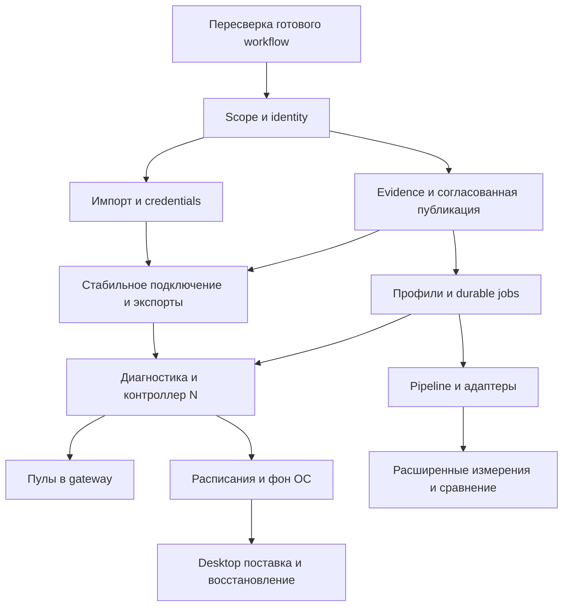

# Зависимости, последовательность и следующий релиз

## Рекомендуемый следующий функциональный релиз

**R1: «Свои списки, проверяемый результат, подключение без потери свойств».**

Законченный путь: создать отдельный список → импортировать файл/текст с понятными ошибками → использовать hostname и авторизацию → проверить выбранный scope существующим профилем → увидеть актуальность → получить рабочее подключение через текущий gateway или совместимый экспорт. Старые публичные адреса не подмешиваются; другой запущенный профиль не перенаправляет подключение.

Релиз закрывает минимальный законченный объём **F02, F03, F04, F09, F28**, а не все 28 карточек. Относительная сложность суммарно **XL** из-за модели данных и credential path; точного срока без реализации и состава команды нет. Разработка идёт последовательными проверяемыми срезами, но анонс «собственные авторизованные прокси поддержаны» возможен только после полного consumer path.

Почему этот выбор: нормальный публичный scan уже существует, а свой hostname/auth список сейчас отбрасывается и не изолируется. Исправление этой границы открывает реальный новый сценарий и создаёт основу maintained pools. Альтернатива «сначала постоянный публичный пул» тоже разумна, если пользовательское наблюдение покажет почти исключительно public-source использование; архитектура admission/collections в обоих случаях общая. Здесь выбран R1 с собственными списками, поскольку ограничение подтверждено кодом, а спрос на новые источники исследуется отдельно.

### Что входит точно

| Срез | Результат для пользователя | Минимальная реализация | Граница |
|---|---|---|---|
| R1a.1 Область и миграция | «Проверяются именно мои записи» | F02, access ID с optional credential reference, membership, collection/profile binding; legacy в отдельной коллекции | Без организаций, shared workspaces и полноценной библиотеки профилей |
| R1a.2 Preview и commit | Ошибки и замены видны до записи | F03 TXT/URI, file/clipboard, merge/replace, transaction/import receipt | Без CSV mapping, подписок и произвольных adapters |
| R1b.1 Авторизованный доступ | Поставщик с hostname/password работает по всему пути | F04 HTTP Basic proxy auth + SOCKS5 user/password; OS vault или сеансовый secret; checker и текущий gateway | Без private endpoints, NTLM/Kerberos, SOCKS4 password, vendor signup или покупки |
| R1a.3 Пригодность и история | Старый успех не выдаётся как новый, recheck не уничтожает прошлое | F09 единый eligibility, checked_at/profile/access revision, freshness, explanation; техническая безопасная запись нового наблюдения | Без полного event journal, очереди jobs и OS sleep automation |
| R1a/b.4 Подключение и экспорт | Клиент получает выбранный scope и поддержанные свойства | F28 coherent generation, compatibility preview, explicit secrets choice, empty policy; короткий проверенный путь local gateway + один внешний формат | Без нового gateway engine, расширения браузера и системной прокси-настройки |

R1a закрывает scope, TXT/URI import, evidence и согласованную публикацию для существующих unauth записей; R1b добавляет end-to-end auth/hostname и один совместимый прямой экспорт. Это два внутренних acceptance gate; только после R1b релиз объявляется поддерживающим собственные авторизованные прокси.

### Обязательные внутренние условия R1

Это необходимые условия пяти карточек, а не скрытое включение целиком F11/F16/F18/F24:

1. **Стабильная привязка потребителя.** Gateway/API selection ссылается на `{collection_id, profile_revision/digest, policy_revision}`, а не на случайно последний global export. До именованных пулов достаточно одной явно выбранной binding на listener. Скан другой коллекции не переключает её. Username-фильтры только сужают binding.
2. **Неразрушающая перепроверка.** Старые наблюдения не DELETE до завершения нового результата. In-flight/failed attempt имеет свой статус, последний завершённый результат/history читаем. Полный durable job scheduler будет F11; сохранность данных нужна уже R1. Очередь перепроверки stale/failed отделена от выдачи fresh; stale observation не должно ошибочно считаться навсегда done. Новый результат старого input не воскрешает уже удалённый membership. В R1 проще блокировать commit replace активной коллекции, а preview содержит collection revision/CAS.
3. **Версия доступа.** Замена credentials повышает `access_revision`, автоматически инвалидирует старые successful admissions и cached gateway bindings. Новый пароль не наследует доказательство старого; raw secret не входит в публичный fingerprint. Повторный импорт того же endpoint/auth method/username/provider parameters предлагает conflict choice: обновить конкретный access (revision++) либо создать отдельный; не перезаписывает и не плодит новые refs молча. Повтор того же import commit ID идемпотентен.
4. **Доступ worker к секрету.** Секрет есть не только в GUI памяти: выбранный transport получает его через ограниченный локальный IPC/OS adapter. Managed raw settings/proxies/gui-input пути заменяются секрет-свободными ссылками; provenance не сохраняет исходную строку с паролем. Нельзя полагаться на stdin при текущем `Popen(stdin=DEVNULL)`; нельзя передавать через аргументы или временный plaintext файл. CLI direct invocation и background child проверяются раздельно. При прекращении сеанса session-only секрет становится недоступен и результат сообщает об этом.
5. **SQLite + OS vault не одна транзакция.** Prepare/stage secret → DB commit reference → finalize; при отказе — откат/удаление staged orphan или записанная безопасная reconciliation. Проверять сбой на каждой границе, replace и отмену preview.
6. **Политика свежести видима.** Для нового режима «пригодные сейчас» предлагается стартовый `max_age=300 s` с показом и возможностью изменить. Это продуктовая эвристика, не гарантия доступности. Legacy/history читаются отдельно; будущая дата/скачок часов помечаются сомнительными, не дают бессрочного pass. TTL каждого row проверяется на каждой выдаче/новом соединении даже без нового snapshot; publication time не подменяет measurement time. Установленные потоки не разрываются только из-за TTL; revoke — отдельное действие. У static TXT нет автоматического enforcement TTL. Пока network epoch не реализован, текст — «проверено N минут назад», а не «проверено в текущей сети».
7. **Секреты и private scope по умолчанию не публикуются.** Обычные JSON API/log/export маскируют access. Для legacy `/proxies`, `/random` и `get` без scope начальная binding фиксируется на мигрированной коллекции «Ранее собранные» и прежнем profile digest (если их нет — empty с причиной); происхождение этих записей остаётся unknown. Новые private коллекции в неё не добавляются автоматически. Единый default выдачи — max_age=300 s, allow_stale=false; explicit history/включение устаревших доступно только как помеченная выборка и никогда не ослабляет gateway admission. Это изменение default документируется в release notes. Legacy public endpoints не начинают внезапно раскрывать новые private коллекции; явный scope и предусмотренный доступ требуются для private данных. Совместимость старого маршрута не оправдывает непреднамеренное расширение выдачи.
8. **Binding и атомарная generation.** Admission/read затрагивают согласованные rows+status+scope+profile из одной generation; clear/remove инвалидирует cache всех потребителей. При повреждении current pointer — diagnostic unavailable либо bounded last-known-good с реальной freshness, не неограниченно старые результаты.
9. **Миграция и восстановление.** Техническая согласованная backup до migration и failure rollback обязательны. Старый binary не должен писать в новую schema; rollback возвращает pre-migration snapshot и сохраняет новую БД отдельно, не обещая lossless downgrade новых auth данных. Пользовательский backup manager F24 можно сделать позже. Исследовательские каталоги и private данные не добавлять в Git.
10. **Путь пользователя закончен.** У выбранной коллекции есть копируемый local connection recipe, test и disconnect instructions, диагностика wrong auth/empty/unsupported. Проба Workbench подтверждает gateway route; реальное подключение клиента подтверждает запрос именно этого клиента. Минимальный путь выполняется в одном поддержанном браузере и CLI recipe без нового extension. Это минимальное завершение F04/F28; расширенный F17 остаётся отдельной задачей.

### Приёмка R1 как релиза

Все пункты — будущие проверки, **не выполненные в текущем исследовании**.

- На мигрированной базе после public scan импорт 2 своих адресов в A не проверяет и не выдаёт public или collection B.
- Одна global membership запись может быть в A/B; удаление из A не удаляет B. Одинаковый endpoint с разными access refs остаётся разным доступом.
- Preview 10 valid + 2 duplicate + 3 invalid даёт объяснимую сводку. Отмена не пишет; replace с отказом не оставляет половину списка. Vault/DB failure между стадиями восстанавливается.
- HTTP Basic и SOCKS5 auth mock работают по полному пути import→check→gateway; ошибочный пароль и locked vault различаются; секрет отсутствует в DB plaintext, логах, argv, обычном API и diagnostic fixture.
- Ротация того же secret ref не использует прежний pass. DNS-ответ hostname может измениться, но identity и показанное время resolved/exit не подменяются; фактические IP проверяются перед каждым соединением и до передачи auth. R1 не разрешает fallback на private/loopback даже после DNS rebind; public-source fetch guard не ослабляется.
- Время заморожено и сдвинуто: eligibility одинаков во всех consumers, stale/history разделены. Recheck stop/crash не уничтожает последнюю завершённую историю и не даёт pending статусу называться новым успехом. Stale/failed входят в явно запрошенную перепроверку; старый completed marker не блокирует новую пробу.
- Publication interrupted между файлами не смешивает поколения. Удалённый current больше не выдаётся прогретым gateway. Пустой/unsupported-only экспорт не переключается на DIRECT.
- Scan B не меняет уже выбранное подключение A. Private элементы не появляются в legacy public API без явного scope.
- Один поддерживаемый внешний формат корректно переносит hostname/auth/IPv6 в закреплённой версии клиента; остальные сохраняют прежнюю поддержку или явно сообщают incompatibility, без тихого удаления свойств.
- GUI и существующие CLI/get/test/API для одного config/scope дают одинаковые IDs/вердикты/фильтры. Одноразовый quick test не получает более сильное обозначение пригодности, чем его реально выполненный pipeline.
- Путь выполняется на Windows/macOS с локальными mock endpoints и отдельными временными данными. Если конкретная ОС/сборка не проверена, это остаётся явным открытым условием выпуска, а не выдуманным pass.

Не входит: новый глобальный каталог источников; полноценные maintained pools; WS/media; all/any/K; scheduler; tray/autostart/.app; расширение; cloud/mobile/TUN; выдуманная fixed-IP гарантия. Релиз не является завершением всей дорожной карты.

## Последовательность развития

| Этап | Функциональный результат | Основные карточки | Входной критерий | Условие выхода |
|---|---|---|---|---|
| R0 Пересверка | Готовая работа другого workflow учтена | Матрица фактов, WIP diff | Текущий workflow завершён или известна согласованная граница его правок | Каждый пункт planned/reuse/partial/done/blocked имеет актуальное доказательство |
| R1 Свои списки | Законченный BYOP и честная выдача | F02/F03/F04/F09/F28 MVP | Актуальный baseline, migration plan, consumer contract | Релизная приёмка выше |
| R2 Надёжные проверки и пул | Сохранённые задания, пополнение N, понятный дефицит | F05/F10/F11/F14/F16/F18; F17 minimum; F01 при готовом probe contract | Scope/access/freshness/generation согласованы | Локальный failure scenario пополняет N, объясняет невозможность, переживает stop/crash без потери данных |
| R3 Быстрее и точнее | Ранние результаты, управляемые источники/сервисы, география | F06/F07/F08/F12/F13/F19/F21/F27 | Job/probe/adapter schema стабильны | Сценарные benchmarks, нет metric bias и скрытого изменения профиля |
| R4 Удобная постоянная desktop-работа | Фон и понятное восстановление на ноутбуке | F15/F22/F23/F24/F25/F26 | Durable jobs + verified OS packaging | Close/quit/wake/second-launch/upgrade/restore QA на обеих ОС |
| R5 По подтверждённому спросу | WS/media и отдельные интеграционные пилоты | F20, выбранные X01–X08 | Конкретный пользовательский сценарий и владелец сопровождения | Bounded experiment закрывает сценарий лучше существующего пути |

Это логические этапы, не обязательные большие релизы и не календарный график. Документация/доступность, минимальная помощь, техническая backup и точные тексты статусов сопровождают каждый этап; R4 содержит полноценные пользовательские средства. macOS packaging можно делать параллельно после стабилизации путей; нельзя задерживать обычное использование CLI/browser до появления native window. F08 country picker/bulk UX можно переиспользовать из WIP, не переписывая.

## Карта зависимостей

Карточные зависимости, чтобы избежать циклов:

- F02 сначала вводит nullable secret ref/access revision; F04 наполняет их. F03 и F04 могут развиваться по независимым adapters после общего schema, но интеграционный путь закрывается вместе.
- F09 и F28 совместно фиксируют **один** eligibility/publication contract; serializers/readers строятся поверх него, а не две взаимозависимые реализации.
- Минимальные non-destructive recheck, scope binding и migration backup — внутри R1; полные F11/F16/F24 расширяют их позже.
- Бюджет проверок учитывает source fetch, probes, retries, judge и speedtest; relay-трафик gateway считается отдельно. Payload bytes не равны billable provider traffic. На исчерпании новые операции не планируются, а остаточный in-flight расход ограничен документированной concurrency × per-operation remaining cap; его проверяют synthetic workload.
- F14 **сам содержит обязательные hard limits** requests/bytes/concurrency и backoff; F15 только добавляет расписания и OS-dependent budget policies. Пул может работать пока приложение открыто, без F22.
- F22 требует F11 и lifecycle API, но не требует наличия всех режимов F14. F15 не требует tray для in-app уведомлений; OS notifications — adapter, а не цикл зависимостей.
- F01 зависит от реального basic probe contract. При отсутствии согласованного публичного оператора допустимы явно документированные существующие targets/custom endpoint, но недопустимо утверждать, что production basic-инфраструктура уже готова.
- F20 engines добавляются по одному после F05/F07/F15 или эквивалентных hard limits. F06 может работать с текущими HTTP probes задолго до WS/media.

## Контракт с отдельным исследованием источников

На первичном чтении обнаружены план `.dwf.ts` и инструменты; к финальной сверке появился предварительный `candidates.json` со 150 записями. Его метки и metadata использованы для F13/F21/F27, без утверждения независимой проверки доступности. Срез и выводы — [стыковка исследований](evidence/source-research-handoff.ru.md). Финальный verification/integration report на момент чтения не обнаружен. Не запускать чужие скрипты, не изменять samples и не повторять глобальный поиск.

Когда появится завершённый материал, принять только записи с полями: source ID, publisher/family/mirror, точный data URL или secret reference, format/adapter, protocol/identity fields, access type/account requirement, fetch quotas/page/byte limits, terms/license attribution, last verification date/evidence и known uncertainty. Metadata поставщика сохранять с происхождением и не превращать в наше измерение.

Импорт исследования — preview/diff, status supported/needs-adapter/needs-auth/unsupported, переиспользование существующего source ID; без автоматического включения всех URL и удаления старого каталога. Для R1 оно не блокирующая зависимость. Для F13/F21 это вход, который всё равно требует проверки текущего adapter и локальных mocks.

## Как выбирать между дальнейшими функциями

1. Сначала исправить разрыв законченного сценария и неверное обещание результата.
2. Затем переиспользовать существующий механизм, добавив недостающий contract/UX.
3. Затем сравнить ценность с относительной стоимостью и сопровождением: F14 значимее ещё 30 presets, F17 значимее extension без наблюдаемой проблемы, F09 значимее ML-score.
4. Учитывать зависимости и ограничивать одновременно открытые миграции. Отдельный эксперимент не становится зависимостью основы.
5. Проверять локальными воспроизводимыми fixtures, затем разрешённым пользовательским пилотом. Нельзя принять публичную доступность сегодня за гарантию качества завтра.

## Минимальная таблица трассировки обязательных сценариев

| Сценарий | Ключевые карточки | Этап развития |
|---|---|---|
| S01 Несколько рабочих | F01/F09/F12 | Уже есть baseline; R1 freshness, R2 контракт, R3 pipeline |
| S02 Страна | F08/F09/F14 | Уже есть endpoint filter; R3 семантика, R2 pool quotas |
| S03 Сервисы | F05/F06/F07/F20 | Baseline есть; R2–R3; специальные engines R5 |
| S04 Свой файл | F02/F03/F28 | R1 |
| S05 Auth | F04/F09/F28 | R1 |
| S06 Проекты/списки | F02/F05/F19 | R1 isolation, R2 profile library, R3 ergonomics |
| S07 Постоянный пул | F11/F14/F15/F16 | R2; расписания/OS policies R4 |
| S08 Подключение | F17/F16/F28 | R1 minimal path; R2 полноценная привязка/мастер |
| S09 GUI/CLI/API | F18 и общие правила F02/F09 | R1 parity существующих consumers; full jobs API после F11 |
| S10 Фон | F22/F23/F15 | R4; browser/headless существующие пути остаются |
| S11 Почему 0 | F09/F10 | R1 auth/import/filter reasons; R2 control health |
| S12 Восстановиться | F11/F22/F24 | R1 data preservation; R2 jobs; R4 OS/backup UI |
| S13 Сравнение | F13/F21 | R3 |
